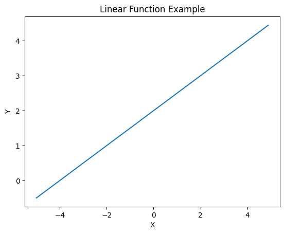
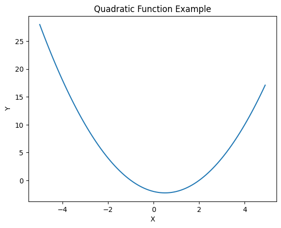
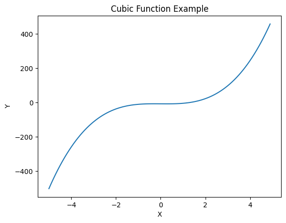
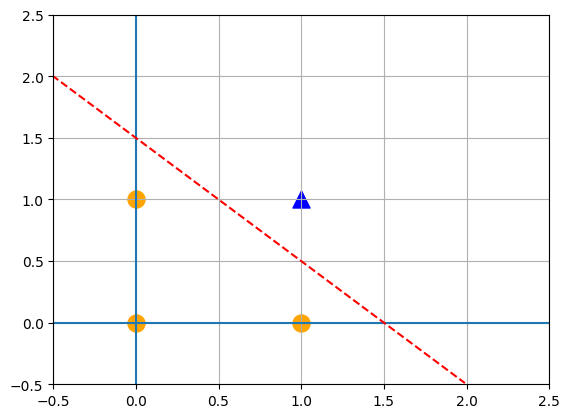
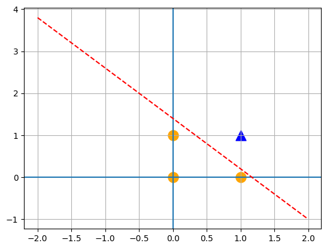
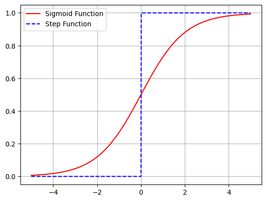
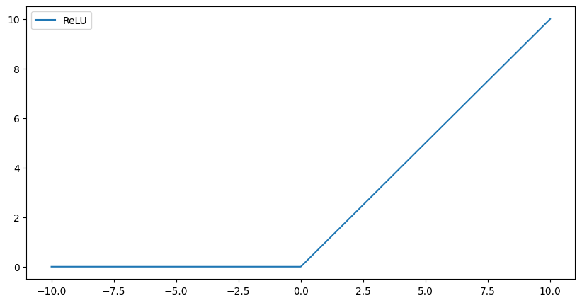

# 1. Preparation


```python
# Import modules
import math
import numpy as np
import matplotlib.pyplot as plt
```

# 2. Fuctions

## 2.1. Linear Function (y = ax + b)


```python
# Define a Linear Function

def linear_function(x):
  a = 0.5
  b = 2

  return a*x+b
```


```python
# Test
print(linear_function(5))
```

    4.5


```python
# Visualization
x = np.arange(-5, 5, 0.1)  # (Start, End, Increase by)
y = linear_function(x)

plt.plot(x, y)
plt.xlabel('X')
plt.ylabel('Y')
plt.title('Linear Function Example')
```


    Text(0.5, 1.0, 'Linear Function Example')




    


## 2.2. Quadratic Function (y = ax^2 + bx + c)


```python
# Define a Quadratic Function

def quadratic_function(x):
  a = 1
  b = -1
  c = -2

  return a*x**2 + b*x + c
```


```python
# Test
print(quadratic_function(2))
```

    0


```python
# Visualization

x = np.arange(-5, 5, 0.1)
y = quadratic_function(x)

plt.plot(x, y)
plt.xlabel('X')
plt.ylabel('Y')
plt.title('Quadratic Function Example')
```


    Text(0.5, 1.0, 'Quadratic Function Example')




​    


## 2.3. Cubic Function (y = ax^3 + bx^2 + cx + d)


```python
# Define a Cubic Function

def cubic_function(x):
  a = 4
  b = 0
  c = -1
  d = -8

  return a*x**3 + b*x**2 + c*x + d

```


```python
# Test
cubic_function(1)
```


    -5


```python
# Visualization

x = np.arange(-5, 5, 0.1)
y = cubic_function(x)

plt.plot(x, y)
plt.xlabel('X')
plt.ylabel('Y')
plt.title('Cubic Function Example')
```


    Text(0.5, 1.0, 'Cubic Function Example')




    


# 3. Tensor

## 3.1. Scalar

- Scalar
 - One number, No direction, No shape


```python
# Scalar

x = np.array(3)
print('Value: ', x)
print('Shape: ', x.shape)
print('Number of Dimension', x.ndim)
```

    Value:  3
    Shape:  ()
    Number of Dimension 0


## 3.2. One-Dimentional Tensor

### 3.2.1. Broadcasting

- Broadcasting
 - Broadcasting is a technique that automatically makes tensors of different shapes compatible for mathematical operations in an efficient and concise way


```python
# Define One-dimentional tensors
a = np.array([1, 2, 3, 4])
b = np.array([5, 6, 7, 8])
c = a + b
d = a + x   # 'x' is a Scalar -> [1,2,3,4]+[3]  => 'Broadcasting': 

print('Value: ', d)
print('Shape: ', d.shape)
print('Dimension: ', d.ndim)
```

    Value:  [4 5 6 7]
    Shape:  (4,)
    Dimension:  1


### 3.2.2. Vector Dot

- Vector Dot (=Dot Product)
 - A mathematical operation that takes two vectors of equal length and returns a scalar obtained by multiplying corresponding elements of the vectors and summing the results
 - To compare groups of dataset


```python
# Define One-dimentional tensors
x = np.array([1, 2, 0])
y = np.array([0, 2, 1])
z = np.dot(x, y)

print('Value: ', z)
print('Shape: ', z.shape)
print('Dimension: ', z.ndim)
```

    Value:  4
    Shape:  ()
    Dimension:  0


## 3.3. Two-Dimentional Tensor

### 3.3.1. Two-Dimentional Tensor Basics


```python
# Define a Two-dimentional tensor
matrix = np.array([[1,2,3,], [4,5,6]])

print('Value: \n', matrix)
print('Shape: ', matrix.shape)
print('Dimention: ', matrix.ndim)
```

    Value: 
     [[1 2 3]
     [4 5 6]]
    Shape:  (2, 3)
    Dimention:  2


```python
a = np.array([[1,2], [3,4]])
b = np.array([[10,10], [10,10]])

print(a * b)
```

    [[10 20]
     [30 40]]


### 3.3.2. Transposed Matrix


```python
# Make an original tensor
a = np.array([[[1,2,3], [4,5,6]]])

print('Value: \n', a)
print('Shape: ', a.shape)
print('Dimention: ', a.ndim)
```

    Value: 
     [[[1 2 3]
      [4 5 6]]]
    Shape:  (1, 2, 3)
    Dimention:  3


```python
# Make a Transposed matrix from the original tensor
a_ = a.T

print('Value: \n', a_)
print('Shape: ', a_.shape)
print('Dimention: ', a_.ndim)
```

    Value: 
     [[[1]
      [4]]
    
     [[2]
      [5]]
    
     [[3]
      [6]]]
    Shape:  (3, 2, 1)
    Dimention:  3


## 3.4. 3-Dimentional Tensor


```python
x = np.array([[[5, 3, 2, 1],
               [5, 5, 3, 1],
               [6, 1, 2, 3]],
              [[1, 1, 1, 1],
               [3, 4, 7, 5],
               [1, 8, 3, 4]],
              [[10, 9, 3, 9],
               [5, 4, 3, 2],
               [7, 6, 3, 4]]])

print('Value: \n', x)
print('Shape: ', x.shape)
print('Dimention: ', x.ndim)
```

    Value: 
     [[[ 5  3  2  1]
      [ 5  5  3  1]
      [ 6  1  2  3]]
    
     [[ 1  1  1  1]
      [ 3  4  7  5]
      [ 1  8  3  4]]
    
     [[10  9  3  9]
      [ 5  4  3  2]
      [ 7  6  3  4]]]
    Shape:  (3, 3, 4)
    Dimention:  3


# 4. Gates

## 4.1. Logic Gate

### 4.1.1. AND Gate


```python
# Define AND
def AND(a, b):
  input = np.array([a,b])
  weights = np.array([0.4, 0.4])
  bias = -0.6
  value = np.sum(input * weights) + bias      # (w0 + w1 + w2 + etc.) + bias
  
  if value <= 0:
    return 0
  else:
    return 1
```


```python
# Test
print(AND(0,0))
print(AND(0,1))
print(AND(1,0))
print(AND(1,1))
```

    0
    0
    0
    1


```python
# Visualization

x1 = np.arange(-2, 2, 0.01)
x2 = np.arange(-2, 2, 0.01)
bias = -0.6

y = (-0.4 * x1 - bias) / 0.4

plt.axvline(x=0)
plt.axhline(y=0)


plt.plot(x1, y, 'r--')
plt.scatter(0, 0, color='orange', marker='o', s=150)
plt.scatter(0, 1, color='orange', marker='o', s=150)
plt.scatter(1, 0, color='orange', marker='o', s=150)
plt.scatter(1, 1, color='blue', marker='^', s=150)

plt.xlim(-0.5, 2.5)
plt.ylim(-0.5, 2.5)
plt.grid()


# Result
# - Inside of the dot line: 0
# - Outside of the dot line: 1

# - Only (1,1) is outside of the line -> the value is '1'
```




### 4.1.2. OR Gate


```python
# Define OR

def OR(a,b):
  input = np.array([a,b])
  weights = np.array([0.4, 0.4])
  bias = -0.3
  value = np.sum(input * weights) + bias      # (w0 + w1 + w2 + etc.) + bias
  
  if value <= 0:
    return 0
  else:
    return 1
```


```python
# Test
print(OR(0,0))
print(OR(0,1))
print(OR(1,0))
print(OR(1,1))
```

    0
    1
    1
    1


### 4.1.3. NAND Gate


```python
# Define NAND

def NAND(a,b):
  input = np.array([a,b])
  weights = np.array([-0.5, -0.5])
  bias = 0.7
  value = np.sum(input * weights) + bias      # (w0 + w1 + w2 + etc.) + bias
  
  if value <= 0:
    return 0
  else:
    return 1
```


```python
# Test
print(NAND(0,0))
print(NAND(0,1))
print(NAND(1,0))
print(NAND(1,1))
```

    1
    1
    1
    0


```python
# Visualization

x1 = np.arange(-2, 2, 0.01)
x2 = np.arange(-2, 2, 0.01)
bias = 0.7

y = (0.6 * x1 - bias) / -0.5

plt.axvline(x=0)
plt.axhline(y=0)


plt.plot(x1, y, 'r--')
plt.scatter(0, 0, color='orange', marker='o', s=150)
plt.scatter(0, 1, color='orange', marker='o', s=150)
plt.scatter(1, 0, color='orange', marker='o', s=150)
plt.scatter(1, 1, color='blue', marker='^', s=150)

plt.grid()


# Result
# - Inside of the dot line: 0
# - Outside of the dot line: 1

# - Only (1,1) is outside of the line -> the value is '1'
```




### 4.1.4. XOR Gate


```python
# Define XOR

def XOR(x1, x2): 
  s1 = NAND(x1, x2)
  s2 = OR(x1, x2)
  y = AND(s1, s2)

  return y
```


```python
# Test
print(XOR(0, 0))
print(XOR(0, 1))
print(XOR(1, 0))
print(XOR(1, 1))
```

    0
    1
    1
    0


# 5. Activation Function

- Activation Function
  - General Steps
    1. ELU
    2. LeakyReLU
    3. ReLU
    4. tanh
    5. Sigmoid
 - Steps from Stanford Univ.
    1. ReLU
    2. ReLU Family(LeakyReLU, ELU)

## 5.1. Step Function

- Step Function
  - y = 0 (x < 0)
  - y = 1 (x >= 0)


```python
# Define a Step Function
def step_function(x):
  if x > 0:
    return 1
  else:
    return 0
```


```python
# Test
print(step_function(0))
print(step_function(-1))
print(step_function(1))
```

    0
    0
    1


```python
# Define a Step Function for Numpy
def step_function_for_numpy(x):
  y = x > 0                 # Result of y: Boolean
  return y.astype(np.int)   # Change the Boolean to (0, 1)
```


```python
# Test
a = np.array([5, 3, -4, 2, 0])
print(step_function_for_numpy(a))
```

    [1 1 0 1 0]


    <ipython-input-33-75a3c42e8791>:4: DeprecationWarning: `np.int` is a deprecated alias for the builtin `int`. To silence this warning, use `int` by itself. Doing this will not modify any behavior and is safe. When replacing `np.int`, you may wish to use e.g. `np.int64` or `np.int32` to specify the precision. If you wish to review your current use, check the release note link for additional information.
    Deprecated in NumPy 1.20; for more details and guidance: https://numpy.org/devdocs/release/1.20.0-notes.html#deprecations
      return y.astype(np.int)


## 5.2. Sigmoid Function

- Sigmoid Function
  - Use for Binary classification  e.g. Identify cats or dogs
  - Output: 0~1
  - Only used in the last output layer in a neural network
  - y = 1 / (1 + e^-x)


```python
# Defind a Sigmoid Function

def sigmoid(x):
  return 1 / (1 + np.exp(-x))   # np.exp(): Transfer 'e' to 'e^x) => np.exp(-x) = e^-x
```


```python
# Test
print(sigmoid(3))
print(sigmoid(10))
print(sigmoid(100))
print(sigmoid(-10))
```

    0.9525741268224334
    0.9999546021312976
    1.0
    4.5397868702434395e-05


```python
# Visualization: Step Function vs Sigmoid Function
x = np.arange(-5, 5, 0.01)

y1 = sigmoid(x)
y2 = step_function_for_numpy(x)

plt.plot(x, y1, 'r-', x, y2, 'b--')
plt.legend(['Sigmoid Function', 'Step Function'])

plt.grid()
```

    <ipython-input-33-75a3c42e8791>:4: DeprecationWarning: `np.int` is a deprecated alias for the builtin `int`. To silence this warning, use `int` by itself. Doing this will not modify any behavior and is safe. When replacing `np.int`, you may wish to use e.g. `np.int64` or `np.int32` to specify the precision. If you wish to review your current use, check the release note link for additional information.
    Deprecated in NumPy 1.20; for more details and guidance: https://numpy.org/devdocs/release/1.20.0-notes.html#deprecations
      return y.astype(np.int)




## 5.3. ReLU (Rectified Linear Unit)

- ReLU: Only get postive numbers
  - y = 0 (x <= 0)
  - y = x (x > 0)


```python
# Define a ReLU
def ReLU(x):
  if x > 0:
    return x
  else:
    return 0
```


```python
# Test
print(ReLU(5))
print(ReLU(-5))
```

    5
    0


```python
# Visualization
x = np.linspace(-10, 10, 1000)
y = np.maximum(0, x)

plt.figure(figsize=(10, 5))
plt.plot(x, y)
plt.legend(['ReLU'])
plt.show()
```

 


## 5.4. Identity Function

- Identity Function
 - Use in Regression Analysis
 - y = x
 - Use for the middle layer in a neural network


```python
# Define an Identity Function
def identity_function(x):
  return x
```

## 5.5. Softmax Function

- Softmax
 - Use for Multi Class Classification
 - Significantly affected by input -> Large input, large output
 - Output value can correspond to probability
 - The sum of the output values is 1
 - y = exp(xi) / Sum(exp(xy)


```python
# Define a Softmax Function
def softmax(x):
  exp_x = np.exp(x)
  sum_exp_x = np.sum(exp_x)
  y = exp_x / sum_exp_x

  return y

```


```python
# Test
x = np.array([0.3, 0.2, 3.0, -1, 2])
print(softmax(x))        # Result: Sum of numbers are '1'
print(np.sum(softmax(x)))
```

    [0.0443832  0.04015958 0.66041009 0.01209583 0.2429513 ]
    1.0

