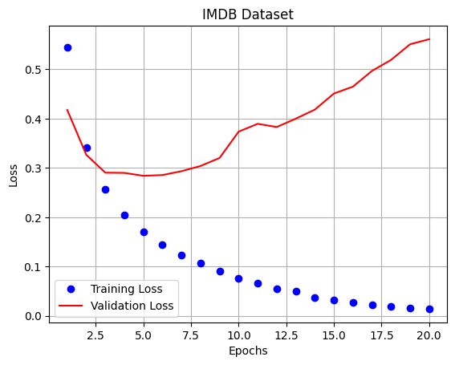
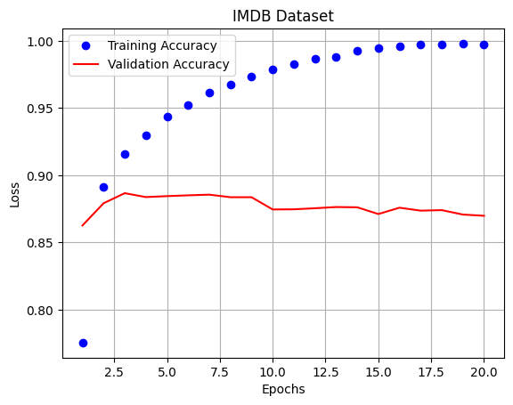

# 0. Excercise: 'IMDB' Dataset

# 1. Preparation


```python
# Import module
import keras
keras.__version__
```


    '2.12.0'


```python
# Import modules
from keras.datasets import imdb
import numpy as np
```

# 2. Check Dataset


```python
# Check the dataset
imdb.load_data(num_words=10000)   # Bring the first 10,000 words in order of frequency
```

    Downloading data from https://storage.googleapis.com/tensorflow/tf-keras-datasets/imdb.npz
    17464789/17464789 [==============================] - 0s 0us/step


    ((array([list([1, 14, 22, 16, 43, 530, 973, 1622, 1385, 65, 458, 4468, 66, 3941, 4, 173, 36, 256, 5, 25, 100, 43, 838, 112, 50, 670, 2, 9, 35, 480, 284, 5, 150, 4, 172, 112, 167, 2, 336, 385, 39, 4, 172, 4536, 1111, 17, 546, 38, 13, 447, 4, 192, 50, 16, 6, 147, 2025, 19, 14, 22, 4, 1920, 4613, 469, 4, 22, 71, 87, 12, 16, 43, 530, 38, 76, 15, 13, 1247, 4, 22, 17, 515, 17, 12, 16, 626, 18, 2, 5, 62, 386, 12, 8, 316, 8, 106, 5, 4, 2223, 5244, 16, 480, 66, 3785, 33, 4, 130, 12, 16, 38, 619, 5, 25, 124, 51, 36, 135, 48, 25, 1415, 33, 6, 22, 12, 215, 28, 77, 52, 5, 14, 407, 16, 82, 2, 8, 4, 107, 117, 5952, 15, 256, 4, 2, 7, 3766, 5, 723, 36, 71, 43, 530, 476, 26, 400, 317, 46, 7, 4, 2, 1029, 13, 104, 88, 4, 381, 15, 297, 98, 32, 2071, 56, 26, 141, 6, 194, 7486, 18, 4, 226, 22, 21, 134, 476, 26, 480, 5, 144, 30, 5535, 18, 51, 36, 28, 224, 92, 25, 104, 4, 226, 65, 16, 38, 1334, 88, 12, 16, 283, 5, 16, 4472, 113, 103, 32, 15, 16, 5345, 19, 178, 32]),
             list([1, 194, 1153, 194, 8255, 78, 228, 5, 6, 1463, 4369, 5012, 134, 26, 4, 715, 8, 118, 1634, 14, 394, 20, 13, 119, 954, 189, 102, 5, 207, 110, 3103, 21, 14, 69, 188, 8, 30, 23, 7, 4, 249, 126, 93, 4, 114, 9, 2300, 1523, 5, 647, 4, 116, 9, 35, 8163, 4, 229, 9, 340, 1322, 4, 118, 9, 4, 130, 4901, 19, 4, 1002, 5, 89, 29, 952, 46, 37, 4, 455, 9, 45, 43, 38, 1543, 1905, 398, 4, 1649, 26, 6853, 5, 163, 11, 3215, 2, 4, 1153, 9, 194, 775, 7, 8255, 2, 349, 2637, 148, 605, 2, 8003, 15, 123, 125, 68, 2, 6853, 15, 349, 165, 4362, 98, 5, 4, 228, 9, 43, 2, 1157, 15, 299, 120, 5, 120, 174, 11, 220, 175, 136, 50, 9, 4373, 228, 8255, 5, 2, 656, 245, 2350, 5, 4, 9837, 131, 152, 491, 18, 2, 32, 7464, 1212, 14, 9, 6, 371, 78, 22, 625, 64, 1382, 9, 8, 168, 145, 23, 4, 1690, 15, 16, 4, 1355, 5, 28, 6, 52, 154, 462, 33, 89, 78, 285, 16, 145, 95]),
             list([1, 14, 47, 8, 30, 31, 7, 4, 249, 108, 7, 4, 5974, 54, 61, 369, 13, 71, 149, 14, 22, 112, 4, 2401, 311, 12, 16, 3711, 33, 75, 43, 1829, 296, 4, 86, 320, 35, 534, 19, 263, 4821, 1301, 4, 1873, 33, 89, 78, 12, 66, 16, 4, 360, 7, 4, 58, 316, 334, 11, 4, 1716, 43, 645, 662, 8, 257, 85, 1200, 42, 1228, 2578, 83, 68, 3912, 15, 36, 165, 1539, 278, 36, 69, 2, 780, 8, 106, 14, 6905, 1338, 18, 6, 22, 12, 215, 28, 610, 40, 6, 87, 326, 23, 2300, 21, 23, 22, 12, 272, 40, 57, 31, 11, 4, 22, 47, 6, 2307, 51, 9, 170, 23, 595, 116, 595, 1352, 13, 191, 79, 638, 89, 2, 14, 9, 8, 106, 607, 624, 35, 534, 6, 227, 7, 129, 113]),
             ...,
             list([1, 11, 6, 230, 245, 6401, 9, 6, 1225, 446, 2, 45, 2174, 84, 8322, 4007, 21, 4, 912, 84, 2, 325, 725, 134, 2, 1715, 84, 5, 36, 28, 57, 1099, 21, 8, 140, 8, 703, 5, 2, 84, 56, 18, 1644, 14, 9, 31, 7, 4, 9406, 1209, 2295, 2, 1008, 18, 6, 20, 207, 110, 563, 12, 8, 2901, 2, 8, 97, 6, 20, 53, 4767, 74, 4, 460, 364, 1273, 29, 270, 11, 960, 108, 45, 40, 29, 2961, 395, 11, 6, 4065, 500, 7, 2, 89, 364, 70, 29, 140, 4, 64, 4780, 11, 4, 2678, 26, 178, 4, 529, 443, 2, 5, 27, 710, 117, 2, 8123, 165, 47, 84, 37, 131, 818, 14, 595, 10, 10, 61, 1242, 1209, 10, 10, 288, 2260, 1702, 34, 2901, 2, 4, 65, 496, 4, 231, 7, 790, 5, 6, 320, 234, 2766, 234, 1119, 1574, 7, 496, 4, 139, 929, 2901, 2, 7750, 5, 4241, 18, 4, 8497, 2, 250, 11, 1818, 7561, 4, 4217, 5408, 747, 1115, 372, 1890, 1006, 541, 9303, 7, 4, 59, 2, 4, 3586, 2]),
             list([1, 1446, 7079, 69, 72, 3305, 13, 610, 930, 8, 12, 582, 23, 5, 16, 484, 685, 54, 349, 11, 4120, 2959, 45, 58, 1466, 13, 197, 12, 16, 43, 23, 2, 5, 62, 30, 145, 402, 11, 4131, 51, 575, 32, 61, 369, 71, 66, 770, 12, 1054, 75, 100, 2198, 8, 4, 105, 37, 69, 147, 712, 75, 3543, 44, 257, 390, 5, 69, 263, 514, 105, 50, 286, 1814, 23, 4, 123, 13, 161, 40, 5, 421, 4, 116, 16, 897, 13, 2, 40, 319, 5872, 112, 6700, 11, 4803, 121, 25, 70, 3468, 4, 719, 3798, 13, 18, 31, 62, 40, 8, 7200, 4, 2, 7, 14, 123, 5, 942, 25, 8, 721, 12, 145, 5, 202, 12, 160, 580, 202, 12, 6, 52, 58, 2, 92, 401, 728, 12, 39, 14, 251, 8, 15, 251, 5, 2, 12, 38, 84, 80, 124, 12, 9, 23]),
             list([1, 17, 6, 194, 337, 7, 4, 204, 22, 45, 254, 8, 106, 14, 123, 4, 2, 270, 2, 5, 2, 2, 732, 2098, 101, 405, 39, 14, 1034, 4, 1310, 9, 115, 50, 305, 12, 47, 4, 168, 5, 235, 7, 38, 111, 699, 102, 7, 4, 4039, 9245, 9, 24, 6, 78, 1099, 17, 2345, 2, 21, 27, 9685, 6139, 5, 2, 1603, 92, 1183, 4, 1310, 7, 4, 204, 42, 97, 90, 35, 221, 109, 29, 127, 27, 118, 8, 97, 12, 157, 21, 6789, 2, 9, 6, 66, 78, 1099, 4, 631, 1191, 5, 2642, 272, 191, 1070, 6, 7585, 8, 2197, 2, 2, 544, 5, 383, 1271, 848, 1468, 2, 497, 2, 8, 1597, 8778, 2, 21, 60, 27, 239, 9, 43, 8368, 209, 405, 10, 10, 12, 764, 40, 4, 248, 20, 12, 16, 5, 174, 1791, 72, 7, 51, 6, 1739, 22, 4, 204, 131, 9])],
            dtype=object),
      array([1, 0, 0, ..., 0, 1, 0])),
     (array([list([1, 591, 202, 14, 31, 6, 717, 10, 10, 2, 2, 5, 4, 360, 7, 4, 177, 5760, 394, 354, 4, 123, 9, 1035, 1035, 1035, 10, 10, 13, 92, 124, 89, 488, 7944, 100, 28, 1668, 14, 31, 23, 27, 7479, 29, 220, 468, 8, 124, 14, 286, 170, 8, 157, 46, 5, 27, 239, 16, 179, 2, 38, 32, 25, 7944, 451, 202, 14, 6, 717]),
             list([1, 14, 22, 3443, 6, 176, 7, 5063, 88, 12, 2679, 23, 1310, 5, 109, 943, 4, 114, 9, 55, 606, 5, 111, 7, 4, 139, 193, 273, 23, 4, 172, 270, 11, 7216, 2, 4, 8463, 2801, 109, 1603, 21, 4, 22, 3861, 8, 6, 1193, 1330, 10, 10, 4, 105, 987, 35, 841, 2, 19, 861, 1074, 5, 1987, 2, 45, 55, 221, 15, 670, 5304, 526, 14, 1069, 4, 405, 5, 2438, 7, 27, 85, 108, 131, 4, 5045, 5304, 3884, 405, 9, 3523, 133, 5, 50, 13, 104, 51, 66, 166, 14, 22, 157, 9, 4, 530, 239, 34, 8463, 2801, 45, 407, 31, 7, 41, 3778, 105, 21, 59, 299, 12, 38, 950, 5, 4521, 15, 45, 629, 488, 2733, 127, 6, 52, 292, 17, 4, 6936, 185, 132, 1988, 5304, 1799, 488, 2693, 47, 6, 392, 173, 4, 2, 4378, 270, 2352, 4, 1500, 7, 4, 65, 55, 73, 11, 346, 14, 20, 9, 6, 976, 2078, 7, 5293, 861, 2, 5, 4182, 30, 3127, 2, 56, 4, 841, 5, 990, 692, 8, 4, 1669, 398, 229, 10, 10, 13, 2822, 670, 5304, 14, 9, 31, 7, 27, 111, 108, 15, 2033, 19, 7836, 1429, 875, 551, 14, 22, 9, 1193, 21, 45, 4829, 5, 45, 252, 8, 2, 6, 565, 921, 3639, 39, 4, 529, 48, 25, 181, 8, 67, 35, 1732, 22, 49, 238, 60, 135, 1162, 14, 9, 290, 4, 58, 10, 10, 472, 45, 55, 878, 8, 169, 11, 374, 5687, 25, 203, 28, 8, 818, 12, 125, 4, 3077]),
             list([1, 111, 748, 4368, 1133, 2, 2, 4, 87, 1551, 1262, 7, 31, 318, 9459, 7, 4, 498, 5076, 748, 63, 29, 5161, 220, 686, 2, 5, 17, 12, 575, 220, 2507, 17, 6, 185, 132, 2, 16, 53, 928, 11, 2, 74, 4, 438, 21, 27, 2, 589, 8, 22, 107, 2, 2, 997, 1638, 8, 35, 2076, 9019, 11, 22, 231, 54, 29, 1706, 29, 100, 2, 2425, 34, 2, 8738, 2, 5, 2, 98, 31, 2122, 33, 6, 58, 14, 3808, 1638, 8, 4, 365, 7, 2789, 3761, 356, 346, 4, 2, 1060, 63, 29, 93, 11, 5421, 11, 2, 33, 6, 58, 54, 1270, 431, 748, 7, 32, 2580, 16, 11, 94, 2, 10, 10, 4, 993, 2, 7, 4, 1766, 2634, 2164, 2, 8, 847, 8, 1450, 121, 31, 7, 27, 86, 2663, 2, 16, 6, 465, 993, 2006, 2, 573, 17, 2, 42, 4, 2, 37, 473, 6, 711, 6, 8869, 7, 328, 212, 70, 30, 258, 11, 220, 32, 7, 108, 21, 133, 12, 9, 55, 465, 849, 3711, 53, 33, 2071, 1969, 37, 70, 1144, 4, 5940, 1409, 74, 476, 37, 62, 91, 1329, 169, 4, 1330, 2, 146, 655, 2212, 5, 258, 12, 184, 2, 546, 5, 849, 2, 7, 4, 22, 1436, 18, 631, 1386, 797, 7, 4, 8712, 71, 348, 425, 4320, 1061, 19, 2, 5, 2, 11, 661, 8, 339, 2, 4, 2455, 2, 7, 4, 1962, 10, 10, 263, 787, 9, 270, 11, 6, 9466, 4, 2, 2, 121, 4, 5437, 26, 4434, 19, 68, 1372, 5, 28, 446, 6, 318, 7149, 8, 67, 51, 36, 70, 81, 8, 4392, 2294, 36, 1197, 8, 2, 2, 18, 6, 711, 4, 9909, 26, 2, 1125, 11, 14, 636, 720, 12, 426, 28, 77, 776, 8, 97, 38, 111, 7489, 6175, 168, 1239, 5189, 137, 2, 18, 27, 173, 9, 2399, 17, 6, 2, 428, 2, 232, 11, 4, 8014, 37, 272, 40, 2708, 247, 30, 656, 6, 2, 54, 2, 3292, 98, 6, 2840, 40, 558, 37, 6093, 98, 4, 2, 1197, 15, 14, 9, 57, 4893, 5, 4659, 6, 275, 711, 7937, 2, 3292, 98, 6, 2, 10, 10, 6639, 19, 14, 2, 267, 162, 711, 37, 5900, 752, 98, 4, 2, 2378, 90, 19, 6, 2, 7, 2, 1810, 2, 4, 4770, 3183, 930, 8, 508, 90, 4, 1317, 8, 4, 2, 17, 2, 3965, 1853, 4, 1494, 8, 4468, 189, 4, 2, 6287, 5774, 4, 4770, 5, 95, 271, 23, 6, 7742, 6063, 2, 5437, 33, 1526, 6, 425, 3155, 2, 4535, 1636, 7, 4, 4669, 2, 469, 4, 4552, 54, 4, 150, 5664, 2, 280, 53, 2, 2, 18, 339, 29, 1978, 27, 7885, 5, 2, 68, 1830, 19, 6571, 2, 4, 1515, 7, 263, 65, 2132, 34, 6, 5680, 7489, 43, 159, 29, 9, 4706, 9, 387, 73, 195, 584, 10, 10, 1069, 4, 58, 810, 54, 14, 6078, 117, 22, 16, 93, 5, 1069, 4, 192, 15, 12, 16, 93, 34, 6, 1766, 2, 33, 4, 5673, 7, 15, 2, 9252, 3286, 325, 12, 62, 30, 776, 8, 67, 14, 17, 6, 2, 44, 148, 687, 2, 203, 42, 203, 24, 28, 69, 2, 6676, 11, 330, 54, 29, 93, 2, 21, 845, 2, 27, 1099, 7, 819, 4, 22, 1407, 17, 6, 2, 787, 7, 2460, 2, 2, 100, 30, 4, 3737, 3617, 3169, 2321, 42, 1898, 11, 4, 3814, 42, 101, 704, 7, 101, 999, 15, 1625, 94, 2926, 180, 5, 9, 9101, 34, 2, 45, 6, 1429, 22, 60, 6, 1220, 31, 11, 94, 6408, 96, 21, 94, 749, 9, 57, 975]),
             ...,
             list([1, 13, 1408, 15, 8, 135, 14, 9, 35, 32, 46, 394, 20, 62, 30, 5093, 21, 45, 184, 78, 4, 1492, 910, 769, 2290, 2515, 395, 4257, 5, 1454, 11, 119, 2, 89, 1036, 4, 116, 218, 78, 21, 407, 100, 30, 128, 262, 15, 7, 185, 2280, 284, 1842, 2, 37, 315, 4, 226, 20, 272, 2942, 40, 29, 152, 60, 181, 8, 30, 50, 553, 362, 80, 119, 12, 21, 846, 5518]),
             list([1, 11, 119, 241, 9, 4, 840, 20, 12, 468, 15, 94, 3684, 562, 791, 39, 4, 86, 107, 8, 97, 14, 31, 33, 4, 2960, 7, 743, 46, 1028, 9, 3531, 5, 4, 768, 47, 8, 79, 90, 145, 164, 162, 50, 6, 501, 119, 7, 9, 4, 78, 232, 15, 16, 224, 11, 4, 333, 20, 4, 985, 200, 5, 2, 5, 9, 1861, 8, 79, 357, 4, 20, 47, 220, 57, 206, 139, 11, 12, 5, 55, 117, 212, 13, 1276, 92, 124, 51, 45, 1188, 71, 536, 13, 520, 14, 20, 6, 2302, 7, 470]),
             list([1, 6, 52, 7465, 430, 22, 9, 220, 2594, 8, 28, 2, 519, 3227, 6, 769, 15, 47, 6, 3482, 4067, 8, 114, 5, 33, 222, 31, 55, 184, 704, 5586, 2, 19, 346, 3153, 5, 6, 364, 350, 4, 184, 5586, 9, 133, 1810, 11, 5417, 2, 21, 4, 7298, 2, 570, 50, 2005, 2643, 9, 6, 1249, 17, 6, 2, 2, 21, 17, 6, 1211, 232, 1138, 2249, 29, 266, 56, 96, 346, 194, 308, 9, 194, 21, 29, 218, 1078, 19, 4, 78, 173, 7, 27, 2, 5698, 3406, 718, 2, 9, 6, 6907, 17, 210, 5, 3281, 5677, 47, 77, 395, 14, 172, 173, 18, 2740, 2931, 4517, 82, 127, 27, 173, 11, 6, 392, 217, 21, 50, 9, 57, 65, 12, 2, 53, 40, 35, 390, 7, 11, 4, 3567, 7, 4, 314, 74, 6, 792, 22, 2, 19, 714, 727, 5205, 382, 4, 91, 6533, 439, 19, 14, 20, 9, 1441, 5805, 1118, 4, 756, 25, 124, 4, 31, 12, 16, 93, 804, 34, 2005, 2643])],
            dtype=object),
      array([0, 1, 1, ..., 0, 0, 0])))


```python
# Define dataset
(train_data, train_labels), (test_data, test_labels) = imdb.load_data(num_words=10000) # Bring the first 10,000 words in order of frequency
```


```python
# Check Data
print('Train Data: ', train_data.shape)
print('Train Labels: ', train_labels.shape)
print('Test Data: ', test_data.shape)
print('Test Labels: ', test_labels.shape)
```

    Train Data:  (25000,)
    Train Labels:  (25000,)
    Test Data:  (25000,)
    Test Labels:  (25000,)


```python
# Check a sample data
train_data[:3]
```


    array([list([1, 14, 22, 16, 43, 530, 973, 1622, 1385, 65, 458, 4468, 66, 3941, 4, 173, 36, 256, 5, 25, 100, 43, 838, 112, 50, 670, 2, 9, 35, 480, 284, 5, 150, 4, 172, 112, 167, 2, 336, 385, 39, 4, 172, 4536, 1111, 17, 546, 38, 13, 447, 4, 192, 50, 16, 6, 147, 2025, 19, 14, 22, 4, 1920, 4613, 469, 4, 22, 71, 87, 12, 16, 43, 530, 38, 76, 15, 13, 1247, 4, 22, 17, 515, 17, 12, 16, 626, 18, 2, 5, 62, 386, 12, 8, 316, 8, 106, 5, 4, 2223, 5244, 16, 480, 66, 3785, 33, 4, 130, 12, 16, 38, 619, 5, 25, 124, 51, 36, 135, 48, 25, 1415, 33, 6, 22, 12, 215, 28, 77, 52, 5, 14, 407, 16, 82, 2, 8, 4, 107, 117, 5952, 15, 256, 4, 2, 7, 3766, 5, 723, 36, 71, 43, 530, 476, 26, 400, 317, 46, 7, 4, 2, 1029, 13, 104, 88, 4, 381, 15, 297, 98, 32, 2071, 56, 26, 141, 6, 194, 7486, 18, 4, 226, 22, 21, 134, 476, 26, 480, 5, 144, 30, 5535, 18, 51, 36, 28, 224, 92, 25, 104, 4, 226, 65, 16, 38, 1334, 88, 12, 16, 283, 5, 16, 4472, 113, 103, 32, 15, 16, 5345, 19, 178, 32]),
           list([1, 194, 1153, 194, 8255, 78, 228, 5, 6, 1463, 4369, 5012, 134, 26, 4, 715, 8, 118, 1634, 14, 394, 20, 13, 119, 954, 189, 102, 5, 207, 110, 3103, 21, 14, 69, 188, 8, 30, 23, 7, 4, 249, 126, 93, 4, 114, 9, 2300, 1523, 5, 647, 4, 116, 9, 35, 8163, 4, 229, 9, 340, 1322, 4, 118, 9, 4, 130, 4901, 19, 4, 1002, 5, 89, 29, 952, 46, 37, 4, 455, 9, 45, 43, 38, 1543, 1905, 398, 4, 1649, 26, 6853, 5, 163, 11, 3215, 2, 4, 1153, 9, 194, 775, 7, 8255, 2, 349, 2637, 148, 605, 2, 8003, 15, 123, 125, 68, 2, 6853, 15, 349, 165, 4362, 98, 5, 4, 228, 9, 43, 2, 1157, 15, 299, 120, 5, 120, 174, 11, 220, 175, 136, 50, 9, 4373, 228, 8255, 5, 2, 656, 245, 2350, 5, 4, 9837, 131, 152, 491, 18, 2, 32, 7464, 1212, 14, 9, 6, 371, 78, 22, 625, 64, 1382, 9, 8, 168, 145, 23, 4, 1690, 15, 16, 4, 1355, 5, 28, 6, 52, 154, 462, 33, 89, 78, 285, 16, 145, 95]),
           list([1, 14, 47, 8, 30, 31, 7, 4, 249, 108, 7, 4, 5974, 54, 61, 369, 13, 71, 149, 14, 22, 112, 4, 2401, 311, 12, 16, 3711, 33, 75, 43, 1829, 296, 4, 86, 320, 35, 534, 19, 263, 4821, 1301, 4, 1873, 33, 89, 78, 12, 66, 16, 4, 360, 7, 4, 58, 316, 334, 11, 4, 1716, 43, 645, 662, 8, 257, 85, 1200, 42, 1228, 2578, 83, 68, 3912, 15, 36, 165, 1539, 278, 36, 69, 2, 780, 8, 106, 14, 6905, 1338, 18, 6, 22, 12, 215, 28, 610, 40, 6, 87, 326, 23, 2300, 21, 23, 22, 12, 272, 40, 57, 31, 11, 4, 22, 47, 6, 2307, 51, 9, 170, 23, 595, 116, 595, 1352, 13, 191, 79, 638, 89, 2, 14, 9, 8, 106, 607, 624, 35, 534, 6, 227, 7, 129, 113])],
          dtype=object)


```python
# Check a sample data
train_labels[:5]

# Result: 0 - Negative, 1 - Positive
```


    array([1, 0, 0, 1, 0])


```python
# Check number of data in Training dataset
i = 0
for sequence in train_data:
  i = i + 1

print('The Number of Dataset in Training dataset: ', i)
```

    The Number of Dataset in Training dataset:  25000


```python
#
max([max(sequence) for sequence in train_data])

# [max(sequence) for sequence in train_data]: Make a list of maximum value in train_data
# max(max(sequence) for sequence in train_data]): Find the maximum value from the list above
```


    9999


# 3. Prepare Data

## 3.1. Vectorize Data


```python
# Made the data into an array of appropriate sizes - 10000-dimension
def vectorize_sequences(sequences, dimension=10000):

  # Create an array filled with '0'
  result = np.zeros((len(sequences), dimension))  # Tuple type

  # Check a shape of the array
  print(result.shape)

  # Add '1' to a sequence where the word is located
  for i, sequence in enumerate(sequences):
    result[i, sequence] = 1
  
  return result
```


```python
# Note: 'enumerate()'
a = [1, 2, 3, 4]
print('a: ', a)
print('emumerated a: ', enumerate(a))

for i, item in enumerate(a):
  print(i, item)

# Result
# - 0, 1, 2, 3: Index
# - 1, 2, 3, 4: Values
```

    a:  [1, 2, 3, 4]
    emumerated a:  <enumerate object at 0x7fa0c036d300>
    0 1
    1 2
    2 3
    3 4


## 3.2. Get Train Data


```python
# Vectorize the Training Data
x_train = vectorize_sequences(train_data)

# Result: (25000, 10000)
# - 25000: Total number of reviews
# - 10000: 10,000 words with the highest frequency in the reviews
```

    (25000, 10000)


```python
# Check a result of vetorized Train Data
x_train[:10]

# Result: [0., 1., ... 0.]
#        - The datatype is the 'float' type
```


    array([[0., 1., 1., ..., 0., 0., 0.],
           [0., 1., 1., ..., 0., 0., 0.],
           [0., 1., 1., ..., 0., 0., 0.],
           ...,
           [0., 1., 1., ..., 0., 0., 0.],
           [0., 1., 1., ..., 0., 0., 0.],
           [0., 1., 1., ..., 0., 0., 0.]])


```python
# Vectorize the X Label Data
x_test = vectorize_sequences(train_labels)
```

    (25000, 10000)


```python
# Check a result of vetorized X Label Data
x_test[:10]
```


    array([[0., 1., 0., ..., 0., 0., 0.],
           [1., 0., 0., ..., 0., 0., 0.],
           [1., 0., 0., ..., 0., 0., 0.],
           ...,
           [1., 0., 0., ..., 0., 0., 0.],
           [0., 1., 0., ..., 0., 0., 0.],
           [1., 0., 0., ..., 0., 0., 0.]])


## 3.3. Get Test Data


```python
# Change Label data to Float type
y_train = np.asarray(train_labels).astype('float32')
y_test = np.asarray(test_labels).astype('float32')
```


```python
y_train[0]
```


    1.0


# 4. Create a Neural Network


```python
# Import modules
from keras import models
from keras import layers
```


```python
# Create a model
model = models.Sequential()

# Input layer
model.add(layers.Dense(16, 
                       activation='relu',
                       input_shape=(10000,)))  # a shape of data is: (W 10,000, H unknown)

# Hidden layer
model.add(layers.Dense(16,
                       activation='relu'))

# Output layer
model.add(layers.Dense(1,   # '1': The result will be '0' or '1'
                       activation = 'sigmoid'))  


# Complie
model.compile(optimizer='rmsprop',         # Optimizer
              loss='binary_crossentropy',  # Loss Function: 0 or 1 -> Binary Crossentropy
              metrics=['accuracy'])          # Evaluation criteria
```

# 5. Devide Data into Three Parts


```python
# Divide the dataset into 3 groups
# x_val: 10,000
# x_partial: 15,000
# X_test: 25,000

x_val = x_train[:10000]            # 0 - 10,000
partial_x_train = x_train[10000:]  # After 10,000

y_val = y_train[:10000]            # 0 - 10,000
partial_y_train = y_train[10000:]  # After 10,000
```

# 6. Fit Data


```python
# Fit data
history = model.fit(partial_x_train, 
                    partial_y_train,
                    epochs = 20,    # The number of training cycle
                    batch_size = 512,
                    validation_data = (x_val, y_val))  # Validate a result of training process

# Result: The best epoch is the Third epoch
```

    Epoch 1/20
    30/30 [==============================] - 7s 176ms/step - loss: 0.5450 - accuracy: 0.7756 - val_loss: 0.4175 - val_accuracy: 0.8627
    Epoch 2/20
    30/30 [==============================] - 1s 46ms/step - loss: 0.3419 - accuracy: 0.8913 - val_loss: 0.3265 - val_accuracy: 0.8792
    Epoch 3/20
    30/30 [==============================] - 1s 48ms/step - loss: 0.2570 - accuracy: 0.9156 - val_loss: 0.2903 - val_accuracy: 0.8867
    Epoch 4/20
    30/30 [==============================] - 2s 59ms/step - loss: 0.2044 - accuracy: 0.9297 - val_loss: 0.2898 - val_accuracy: 0.8838
    Epoch 5/20
    30/30 [==============================] - 2s 61ms/step - loss: 0.1698 - accuracy: 0.9434 - val_loss: 0.2840 - val_accuracy: 0.8845
    Epoch 6/20
    30/30 [==============================] - 1s 48ms/step - loss: 0.1449 - accuracy: 0.9523 - val_loss: 0.2855 - val_accuracy: 0.8851
    Epoch 7/20
    30/30 [==============================] - 2s 54ms/step - loss: 0.1225 - accuracy: 0.9615 - val_loss: 0.2934 - val_accuracy: 0.8856
    Epoch 8/20
    30/30 [==============================] - 1s 44ms/step - loss: 0.1076 - accuracy: 0.9677 - val_loss: 0.3039 - val_accuracy: 0.8837
    Epoch 9/20
    30/30 [==============================] - 1s 43ms/step - loss: 0.0899 - accuracy: 0.9734 - val_loss: 0.3202 - val_accuracy: 0.8837
    Epoch 10/20
    30/30 [==============================] - 1s 43ms/step - loss: 0.0760 - accuracy: 0.9789 - val_loss: 0.3735 - val_accuracy: 0.8746
    Epoch 11/20
    30/30 [==============================] - 1s 42ms/step - loss: 0.0660 - accuracy: 0.9828 - val_loss: 0.3894 - val_accuracy: 0.8747
    Epoch 12/20
    30/30 [==============================] - 1s 43ms/step - loss: 0.0548 - accuracy: 0.9869 - val_loss: 0.3828 - val_accuracy: 0.8755
    Epoch 13/20
    30/30 [==============================] - 1s 48ms/step - loss: 0.0498 - accuracy: 0.9878 - val_loss: 0.3998 - val_accuracy: 0.8764
    Epoch 14/20
    30/30 [==============================] - 2s 69ms/step - loss: 0.0378 - accuracy: 0.9925 - val_loss: 0.4182 - val_accuracy: 0.8762
    Epoch 15/20
    30/30 [==============================] - 2s 63ms/step - loss: 0.0316 - accuracy: 0.9946 - val_loss: 0.4507 - val_accuracy: 0.8712
    Epoch 16/20
    30/30 [==============================] - 1s 45ms/step - loss: 0.0268 - accuracy: 0.9957 - val_loss: 0.4648 - val_accuracy: 0.8759
    Epoch 17/20
    30/30 [==============================] - 2s 56ms/step - loss: 0.0230 - accuracy: 0.9970 - val_loss: 0.4966 - val_accuracy: 0.8737
    Epoch 18/20
    30/30 [==============================] - 2s 55ms/step - loss: 0.0187 - accuracy: 0.9973 - val_loss: 0.5189 - val_accuracy: 0.8741
    Epoch 19/20
    30/30 [==============================] - 2s 54ms/step - loss: 0.0159 - accuracy: 0.9979 - val_loss: 0.5507 - val_accuracy: 0.8708
    Epoch 20/20
    30/30 [==============================] - 1s 42ms/step - loss: 0.0144 - accuracy: 0.9975 - val_loss: 0.5609 - val_accuracy: 0.8699


```python
# Check contents of the history
history_dict = history.history
print(history_dict.keys())
print('\n', history_dict.items())
```

    dict_keys(['loss', 'accuracy', 'val_loss', 'val_accuracy'])
    
     dict_items([('loss', [0.54498690366745, 0.3418734073638916, 0.2570478916168213, 0.2044125348329544, 0.1697668731212616, 0.14492782950401306, 0.12251386046409607, 0.10763061046600342, 0.0899081602692604, 0.07603313028812408, 0.06596952676773071, 0.05480169132351875, 0.04980279132723808, 0.03780589625239372, 0.031584255397319794, 0.026779640465974808, 0.023048995062708855, 0.018693016842007637, 0.01592365838587284, 0.014397983439266682]), ('accuracy', [0.775600016117096, 0.8913333415985107, 0.9156000018119812, 0.9297333359718323, 0.9434000253677368, 0.9523333311080933, 0.9614666700363159, 0.9676666855812073, 0.9733999967575073, 0.9789333343505859, 0.9828000068664551, 0.9868666529655457, 0.9878000020980835, 0.9925333261489868, 0.9945999979972839, 0.9956666827201843, 0.996999979019165, 0.9973333477973938, 0.9979333281517029, 0.9975333213806152]), ('val_loss', [0.4174790382385254, 0.32648733258247375, 0.29030126333236694, 0.28984665870666504, 0.284036785364151, 0.28550034761428833, 0.29335761070251465, 0.3038879334926605, 0.3202303946018219, 0.37354716658592224, 0.3893824517726898, 0.382832795381546, 0.3998195230960846, 0.41815826296806335, 0.45072391629219055, 0.46476152539253235, 0.49663519859313965, 0.5188717246055603, 0.5506603121757507, 0.5608623027801514]), ('val_accuracy', [0.8626999855041504, 0.8791999816894531, 0.8866999745368958, 0.8838000297546387, 0.8845000267028809, 0.8851000070571899, 0.8855999708175659, 0.8837000131607056, 0.8837000131607056, 0.8745999932289124, 0.8747000098228455, 0.8755000233650208, 0.8763999938964844, 0.8762000203132629, 0.8712000250816345, 0.8758999705314636, 0.8737000226974487, 0.8741000294685364, 0.8708000183105469, 0.8698999881744385])])


# 7. Visualization


```python
# Import modules
import matplotlib.pyplot as plt
```


```python
# Define 'accuracy' and 'loss'
acc = history.history['accuracy']  # Accuracy of training
loss = history.history['loss']     # Y-axis
val_acc = history.history['val_accuracy']
val_loss = history.history['val_loss']

epochs = range(1, len(acc)+1)      # X-axis
```


```python
# Visualization for Loss
plt.plot(epochs,  # Y-axis
         loss,    # X-axis
         'bo',
         label='Training Loss')

plt.plot(epochs,
         val_loss,
         'r-',
         label='Validation Loss')

plt.legend()
plt.title('IMDB Dataset')
plt.xlabel('Epochs')
plt.ylabel('Loss')
plt.grid()


# Result:
# The line of Validation set is the lowest value -> The best epoch
# After 3rd epoch: Training loss is overweighted
```



    

```python
# Visualization for Accuracy
plt.plot(epochs,  # Y-axis
         acc,    # X-axis
         'bo',
         label='Training Accuracy')

plt.plot(epochs,
         val_acc,
         'r-',
         label='Validation Accuracy')

plt.legend()
plt.title('IMDB Dataset')
plt.xlabel('Epochs')
plt.ylabel('Loss')
plt.grid()

```





# 8 Prediction

* Note: Before doing prediction, reset the model with a value of the best epoch  
 => The best epoch of this model: Thrid epoch  
  => When fitting models, original epoch is '20' but it's changed to '3' as 3 is the best epoch


```python
# Prediction
model.predict(x_test)
```

    782/782 [==============================] - 3s 3ms/step


    array([[0.6017049 ],
           [0.5782289 ],
           [0.5782289 ],
           ...,
           [0.5782289 ],
           [0.60170496],
           [0.5782289 ]], dtype=float32)


# 9. Evaluation


```python
# Evaluation by using Test data
test_loss, test_acc = model.evaluate(x_test, y_test)
print('loss={0}, accuracy={1}'.format(test_loss, test_acc))
```

    782/782 [==============================] - 2s 2ms/step - loss: 0.7101 - accuracy: 0.5000
    loss=0.7100858092308044, accuracy=0.5

