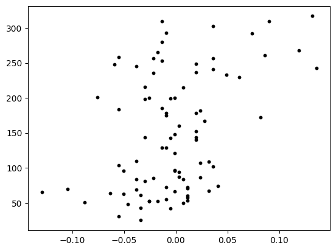
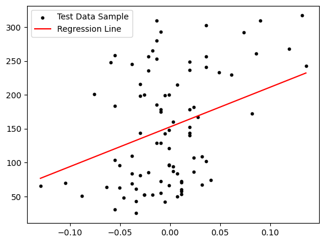

# 1. Preparation

## 1.1. Load Basic Modules and Dataset


```python
# Load modules

import numpy as np
import pandas as pd
import sklearn
import matplotlib.pyplot as plt
```


```python
# Load Dataset
from sklearn.datasets import load_diabetes

diabetes = load_diabetes()
```


```python
# View an overview of the dataset
print(diabetes.DESCR)
```

    .. _diabetes_dataset:
    
    Diabetes dataset
    ----------------
    
    Ten baseline variables, age, sex, body mass index, average blood
    pressure, and six blood serum measurements were obtained for each of n =
    442 diabetes patients, as well as the response of interest, a
    quantitative measure of disease progression one year after baseline.
    
    **Data Set Characteristics:**
    
      :Number of Instances: 442
    
      :Number of Attributes: First 10 columns are numeric predictive values
    
      :Target: Column 11 is a quantitative measure of disease progression one year after baseline
    
      :Attribute Information:
          - age     age in years
          - sex
          - bmi     body mass index
          - bp      average blood pressure
          - s1      tc, total serum cholesterol
          - s2      ldl, low-density lipoproteins
          - s3      hdl, high-density lipoproteins
          - s4      tch, total cholesterol / HDL
          - s5      ltg, possibly log of serum triglycerides level
          - s6      glu, blood sugar level
    
    Note: Each of these 10 feature variables have been mean centered and scaled by the standard deviation times the square root of `n_samples` (i.e. the sum of squares of each column totals 1).
    
    Source URL:
    https://www4.stat.ncsu.edu/~boos/var.select/diabetes.html
    
    For more information see:
    Bradley Efron, Trevor Hastie, Iain Johnstone and Robert Tibshirani (2004) "Least Angle Regression," Annals of Statistics (with discussion), 407-499.
    (https://web.stanford.edu/~hastie/Papers/LARS/LeastAngle_2002.pdf)


​    

# 2. Simple Linear Regression

## 2.1. Prepareation

### Load Data


```python
data = diabetes.data
label = diabetes.target  # Labels
columns = diabetes.feature_names # Column Names
```

### Make a DataFrame


```python
# Make a DataFrame
data = pd.DataFrame(data, columns=columns)

```

### Look up Data


```python
data.head()
```


  <div id="df-045aa9b1-dc6f-424b-9a2d-c2fb70763484">
    <div class="colab-df-container">
      <div>
<style scoped>
    .dataframe tbody tr th:only-of-type {
        vertical-align: middle;
    }

    .dataframe tbody tr th {
        vertical-align: top;
    }
    
    .dataframe thead th {
        text-align: right;
    }


<table border="1" class="dataframe">
  <thead>
    <tr style="text-align: right;">
      <th></th>
      <th>age</th>
      <th>sex</th>
      <th>bmi</th>
      <th>bp</th>
      <th>s1</th>
      <th>s2</th>
      <th>s3</th>
      <th>s4</th>
      <th>s5</th>
      <th>s6</th>
    </tr>
  </thead>
  <tbody>
    <tr>
      <th>0</th>
      <td>0.038076</td>
      <td>0.050680</td>
      <td>0.061696</td>
      <td>0.021872</td>
      <td>-0.044223</td>
      <td>-0.034821</td>
      <td>-0.043401</td>
      <td>-0.002592</td>
      <td>0.019907</td>
      <td>-0.017646</td>
    </tr>
    <tr>
      <th>1</th>
      <td>-0.001882</td>
      <td>-0.044642</td>
      <td>-0.051474</td>
      <td>-0.026328</td>
      <td>-0.008449</td>
      <td>-0.019163</td>
      <td>0.074412</td>
      <td>-0.039493</td>
      <td>-0.068332</td>
      <td>-0.092204</td>
    </tr>
    <tr>
      <th>2</th>
      <td>0.085299</td>
      <td>0.050680</td>
      <td>0.044451</td>
      <td>-0.005670</td>
      <td>-0.045599</td>
      <td>-0.034194</td>
      <td>-0.032356</td>
      <td>-0.002592</td>
      <td>0.002861</td>
      <td>-0.025930</td>
    </tr>
    <tr>
      <th>3</th>
      <td>-0.089063</td>
      <td>-0.044642</td>
      <td>-0.011595</td>
      <td>-0.036656</td>
      <td>0.012191</td>
      <td>0.024991</td>
      <td>-0.036038</td>
      <td>0.034309</td>
      <td>0.022688</td>
      <td>-0.009362</td>
    </tr>
    <tr>
      <th>4</th>
      <td>0.005383</td>
      <td>-0.044642</td>
      <td>-0.036385</td>
      <td>0.021872</td>
      <td>0.003935</td>
      <td>0.015596</td>
      <td>0.008142</td>
      <td>-0.002592</td>
      <td>-0.031988</td>
      <td>-0.046641</td>
    </tr>
  </tbody>
</table>

    .colab-df-convert {
      background-color: #E8F0FE;
      border: none;
      border-radius: 50%;
      cursor: pointer;
      display: none;
      fill: #1967D2;
      height: 32px;
      padding: 0 0 0 0;
      width: 32px;
    }
    
    .colab-df-convert:hover {
      background-color: #E2EBFA;
      box-shadow: 0px 1px 2px rgba(60, 64, 67, 0.3), 0px 1px 3px 1px rgba(60, 64, 67, 0.15);
      fill: #174EA6;
    }
    
    [theme=dark] .colab-df-convert {
      background-color: #3B4455;
      fill: #D2E3FC;
    }
    
    [theme=dark] .colab-df-convert:hover {
      background-color: #434B5C;
      box-shadow: 0px 1px 3px 1px rgba(0, 0, 0, 0.15);
      filter: drop-shadow(0px 1px 2px rgba(0, 0, 0, 0.3));
      fill: #FFFFFF;
    }


      <script>
        const buttonEl =
          document.querySelector('#df-045aa9b1-dc6f-424b-9a2d-c2fb70763484 button.colab-df-convert');
        buttonEl.style.display =
          google.colab.kernel.accessAllowed ? 'block' : 'none';
    
        async function convertToInteractive(key) {
          const element = document.querySelector('#df-045aa9b1-dc6f-424b-9a2d-c2fb70763484');
          const dataTable =
            await google.colab.kernel.invokeFunction('convertToInteractive',
                                                     [key], {});
          if (!dataTable) return;
    
          const docLinkHtml = 'Like what you see? Visit the ' +
            '<a target="_blank" href=https://colab.research.google.com/notebooks/data_table.ipynb>data table notebook</a>'
            + ' to learn more about interactive tables.';
          element.innerHTML = '';
          dataTable['output_type'] = 'display_data';
          await google.colab.output.renderOutput(dataTable, element);
          const docLink = document.createElement('div');
          docLink.innerHTML = docLinkHtml;
          element.appendChild(docLink);
        }
      </script>
    </div>


```python
data.shape
```


    (442, 10)


### Load an Algorithm


```python
# Prepare an algorithm
from sklearn.linear_model import LinearRegression

sim_lr = LinearRegression()
```

## 1.2. Train Dataset

### Split Dataset


```python
from sklearn.model_selection import train_test_split
```


```python
X_train, X_test, y_train, y_test = train_test_split(data, 
                                                    label, 
                                                    test_size = 0.2, 
                                                    random_state=2023)
```

### Reshape Datafram


```python
# Reshape dataframe to (-1, 1) -> Otherwise, it's not able for Skitlearn to run the data
X_train['s6'].values.reshape((-1, 1))  # Random rows, 1 column


```


    array([[-0.04664087],
           [ 0.03205916],
           [ 0.03620126],
           [-0.02593034],
           [-0.01764613],
           [ 0.02791705],
           [ 0.00720652],
           [ 0.01963284],
           [-0.0010777 ],
           [ 0.06933812],
           [-0.03835666],
           [-0.01350402],
           [-0.01350402],
           [ 0.01549073],
           [ 0.04448548],
           [-0.03421455],
           [ 0.07348023],
           [ 0.04034337],
           [ 0.02791705],
           [ 0.04448548],
           [ 0.02377494],
           [-0.03835666],
           [-0.00936191],
           [-0.0052198 ],
           [ 0.00720652],
           [ 0.02791705],
           [ 0.04034337],
           [-0.05906719],
           [ 0.02791705],
           [ 0.09833287],
           [ 0.07348023],
           [ 0.02791705],
           [-0.0052198 ],
           [-0.03421455],
           [ 0.0569118 ],
           [-0.04249877],
           [-0.00936191],
           [-0.03835666],
           [ 0.06519601],
           [-0.0010777 ],
           [-0.01764613],
           [-0.03835666],
           [ 0.00720652],
           [-0.03835666],
           [-0.03835666],
           [-0.0010777 ],
           [-0.01764613],
           [ 0.01134862],
           [ 0.02791705],
           [-0.0010777 ],
           [-0.04664087],
           [ 0.00306441],
           [ 0.00306441],
           [-0.03007245],
           [-0.12948301],
           [-0.01350402],
           [ 0.04034337],
           [ 0.08590655],
           [ 0.09419076],
           [ 0.00306441],
           [ 0.04034337],
           [-0.00936191],
           [-0.0052198 ],
           [ 0.04862759],
           [-0.0010777 ],
           [ 0.10661708],
           [ 0.10661708],
           [-0.03007245],
           [-0.09220405],
           [-0.05906719],
           [-0.0052198 ],
           [-0.0010777 ],
           [-0.04249877],
           [ 0.0569118 ],
           [ 0.07348023],
           [-0.00936191],
           [ 0.04448548],
           [ 0.08590655],
           [-0.02593034],
           [ 0.00306441],
           [-0.03835666],
           [ 0.01549073],
           [-0.03835666],
           [-0.06735141],
           [ 0.02791705],
           [ 0.01134862],
           [ 0.02377494],
           [-0.05906719],
           [ 0.02791705],
           [-0.05492509],
           [-0.0632093 ],
           [ 0.01134862],
           [ 0.04448548],
           [-0.06735141],
           [ 0.08176444],
           [ 0.04034337],
           [-0.01764613],
           [-0.01764613],
           [-0.02178823],
           [ 0.07348023],
           [ 0.1190434 ],
           [ 0.03205916],
           [ 0.04034337],
           [ 0.01549073],
           [ 0.01134862],
           [ 0.00306441],
           [ 0.0569118 ],
           [-0.01350402],
           [-0.04249877],
           [ 0.01549073],
           [ 0.04034337],
           [-0.08806194],
           [-0.01764613],
           [ 0.00306441],
           [ 0.00306441],
           [-0.10463037],
           [-0.02593034],
           [-0.0010777 ],
           [ 0.02791705],
           [ 0.00306441],
           [ 0.01134862],
           [ 0.01963284],
           [-0.02593034],
           [-0.02178823],
           [ 0.01549073],
           [ 0.06933812],
           [-0.04249877],
           [ 0.03620126],
           [-0.0010777 ],
           [-0.05078298],
           [ 0.01963284],
           [-0.03007245],
           [ 0.02791705],
           [-0.05492509],
           [-0.02178823],
           [ 0.00720652],
           [ 0.01963284],
           [-0.05492509],
           [ 0.07348023],
           [ 0.04448548],
           [-0.0010777 ],
           [-0.01764613],
           [-0.03835666],
           [-0.00936191],
           [ 0.00720652],
           [-0.04249877],
           [-0.01764613],
           [ 0.04034337],
           [ 0.00720652],
           [-0.05906719],
           [ 0.03205916],
           [-0.13776723],
           [ 0.01549073],
           [ 0.03620126],
           [-0.04249877],
           [ 0.12732762],
           [-0.05492509],
           [-0.0052198 ],
           [-0.04664087],
           [ 0.01549073],
           [ 0.01549073],
           [-0.0052198 ],
           [ 0.05276969],
           [-0.05492509],
           [-0.01350402],
           [-0.02178823],
           [ 0.00306441],
           [ 0.02377494],
           [ 0.00306441],
           [ 0.00720652],
           [ 0.07348023],
           [-0.09220405],
           [ 0.13561183],
           [-0.0010777 ],
           [-0.05492509],
           [-0.07563562],
           [-0.05078298],
           [ 0.01963284],
           [-0.00936191],
           [-0.07977773],
           [-0.05078298],
           [-0.05078298],
           [-0.0010777 ],
           [ 0.02377494],
           [ 0.01549073],
           [ 0.07348023],
           [ 0.01963284],
           [ 0.04034337],
           [ 0.13146972],
           [ 0.09004865],
           [-0.00936191],
           [ 0.03205916],
           [ 0.07762233],
           [-0.07977773],
           [-0.01350402],
           [-0.02178823],
           [-0.07977773],
           [-0.09634616],
           [-0.01350402],
           [ 0.01963284],
           [-0.03007245],
           [-0.05906719],
           [-0.03421455],
           [-0.05078298],
           [ 0.06105391],
           [-0.05492509],
           [ 0.13561183],
           [ 0.10661708],
           [-0.05078298],
           [-0.02178823],
           [-0.06735141],
           [ 0.05276969],
           [-0.03835666],
           [-0.07563562],
           [-0.07149352],
           [-0.03421455],
           [-0.08391984],
           [ 0.01963284],
           [ 0.00720652],
           [ 0.02377494],
           [ 0.06933812],
           [ 0.08176444],
           [ 0.01549073],
           [-0.0010777 ],
           [ 0.01549073],
           [ 0.04862759],
           [-0.01350402],
           [-0.07563562],
           [-0.04664087],
           [-0.07149352],
           [-0.01764613],
           [-0.03007245],
           [ 0.04862759],
           [ 0.08590655],
           [-0.09220405],
           [ 0.04448548],
           [ 0.07762233],
           [ 0.00720652],
           [ 0.03620126],
           [ 0.00306441],
           [ 0.01963284],
           [ 0.0569118 ],
           [-0.01764613],
           [ 0.04034337],
           [-0.04249877],
           [-0.05906719],
           [-0.02593034],
           [-0.08391984],
           [-0.09220405],
           [ 0.01134862],
           [ 0.06105391],
           [-0.0052198 ],
           [ 0.00306441],
           [ 0.06105391],
           [ 0.00306441],
           [ 0.06105391],
           [ 0.01963284],
           [ 0.03205916],
           [ 0.00720652],
           [-0.03421455],
           [ 0.01963284],
           [ 0.02377494],
           [ 0.01963284],
           [ 0.00306441],
           [ 0.00306441],
           [ 0.03620126],
           [-0.07149352],
           [ 0.01963284],
           [-0.05906719],
           [ 0.00720652],
           [-0.02593034],
           [ 0.01134862],
           [ 0.06105391],
           [-0.0052198 ],
           [ 0.06933812],
           [-0.08391984],
           [ 0.02791705],
           [-0.05492509],
           [ 0.00720652],
           [ 0.02791705],
           [-0.03835666],
           [-0.01764613],
           [ 0.00720652],
           [ 0.02377494],
           [ 0.01549073],
           [-0.01764613],
           [-0.03007245],
           [ 0.01134862],
           [-0.04664087],
           [-0.0052198 ],
           [ 0.00720652],
           [-0.05492509],
           [-0.02178823],
           [ 0.09833287],
           [ 0.04862759],
           [-0.0052198 ],
           [ 0.06933812],
           [-0.0632093 ],
           [ 0.04448548],
           [ 0.00306441],
           [-0.01764613],
           [ 0.00306441],
           [-0.03007245],
           [ 0.01963284],
           [-0.0010777 ],
           [-0.01350402],
           [-0.06735141],
           [-0.02593034],
           [-0.0052198 ],
           [ 0.0569118 ],
           [ 0.10661708],
           [ 0.06105391],
           [ 0.01549073],
           [-0.01764613],
           [-0.03007245],
           [-0.09634616],
           [-0.04664087],
           [-0.04249877],
           [-0.05906719],
           [ 0.04862759],
           [ 0.00720652],
           [ 0.08176444],
           [ 0.03205916],
           [ 0.02377494],
           [ 0.03205916],
           [-0.06735141],
           [-0.02178823],
           [-0.04664087],
           [ 0.04034337],
           [ 0.0569118 ],
           [-0.07149352],
           [ 0.00720652],
           [ 0.01549073],
           [-0.01350402],
           [-0.05492509],
           [-0.05078298],
           [-0.07977773],
           [-0.07149352],
           [ 0.04862759],
           [ 0.00306441],
           [ 0.03205916],
           [ 0.04862759],
           [ 0.04034337],
           [ 0.03205916],
           [-0.05906719],
           [-0.01350402],
           [-0.02178823],
           [-0.00936191],
           [-0.06735141],
           [ 0.00306441],
           [ 0.0569118 ],
           [-0.03421455],
           [ 0.00720652]])


### Fit data


```python
sim_lr.fit(X_train['s6'].values.reshape((-1,1)), y_train)
```


<style>#sk-container-id-1 {color: black;background-color: white;}#sk-container-id-1 pre{padding: 0;}#sk-container-id-1 div.sk-toggleable {background-color: white;}#sk-container-id-1 label.sk-toggleable__label {cursor: pointer;display: block;width: 100%;margin-bottom: 0;padding: 0.3em;box-sizing: border-box;text-align: center;}#sk-container-id-1 label.sk-toggleable__label-arrow:before {content: "▸";float: left;margin-right: 0.25em;color: #696969;}#sk-container-id-1 label.sk-toggleable__label-arrow:hover:before {color: black;}#sk-container-id-1 div.sk-estimator:hover label.sk-toggleable__label-arrow:before {color: black;}#sk-container-id-1 div.sk-toggleable__content {max-height: 0;max-width: 0;overflow: hidden;text-align: left;background-color: #f0f8ff;}#sk-container-id-1 div.sk-toggleable__content pre {margin: 0.2em;color: black;border-radius: 0.25em;background-color: #f0f8ff;}#sk-container-id-1 input.sk-toggleable__control:checked~div.sk-toggleable__content {max-height: 200px;max-width: 100%;overflow: auto;}#sk-container-id-1 input.sk-toggleable__control:checked~label.sk-toggleable__label-arrow:before {content: "▾";}#sk-container-id-1 div.sk-estimator input.sk-toggleable__control:checked~label.sk-toggleable__label {background-color: #d4ebff;}#sk-container-id-1 div.sk-label input.sk-toggleable__control:checked~label.sk-toggleable__label {background-color: #d4ebff;}#sk-container-id-1 input.sk-hidden--visually {border: 0;clip: rect(1px 1px 1px 1px);clip: rect(1px, 1px, 1px, 1px);height: 1px;margin: -1px;overflow: hidden;padding: 0;position: absolute;width: 1px;}#sk-container-id-1 div.sk-estimator {font-family: monospace;background-color: #f0f8ff;border: 1px dotted black;border-radius: 0.25em;box-sizing: border-box;margin-bottom: 0.5em;}#sk-container-id-1 div.sk-estimator:hover {background-color: #d4ebff;}#sk-container-id-1 div.sk-parallel-item::after {content: "";width: 100%;border-bottom: 1px solid gray;flex-grow: 1;}#sk-container-id-1 div.sk-label:hover label.sk-toggleable__label {background-color: #d4ebff;}#sk-container-id-1 div.sk-serial::before {content: "";position: absolute;border-left: 1px solid gray;box-sizing: border-box;top: 0;bottom: 0;left: 50%;z-index: 0;}#sk-container-id-1 div.sk-serial {display: flex;flex-direction: column;align-items: center;background-color: white;padding-right: 0.2em;padding-left: 0.2em;position: relative;}#sk-container-id-1 div.sk-item {position: relative;z-index: 1;}#sk-container-id-1 div.sk-parallel {display: flex;align-items: stretch;justify-content: center;background-color: white;position: relative;}#sk-container-id-1 div.sk-item::before, #sk-container-id-1 div.sk-parallel-item::before {content: "";position: absolute;border-left: 1px solid gray;box-sizing: border-box;top: 0;bottom: 0;left: 50%;z-index: -1;}#sk-container-id-1 div.sk-parallel-item {display: flex;flex-direction: column;z-index: 1;position: relative;background-color: white;}#sk-container-id-1 div.sk-parallel-item:first-child::after {align-self: flex-end;width: 50%;}#sk-container-id-1 div.sk-parallel-item:last-child::after {align-self: flex-start;width: 50%;}#sk-container-id-1 div.sk-parallel-item:only-child::after {width: 0;}#sk-container-id-1 div.sk-dashed-wrapped {border: 1px dashed gray;margin: 0 0.4em 0.5em 0.4em;box-sizing: border-box;padding-bottom: 0.4em;background-color: white;}#sk-container-id-1 div.sk-label label {font-family: monospace;font-weight: bold;display: inline-block;line-height: 1.2em;}#sk-container-id-1 div.sk-label-container {text-align: center;}#sk-container-id-1 div.sk-container {/* jupyter's `normalize.less` sets `[hidden] { display: none; }` but bootstrap.min.css set `[hidden] { display: none !important; }` so we also need the `!important` here to be able to override the default hidden behavior on the sphinx rendered scikit-learn.org. See: https://github.com/scikit-learn/scikit-learn/issues/21755 */display: inline-block !important;position: relative;}#sk-container-id-1 div.sk-text-repr-fallback {display: none;}</style><div id="sk-container-id-1" class="sk-top-container"><div class="sk-text-repr-fallback"><pre>LinearRegression()</pre><b>In a Jupyter environment, please rerun this cell to show the HTML representation or trust the notebook. <br />On GitHub, the HTML representation is unable to render, please try loading this page with nbviewer.org.</b></div><div class="sk-container" hidden><div class="sk-item"><div class="sk-estimator sk-toggleable"><input class="sk-toggleable__control sk-hidden--visually" id="sk-estimator-id-1" type="checkbox" checked><label for="sk-estimator-id-1" class="sk-toggleable__label sk-toggleable__label-arrow">LinearRegression</label><div class="sk-toggleable__content"><pre>LinearRegression()</pre></div></div></div></div></div>


## 1.3. Prediction


```python
# Need to use 's6' column as a train data
y_pred = sim_lr.predict(X_test['s6'].values.reshape((-1,1)))
```


```python
# Check a result
y_pred
```


    array([142.24503778, 202.99956903, 154.39594403, 164.11666903,
           173.83739403, 151.96576278, 149.53558153, 147.10540028,
           147.10540028, 229.73156277, 139.81485654, 115.51304404,
           137.38467529, 168.97703153, 120.37340654, 154.39594403,
           176.26757528, 122.80358779, 222.44101902, 164.11666903,
           134.95449404, 130.09413154, 159.25630653, 151.96576278,
           171.40721278, 200.56938778, 139.81485654, 134.95449404,
           173.83739403, 137.38467529, 166.54685028, 154.39594403,
           164.11666903, 130.09413154, 142.24503778, 181.12793778,
           117.94322529, 166.54685028, 144.67521903, 195.70902528,
           130.09413154, 151.96576278, 164.11666903, 173.83739403,
           188.41848153, 132.52431279, 151.96576278, 120.37340654,
           205.42975028, 130.09413154, 156.82612528, 134.95449404,
           132.52431279, 171.40721278, 144.67521903, 144.67521903,
           156.82612528, 147.10540028, 232.16174402, 159.25630653,
           156.82612528,  76.63014404,  91.21123154, 159.25630653,
           132.52431279, 159.25630653, 164.11666903, 144.67521903,
           139.81485654, 147.10540028, 164.11666903, 151.96576278,
           134.95449404, 151.96576278, 159.25630653, 147.10540028,
           100.93195654, 108.22250029, 144.67521903, 125.23376904,
           147.10540028, 137.38467529, 120.37340654, 173.83739403,
           149.53558153, 120.37340654, 149.53558153, 166.54685028,
           122.80358779])


## 1.4. Check a Result


```python
# Load Modules
from sklearn.metrics import r2_score
```


```python
print('The Accuracy score of Simple Linear Regression - R2 : {:.2f}'.format(r2_score(y_test, y_pred)))
```

    The Accuracy score of Simple Linear Regression - R2 : 0.16


## 1.5. Visualization


### Scatter Plot

#### a. Draw a Scatter Plot


```python
plt.scatter(X_test['s6'], # X-axis
            y_test,       # Y-axis
            s=10,         # Size of dots
            c='black')    # color   
```


    <matplotlib.collections.PathCollection at 0x7f6ae2867580>




​    


#### b. Add a linear line


```python
# Linear Line
line_x = np.linspace(np.min(X_test['s6']),  # Get min from 's6'
                     np.max(X_test['s6']),  # Get max from 's6'
                     10) # Number of dots

# line_y: Predicted value using Simple Linear Regression
line_y = sim_lr.predict(line_x.reshape((10,1)))

print('line_x: \n', line_x)
print('line_y: \n', line_y)
```

    line_x: 
     [-0.12948301 -0.10002803 -0.07057305 -0.04111806 -0.01166308  0.0177919
      0.04724688  0.07670187  0.10615685  0.13561183]
    line_y: 
     [ 76.63014404  93.91143293 111.19272182 128.4740107  145.75529959
     163.03658848 180.31787736 197.59916625 214.88045514 232.16174402]


#### c. Draw a scatter plot with a linear line


```python
# Scatter Plot
plt.scatter(X_test['s6'],
            y_test,
            s=10,
            c='black')

# Linear Regression
plt.plot(line_x,
          line_y,
          c='red')

# Title
plt.legend(['Test Data Sample', 
           'Regression Line'])
```


    <matplotlib.legend.Legend at 0x7f6ae28fe350>




```python
print('The Accuracy score of Simple Linear Regression - R2 : {:.2f}'.format(r2_score(y_test, y_pred)))
print('The Simple Linear Regression - Coefficient(w): {:.4f}, Intercept(b): {:.4f}'.format(sim_lr.coef_[0], sim_lr.intercept_))
```

    The Accuracy score of Simple Linear Regression - R2 : 0.16
    The Simple Linear Regression - Coefficient(w): 586.7017, Intercept(b): 152.5980


# 3. Multiple Linear Regression

## 3.1. Load dataset


```python
mul_lr = LinearRegression()

```

## 3.2. Fit data


```python
mul_lr.fit(X_train, y_train)
```


## 3.3. Prediction


```python
y_pred = mul_lr.predict(X_test)
```

## 3.4. Check a Result


```python
print('Multiple Linear Regression - R2: {:.2f}'.format(r2_score(y_test, y_pred)))
```

    Multiple Linear Regression - R2: 0.50


# 4. Decision Tree Regressor: 's6'

- Machine Learning Algorithm Based Regression
 - Decision Tree Regressor

## 4.1. Preparation


```python
# Load modules
from sklearn.tree import DecisionTreeRegressor
```


```python
# Get algorithm
dt_regr = DecisionTreeRegressor(max_depth=5)
```

## 4.2. Fit Data


```python
dt_regr.fit(X_train['s6'].values.reshape((-1,1)),   # Reshape the column 's6'
            y_train)
```


## 4.3. Prediction


```python
y_pred = dt_regr.predict(X_test['s6'].values.reshape((-1,1)))
```

## 4.4. Check a Result


```python
print('Simple Decision Tree Regressor - R2: {:.2f}'.format(r2_score(y_test, y_pred)))
```

    Simple Decision Tree Regressor - R2: 0.14


## 4.5. Visualization


```python
# Add linear line
line_x = np.linspace(np.min(X_test['s6']),
                     np.max(X_test['s6']),
                     10)

line_y = dt_regr.predict(line_x.reshape((-1,1)))
```


```python
# Draw graphs
plt.scatter(X_test['s6'],
            y_test,
            s=10,
            c='b')

# Linear Regression
plt.plot(line_x,
        line_y,
        c='red')

# Title
plt.legend(['Test Data Sample', 'Regression Line'])
```


    <matplotlib.legend.Legend at 0x7f6ade6de050>


# 5. Multiple Decision Tree Regressor


```python
mt_regre = DecisionTreeRegressor(max_depth=5)
```


```python
mt_regre.fit(X_train, y_train)
```


```python
y_pred =  mt_regre.predict(X_test)
```


```python
print('Multiple Decision Tree Regressor - R2: {:.2f}'.format(r2_score(y_test, y_pred)))
```

    Multiple Decision Tree Regressor - R2: 0.31


# 6. Support Vector Machine Regressor

## 6.1. Preparation


```python
from sklearn.svm import SVR
```


```python
svm_regre = SVR()
```

## 6.2. Fit Data


```python
svm_regre.fit(X_train['s6'].values.reshape((-1,1)),
              y_train)
```


## 6.3. Prediction


```python
y_pred = svm_regre.predict(X_test['s6'].values.reshape((-1,1)))
```

## 6.4. Check a Result


```python
print('Simple Support Vector Machine Regression - R2: {:.2f}'.format(r2_score(y_test, y_pred)))
```

    Simple Support Vector Machine Regression - R2: 0.06


## 6.5. Find better models

* Note: The result of R2 above is too low (R2=0.06), so it needs to be find another solution.

### Try Multiple Support Vector Machine Regressor


```python
svm_regr = SVR()
svm_regr.fit(X_train, y_train)
y_pred = svm_regr.predict(X_test)
print('Multiple Support Vector Machine Regressor - R2: {:.2f}'.format(r2_score(y_test,y_pred)))
```

    Multiple Support Vector Machine Regressor - R2: 0.17


### Try Use 'c=2'


```python
m_regr = SVR(C=2)
svm_regr.fit(X_train, y_train)
y_pred = svm_regr.predict(X_test)
print('Multiple Support Vector Machine Regressor - R2: {:.2f}'.format(r2_score(y_test,y_pred)))
```

    Multiple Support Vector Machine Regressor - R2: 0.17


### Try using 'for' statement


```python
for i in [1,2,3,4,5,6,7,8,9,10,11,12,13,14,15,16,17,18,19,20]:
  m_regr = SVR(C=i)
  m_regr.fit(X_train, y_train)
  y_pred = m_regr.predict(X_test)
  print('Multiple Support Vector Machine Regressor(i={}) - R2: {:.2f}'.format(i,
                                                                              r2_score(y_test, y_pred)))
  
#print('The best solution: \n i = {}, R2 = {} '.format(i, y_pred))
```

    Multiple Support Vector Machine Regressor(i=1) - R2: 0.17
    Multiple Support Vector Machine Regressor(i=2) - R2: 0.29
    Multiple Support Vector Machine Regressor(i=3) - R2: 0.35
    Multiple Support Vector Machine Regressor(i=4) - R2: 0.39
    Multiple Support Vector Machine Regressor(i=5) - R2: 0.42
    Multiple Support Vector Machine Regressor(i=6) - R2: 0.44
    Multiple Support Vector Machine Regressor(i=7) - R2: 0.46
    Multiple Support Vector Machine Regressor(i=8) - R2: 0.47
    Multiple Support Vector Machine Regressor(i=9) - R2: 0.48
    Multiple Support Vector Machine Regressor(i=10) - R2: 0.49
    Multiple Support Vector Machine Regressor(i=11) - R2: 0.49
    Multiple Support Vector Machine Regressor(i=12) - R2: 0.50
    Multiple Support Vector Machine Regressor(i=13) - R2: 0.50
    Multiple Support Vector Machine Regressor(i=14) - R2: 0.50
    Multiple Support Vector Machine Regressor(i=15) - R2: 0.50
    Multiple Support Vector Machine Regressor(i=16) - R2: 0.50
    Multiple Support Vector Machine Regressor(i=17) - R2: 0.50
    Multiple Support Vector Machine Regressor(i=18) - R2: 0.50
    Multiple Support Vector Machine Regressor(i=19) - R2: 0.50
    Multiple Support Vector Machine Regressor(i=20) - R2: 0.50


# 7. Multi Layer Perceptron Regressor

## 7.1. Preparation


```python
from sklearn.neural_network import MLPRegressor
```


```python
mlp_regr = MLPRegressor()
```

## 7.2. Fit Data


```python
mlp_regr.fit(X_train, y_train)
```

    /usr/local/lib/python3.10/dist-packages/sklearn/neural_network/_multilayer_perceptron.py:686: ConvergenceWarning: Stochastic Optimizer: Maximum iterations (200) reached and the optimization hasn't converged yet.
      warnings.warn(


## 7.3. Prediction


```python
y_pred = mlp_regr.predict(X_test)
```

## 7.4. Check a Result


```python
print('Multi Layer Perception Regressor - S2: {:.2f}'.format(r2_score(y_test, y_pred)))
```

    Multi Layer Perception Regressor - S2: -2.46


## 7.5. Find Better Solutions

### Set hidden layer


```python
mlp_regr = MLPRegressor(hidden_layer_sizes=200)
mlp_regr.fit(X_train, y_train)
y_pred = mlp_regr.predict(X_test)
print('Multi Layer Perception Regressor - S2: {:.2f}'.format(r2_score(y_test, y_pred)))
```

    Multi Layer Perception Regressor - S2: -1.84


    /usr/local/lib/python3.10/dist-packages/sklearn/neural_network/_multilayer_perceptron.py:686: ConvergenceWarning: Stochastic Optimizer: Maximum iterations (200) reached and the optimization hasn't converged yet.
      warnings.warn(


### Set 'max_iter' : Number of Repeat


```python
mlp_regr = MLPRegressor(hidden_layer_sizes=200, max_iter=100000)
mlp_regr.fit(X_train, y_train)
y_pred = mlp_regr.predict(X_test)
print('Multi Layer Perception Regressor - S2: {:.2f}'.format(r2_score(y_test, y_pred)))
```
