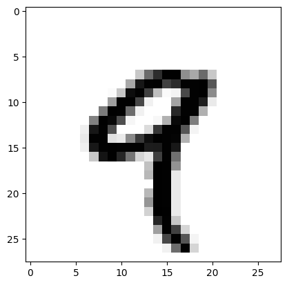

# 0. MNIST Dataset

# 1. Preparation


```python
# Import module
import keras
keras.__version__
```


    '2.12.0'


# 2. Preparation


```python
# Load a dataset
from keras.datasets import mnist  # 'mnist' dataset: Handwriting dataset

# Check the dataset
mnist.load_data()
```


    ((array([[[0, 0, 0, ..., 0, 0, 0],
              [0, 0, 0, ..., 0, 0, 0],
              [0, 0, 0, ..., 0, 0, 0],
              ...,
              [0, 0, 0, ..., 0, 0, 0],
              [0, 0, 0, ..., 0, 0, 0],
              [0, 0, 0, ..., 0, 0, 0]],
      
             [[0, 0, 0, ..., 0, 0, 0],
              [0, 0, 0, ..., 0, 0, 0],
              [0, 0, 0, ..., 0, 0, 0],
              ...,
              [0, 0, 0, ..., 0, 0, 0],
              [0, 0, 0, ..., 0, 0, 0],
              [0, 0, 0, ..., 0, 0, 0]],
      
             [[0, 0, 0, ..., 0, 0, 0],
              [0, 0, 0, ..., 0, 0, 0],
              [0, 0, 0, ..., 0, 0, 0],
              ...,
              [0, 0, 0, ..., 0, 0, 0],
              [0, 0, 0, ..., 0, 0, 0],
              [0, 0, 0, ..., 0, 0, 0]],
      
             ...,
      
             [[0, 0, 0, ..., 0, 0, 0],
              [0, 0, 0, ..., 0, 0, 0],
              [0, 0, 0, ..., 0, 0, 0],
              ...,
              [0, 0, 0, ..., 0, 0, 0],
              [0, 0, 0, ..., 0, 0, 0],
              [0, 0, 0, ..., 0, 0, 0]],
      
             [[0, 0, 0, ..., 0, 0, 0],
              [0, 0, 0, ..., 0, 0, 0],
              [0, 0, 0, ..., 0, 0, 0],
              ...,
              [0, 0, 0, ..., 0, 0, 0],
              [0, 0, 0, ..., 0, 0, 0],
              [0, 0, 0, ..., 0, 0, 0]],
      
             [[0, 0, 0, ..., 0, 0, 0],
              [0, 0, 0, ..., 0, 0, 0],
              [0, 0, 0, ..., 0, 0, 0],
              ...,
              [0, 0, 0, ..., 0, 0, 0],
              [0, 0, 0, ..., 0, 0, 0],
              [0, 0, 0, ..., 0, 0, 0]]], dtype=uint8),
      array([5, 0, 4, ..., 5, 6, 8], dtype=uint8)),
     (array([[[0, 0, 0, ..., 0, 0, 0],
              [0, 0, 0, ..., 0, 0, 0],
              [0, 0, 0, ..., 0, 0, 0],
              ...,
              [0, 0, 0, ..., 0, 0, 0],
              [0, 0, 0, ..., 0, 0, 0],
              [0, 0, 0, ..., 0, 0, 0]],
      
             [[0, 0, 0, ..., 0, 0, 0],
              [0, 0, 0, ..., 0, 0, 0],
              [0, 0, 0, ..., 0, 0, 0],
              ...,
              [0, 0, 0, ..., 0, 0, 0],
              [0, 0, 0, ..., 0, 0, 0],
              [0, 0, 0, ..., 0, 0, 0]],
      
             [[0, 0, 0, ..., 0, 0, 0],
              [0, 0, 0, ..., 0, 0, 0],
              [0, 0, 0, ..., 0, 0, 0],
              ...,
              [0, 0, 0, ..., 0, 0, 0],
              [0, 0, 0, ..., 0, 0, 0],
              [0, 0, 0, ..., 0, 0, 0]],
      
             ...,
      
             [[0, 0, 0, ..., 0, 0, 0],
              [0, 0, 0, ..., 0, 0, 0],
              [0, 0, 0, ..., 0, 0, 0],
              ...,
              [0, 0, 0, ..., 0, 0, 0],
              [0, 0, 0, ..., 0, 0, 0],
              [0, 0, 0, ..., 0, 0, 0]],
      
             [[0, 0, 0, ..., 0, 0, 0],
              [0, 0, 0, ..., 0, 0, 0],
              [0, 0, 0, ..., 0, 0, 0],
              ...,
              [0, 0, 0, ..., 0, 0, 0],
              [0, 0, 0, ..., 0, 0, 0],
              [0, 0, 0, ..., 0, 0, 0]],
      
             [[0, 0, 0, ..., 0, 0, 0],
              [0, 0, 0, ..., 0, 0, 0],
              [0, 0, 0, ..., 0, 0, 0],
              ...,
              [0, 0, 0, ..., 0, 0, 0],
              [0, 0, 0, ..., 0, 0, 0],
              [0, 0, 0, ..., 0, 0, 0]]], dtype=uint8),
      array([7, 2, 1, ..., 4, 5, 6], dtype=uint8)))


```python
# Define Train and Test Data
(train_images, train_labels), (test_images, test_labels) = mnist.load_data()
```

# 3. Check Data

## 3.1. Check Dataset


```python
# Check a shape of train images
train_images.shape

# Result: (60000, 28, 28) 
#        - Total number of images: 60000
#        - Size: 28px * 28px
```


    (60000, 28, 28)


```python
# Check a shape of labels
train_labels.shape
```


    (60000,)


```python
# Check a shape of test images
test_images.shape
```


    (10000, 28, 28)


## 3.2. Check Data


```python
# Import modules
import matplotlib.pyplot as plt

digit = train_images[4]
print(digit)
```

    [[  0   0   0   0   0   0   0   0   0   0   0   0   0   0   0   0   0   0
        0   0   0   0   0   0   0   0   0   0]
     [  0   0   0   0   0   0   0   0   0   0   0   0   0   0   0   0   0   0
        0   0   0   0   0   0   0   0   0   0]
     [  0   0   0   0   0   0   0   0   0   0   0   0   0   0   0   0   0   0
        0   0   0   0   0   0   0   0   0   0]
     [  0   0   0   0   0   0   0   0   0   0   0   0   0   0   0   0   0   0
        0   0   0   0   0   0   0   0   0   0]
     [  0   0   0   0   0   0   0   0   0   0   0   0   0   0   0   0   0   0
        0   0   0   0   0   0   0   0   0   0]
     [  0   0   0   0   0   0   0   0   0   0   0   0   0   0   0   0   0   0
        0   0   0   0   0   0   0   0   0   0]
     [  0   0   0   0   0   0   0   0   0   0   0   0   0   0   0   0   0   0
        0   0   0   0   0   0   0   0   0   0]
     [  0   0   0   0   0   0   0   0   0   0   0   0  55 148 210 253 253 113
       87 148  55   0   0   0   0   0   0   0]
     [  0   0   0   0   0   0   0   0   0   0   0  87 232 252 253 189 210 252
      252 253 168   0   0   0   0   0   0   0]
     [  0   0   0   0   0   0   0   0   0   4  57 242 252 190  65   5  12 182
      252 253 116   0   0   0   0   0   0   0]
     [  0   0   0   0   0   0   0   0   0  96 252 252 183  14   0   0  92 252
      252 225  21   0   0   0   0   0   0   0]
     [  0   0   0   0   0   0   0   0 132 253 252 146  14   0   0   0 215 252
      252  79   0   0   0   0   0   0   0   0]
     [  0   0   0   0   0   0   0 126 253 247 176   9   0   0   8  78 245 253
      129   0   0   0   0   0   0   0   0   0]
     [  0   0   0   0   0   0  16 232 252 176   0   0   0  36 201 252 252 169
       11   0   0   0   0   0   0   0   0   0]
     [  0   0   0   0   0   0  22 252 252  30  22 119 197 241 253 252 251  77
        0   0   0   0   0   0   0   0   0   0]
     [  0   0   0   0   0   0  16 231 252 253 252 252 252 226 227 252 231   0
        0   0   0   0   0   0   0   0   0   0]
     [  0   0   0   0   0   0   0  55 235 253 217 138  42  24 192 252 143   0
        0   0   0   0   0   0   0   0   0   0]
     [  0   0   0   0   0   0   0   0   0   0   0   0   0  62 255 253 109   0
        0   0   0   0   0   0   0   0   0   0]
     [  0   0   0   0   0   0   0   0   0   0   0   0   0  71 253 252  21   0
        0   0   0   0   0   0   0   0   0   0]
     [  0   0   0   0   0   0   0   0   0   0   0   0   0   0 253 252  21   0
        0   0   0   0   0   0   0   0   0   0]
     [  0   0   0   0   0   0   0   0   0   0   0   0   0  71 253 252  21   0
        0   0   0   0   0   0   0   0   0   0]
     [  0   0   0   0   0   0   0   0   0   0   0   0   0 106 253 252  21   0
        0   0   0   0   0   0   0   0   0   0]
     [  0   0   0   0   0   0   0   0   0   0   0   0   0  45 255 253  21   0
        0   0   0   0   0   0   0   0   0   0]
     [  0   0   0   0   0   0   0   0   0   0   0   0   0   0 218 252  56   0
        0   0   0   0   0   0   0   0   0   0]
     [  0   0   0   0   0   0   0   0   0   0   0   0   0   0  96 252 189  42
        0   0   0   0   0   0   0   0   0   0]
     [  0   0   0   0   0   0   0   0   0   0   0   0   0   0  14 184 252 170
       11   0   0   0   0   0   0   0   0   0]
     [  0   0   0   0   0   0   0   0   0   0   0   0   0   0   0  14 147 252
       42   0   0   0   0   0   0   0   0   0]
     [  0   0   0   0   0   0   0   0   0   0   0   0   0   0   0   0   0   0
        0   0   0   0   0   0   0   0   0   0]]


```python
# Check a dimension
print(train_images.ndim)
```

    3


```python
# Show an image
plt.imshow(digit, cmap=plt.cm.binary)
```


    <matplotlib.image.AxesImage at 0x7f21b9a963e0>




# 4. Train the Dataset


```python
# Import modules
from keras import models
from keras import layers
```

## 4.1. Create a Neural Network


```python
# Make a model using ReLU and Softmax
network = models.Sequential()

# Input Layer
network.add(layers.Dense(512, # Number of images in Input Layer
                         activation='relu',input_shape=(28*28,))) 

# Output Layer
network.add(layers.Dense(10,   # Number of images in Output Layer -> (0 - 9)
                         activation = 'softmax'))   

# Complie
network.compile(optimizer='rmsprop',
                loss='categorical_crossentropy',
                metrics=['accuracy'])
```

## 4.2. Prepare Data


```python
# Prepare Data
train_images = train_images.reshape((60000, 28*28))
train_images = train_images.astype('float32') / 255

test_images = test_images.reshape((10000, 28*28))
test_images = test_images.astype('float32') / 255
```


```python
# Transfer Label Data to Categorical Data
from tensorflow.keras.utils import to_categorical

train_labels = to_categorical(train_labels)
test_labels = to_categorical(test_labels)
```

## 4.3. Fit the Nueral Network


```python
network.fit(train_images,
            train_labels,
            epochs = 5,         # epochs: Number of fit cycle 
            batch_size = 128)   # batch_size: Number of training
```

    Epoch 1/5
    120/120 [==============================] - 4s 31ms/step - loss: 0.0218 - accuracy: 0.9944
    Epoch 2/5
    120/120 [==============================] - 3s 24ms/step - loss: 0.0177 - accuracy: 0.9961
    Epoch 3/5
    120/120 [==============================] - 4s 31ms/step - loss: 0.0150 - accuracy: 0.9967
    Epoch 4/5
    120/120 [==============================] - 6s 47ms/step - loss: 0.0125 - accuracy: 0.9978
    Epoch 5/5
    120/120 [==============================] - 3s 24ms/step - loss: 0.0102 - accuracy: 0.9984


    <keras.callbacks.History at 0x7f21b29eb9a0>


```python
network.fit(train_images,
            train_labels,
            epochs = 5,         # epochs: Number of fit cycle 
            batch_size = 60)   # batch_size: Number of training
```

    Epoch 1/5
    1000/1000 [==============================] - 10s 10ms/step - loss: 0.0227 - accuracy: 0.9926
    Epoch 2/5
    1000/1000 [==============================] - 10s 10ms/step - loss: 0.0171 - accuracy: 0.9948
    Epoch 3/5
    1000/1000 [==============================] - 10s 10ms/step - loss: 0.0134 - accuracy: 0.9957
    Epoch 4/5
    1000/1000 [==============================] - 9s 9ms/step - loss: 0.0105 - accuracy: 0.9970
    Epoch 5/5
    1000/1000 [==============================] - 10s 10ms/step - loss: 0.0081 - accuracy: 0.9976


    <keras.callbacks.History at 0x7f21b29f7580>


```python
network.fit(train_images,
            train_labels,
            epochs = 5,         # epochs: Number of fit cycle 
            batch_size = 500)   # batch_size: Number of training
```

    Epoch 1/5
    120/120 [==============================] - 3s 25ms/step - loss: 0.0025 - accuracy: 0.9996
    Epoch 2/5
    120/120 [==============================] - 4s 32ms/step - loss: 0.0012 - accuracy: 0.9999
    Epoch 3/5
    120/120 [==============================] - 6s 53ms/step - loss: 9.1755e-04 - accuracy: 0.9999
    Epoch 4/5
    120/120 [==============================] - 3s 25ms/step - loss: 6.9982e-04 - accuracy: 1.0000
    Epoch 5/5
    120/120 [==============================] - 3s 25ms/step - loss: 6.2259e-04 - accuracy: 1.0000


    <keras.callbacks.History at 0x7f21b2a12bc0>


# 5. Test


```python
test_loss, test_acc = network.evaluate(test_images, test_labels)
print('test acc:', test_acc)
```

    313/313 [==============================] - 1s 4ms/step - loss: 0.0646 - accuracy: 0.9836
    test acc: 0.9836000204086304

