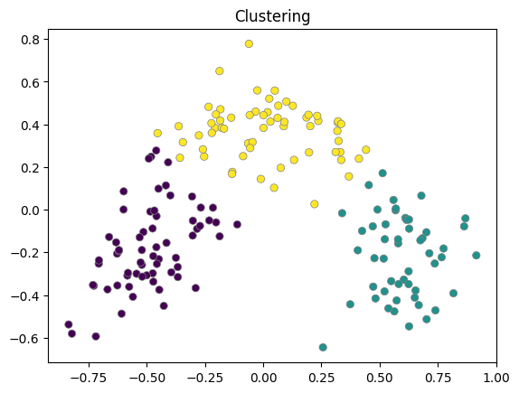
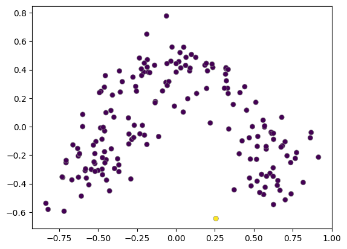
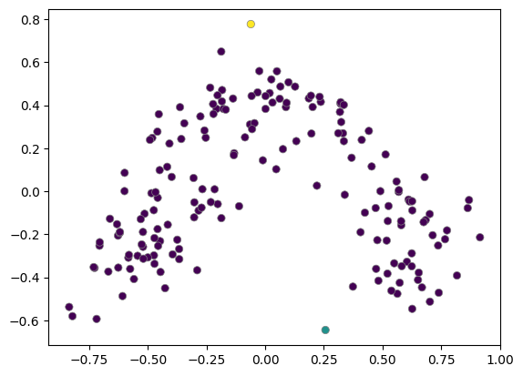
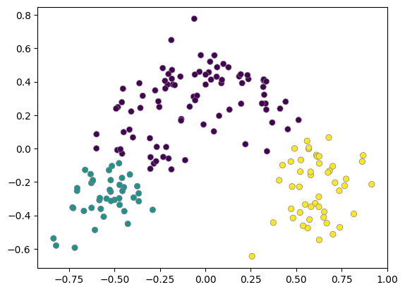
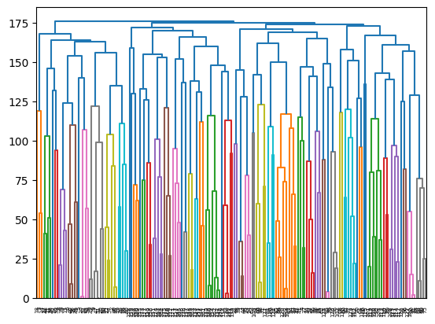

# 1. Preparation

## 1.1. Import Modules


```python
import numpy as np
import pandas as pd
import sklearn
import matplotlib.pyplot as plt
```


```python
# Ignore light warnings
import warnings
warnings.filterwarnings('ignore')
```


```python
# Import OS 
import os
from os.path import join
```

## 1.2. Get Dataset: Wine Dataset


```python
# Import Wine Dataset
from sklearn.datasets import load_wine
```


```python
# Load Data on memory
wine = load_wine()
```

## 1.3. Check the Dataset


```python
# Overview
print(wine.DESCR)
```

    .. _wine_dataset:
    
    Wine recognition dataset
    ------------------------
    
    **Data Set Characteristics:**
    
        :Number of Instances: 178
        :Number of Attributes: 13 numeric, predictive attributes and the class
        :Attribute Information:
     		- Alcohol
     		- Malic acid
     		- Ash
    		- Alcalinity of ash  
     		- Magnesium
    		- Total phenols
     		- Flavanoids
     		- Nonflavanoid phenols
     		- Proanthocyanins
    		- Color intensity
     		- Hue
     		- OD280/OD315 of diluted wines
     		- Proline
    
        - class:
                - class_0
                - class_1
                - class_2
    		
        :Summary Statistics:
        
        ============================= ==== ===== ======= =====
                                       Min   Max   Mean     SD
        ============================= ==== ===== ======= =====
        Alcohol:                      11.0  14.8    13.0   0.8
        Malic Acid:                   0.74  5.80    2.34  1.12
        Ash:                          1.36  3.23    2.36  0.27
        Alcalinity of Ash:            10.6  30.0    19.5   3.3
        Magnesium:                    70.0 162.0    99.7  14.3
        Total Phenols:                0.98  3.88    2.29  0.63
        Flavanoids:                   0.34  5.08    2.03  1.00
        Nonflavanoid Phenols:         0.13  0.66    0.36  0.12
        Proanthocyanins:              0.41  3.58    1.59  0.57
        Colour Intensity:              1.3  13.0     5.1   2.3
        Hue:                          0.48  1.71    0.96  0.23
        OD280/OD315 of diluted wines: 1.27  4.00    2.61  0.71
        Proline:                       278  1680     746   315
        ============================= ==== ===== ======= =====
    
        :Missing Attribute Values: None
        :Class Distribution: class_0 (59), class_1 (71), class_2 (48)
        :Creator: R.A. Fisher
        :Donor: Michael Marshall (MARSHALL%PLU@io.arc.nasa.gov)
        :Date: July, 1988
    
    This is a copy of UCI ML Wine recognition datasets.
    https://archive.ics.uci.edu/ml/machine-learning-databases/wine/wine.data
    
    The data is the results of a chemical analysis of wines grown in the same
    region in Italy by three different cultivators. There are thirteen different
    measurements taken for different constituents found in the three types of
    wine.
    
    Original Owners: 
    
    Forina, M. et al, PARVUS - 
    An Extendible Package for Data Exploration, Classification and Correlation. 
    Institute of Pharmaceutical and Food Analysis and Technologies,
    Via Brigata Salerno, 16147 Genoa, Italy.
    
    Citation:
    
    Lichman, M. (2013). UCI Machine Learning Repository
    [https://archive.ics.uci.edu/ml]. Irvine, CA: University of California,
    School of Information and Computer Science. 
    
    .. topic:: References
    
      (1) S. Aeberhard, D. Coomans and O. de Vel, 
      Comparison of Classifiers in High Dimensional Settings, 
      Tech. Rep. no. 92-02, (1992), Dept. of Computer Science and Dept. of  
      Mathematics and Statistics, James Cook University of North Queensland. 
      (Also submitted to Technometrics). 
    
      The data was used with many others for comparing various 
      classifiers. The classes are separable, though only RDA 
      has achieved 100% correct classification. 
      (RDA : 100%, QDA 99.4%, LDA 98.9%, 1NN 96.1% (z-transformed data)) 
      (All results using the leave-one-out technique) 
    
      (2) S. Aeberhard, D. Coomans and O. de Vel, 
      "THE CLASSIFICATION PERFORMANCE OF RDA" 
      Tech. Rep. no. 92-01, (1992), Dept. of Computer Science and Dept. of 
      Mathematics and Statistics, James Cook University of North Queensland. 
      (Also submitted to Journal of Chemometrics).


​    

## 1.3. Make a DataFrame


```python
# Get each items
data = wine.data
label = wine.target
columns = wine.feature_names
```


```python
# Make a DataFrame
data = pd.DataFrame(data, columns = columns)
```


```python
# Check the DataFrame
data.head()
```


  <div id="df-7cdecf0c-2249-4cc2-859d-66368ebcf74c">
    <div class="colab-df-container">
      <div>
<style scoped>
    .dataframe tbody tr th:only-of-type {
        vertical-align: middle;
    }

    .dataframe tbody tr th {
        vertical-align: top;
    }
    
    .dataframe thead th {
        text-align: right;
    }
</style>
<table border="1" class="dataframe">
  <thead>
    <tr style="text-align: right;">
      <th></th>
      <th>alcohol</th>
      <th>malic_acid</th>
      <th>ash</th>
      <th>alcalinity_of_ash</th>
      <th>magnesium</th>
      <th>total_phenols</th>
      <th>flavanoids</th>
      <th>nonflavanoid_phenols</th>
      <th>proanthocyanins</th>
      <th>color_intensity</th>
      <th>hue</th>
      <th>od280/od315_of_diluted_wines</th>
      <th>proline</th>
    </tr>
  </thead>
  <tbody>
    <tr>
      <th>0</th>
      <td>14.23</td>
      <td>1.71</td>
      <td>2.43</td>
      <td>15.6</td>
      <td>127.0</td>
      <td>2.80</td>
      <td>3.06</td>
      <td>0.28</td>
      <td>2.29</td>
      <td>5.64</td>
      <td>1.04</td>
      <td>3.92</td>
      <td>1065.0</td>
    </tr>
    <tr>
      <th>1</th>
      <td>13.20</td>
      <td>1.78</td>
      <td>2.14</td>
      <td>11.2</td>
      <td>100.0</td>
      <td>2.65</td>
      <td>2.76</td>
      <td>0.26</td>
      <td>1.28</td>
      <td>4.38</td>
      <td>1.05</td>
      <td>3.40</td>
      <td>1050.0</td>
    </tr>
    <tr>
      <th>2</th>
      <td>13.16</td>
      <td>2.36</td>
      <td>2.67</td>
      <td>18.6</td>
      <td>101.0</td>
      <td>2.80</td>
      <td>3.24</td>
      <td>0.30</td>
      <td>2.81</td>
      <td>5.68</td>
      <td>1.03</td>
      <td>3.17</td>
      <td>1185.0</td>
    </tr>
    <tr>
      <th>3</th>
      <td>14.37</td>
      <td>1.95</td>
      <td>2.50</td>
      <td>16.8</td>
      <td>113.0</td>
      <td>3.85</td>
      <td>3.49</td>
      <td>0.24</td>
      <td>2.18</td>
      <td>7.80</td>
      <td>0.86</td>
      <td>3.45</td>
      <td>1480.0</td>
    </tr>
    <tr>
      <th>4</th>
      <td>13.24</td>
      <td>2.59</td>
      <td>2.87</td>
      <td>21.0</td>
      <td>118.0</td>
      <td>2.80</td>
      <td>2.69</td>
      <td>0.39</td>
      <td>1.82</td>
      <td>4.32</td>
      <td>1.04</td>
      <td>2.93</td>
      <td>735.0</td>
    </tr>
  </tbody>
</table>
</div>
      <button class="colab-df-convert" onclick="convertToInteractive('df-7cdecf0c-2249-4cc2-859d-66368ebcf74c')"
              title="Convert this dataframe to an interactive table."
              style="display:none;">

  <svg xmlns="http://www.w3.org/2000/svg" height="24px"viewBox="0 0 24 24"
       width="24px">
    <path d="M0 0h24v24H0V0z" fill="none"/>
    <path d="M18.56 5.44l.94 2.06.94-2.06 2.06-.94-2.06-.94-.94-2.06-.94 2.06-2.06.94zm-11 1L8.5 8.5l.94-2.06 2.06-.94-2.06-.94L8.5 2.5l-.94 2.06-2.06.94zm10 10l.94 2.06.94-2.06 2.06-.94-2.06-.94-.94-2.06-.94 2.06-2.06.94z"/><path d="M17.41 7.96l-1.37-1.37c-.4-.4-.92-.59-1.43-.59-.52 0-1.04.2-1.43.59L10.3 9.45l-7.72 7.72c-.78.78-.78 2.05 0 2.83L4 21.41c.39.39.9.59 1.41.59.51 0 1.02-.2 1.41-.59l7.78-7.78 2.81-2.81c.8-.78.8-2.07 0-2.86zM5.41 20L4 18.59l7.72-7.72 1.47 1.35L5.41 20z"/>
  </svg>
      </button>

  <style>
    .colab-df-container {
      display:flex;
      flex-wrap:wrap;
      gap: 12px;
    }

    .colab-df-convert {
      background-color: #E8F0FE;
      border: none;
      border-radius: 50%;
      cursor: pointer;
      display: none;
      fill: #1967D2;
      height: 32px;
      padding: 0 0 0 0;
      width: 32px;
    }
    
    .colab-df-convert:hover {
      background-color: #E2EBFA;
      box-shadow: 0px 1px 2px rgba(60, 64, 67, 0.3), 0px 1px 3px 1px rgba(60, 64, 67, 0.15);
      fill: #174EA6;
    }
    
    [theme=dark] .colab-df-convert {
      background-color: #3B4455;
      fill: #D2E3FC;
    }
    
    [theme=dark] .colab-df-convert:hover {
      background-color: #434B5C;
      box-shadow: 0px 1px 3px 1px rgba(0, 0, 0, 0.15);
      filter: drop-shadow(0px 1px 2px rgba(0, 0, 0, 0.3));
      fill: #FFFFFF;
    }
  </style>

      <script>
        const buttonEl =
          document.querySelector('#df-7cdecf0c-2249-4cc2-859d-66368ebcf74c button.colab-df-convert');
        buttonEl.style.display =
          google.colab.kernel.accessAllowed ? 'block' : 'none';
    
        async function convertToInteractive(key) {
          const element = document.querySelector('#df-7cdecf0c-2249-4cc2-859d-66368ebcf74c');
          const dataTable =
            await google.colab.kernel.invokeFunction('convertToInteractive',
                                                     [key], {});
          if (!dataTable) return;
    
          const docLinkHtml = 'Like what you see? Visit the ' +
            '<a target="_blank" href=https://colab.research.google.com/notebooks/data_table.ipynb>data table notebook</a>'
            + ' to learn more about interactive tables.';
          element.innerHTML = '';
          dataTable['output_type'] = 'display_data';
          await google.colab.output.renderOutput(dataTable, element);
          const docLink = document.createElement('div');
          docLink.innerHTML = docLinkHtml;
          element.appendChild(docLink);
        }
      </script>
    </div>
  </div>


# 2. Data Pre-Processing

## 2.1. Min-Max Scaling


```python
# If a size of data is small and dimensions are high, its density is small -> Need of clustering
```


```python
# Import module
from sklearn.preprocessing import MinMaxScaler
```


```python
# Load scaler on memory
scaler = MinMaxScaler()

# Fit Data
data = scaler.fit_transform(data)  # Result is in numpy.ndarray -> No 'head' 

# Check Data
data[:5] # Use data[:5] instead of 'data.head()'
```


    array([[0.84210526, 0.1916996 , 0.57219251, 0.25773196, 0.61956522,
            0.62758621, 0.57383966, 0.28301887, 0.59305994, 0.37201365,
            0.45528455, 0.97069597, 0.56134094],
           [0.57105263, 0.2055336 , 0.4171123 , 0.03092784, 0.32608696,
            0.57586207, 0.51054852, 0.24528302, 0.27444795, 0.26450512,
            0.46341463, 0.78021978, 0.55064194],
           [0.56052632, 0.3201581 , 0.70053476, 0.41237113, 0.33695652,
            0.62758621, 0.61181435, 0.32075472, 0.75709779, 0.37542662,
            0.44715447, 0.6959707 , 0.64693295],
           [0.87894737, 0.23913043, 0.60962567, 0.31958763, 0.4673913 ,
            0.98965517, 0.66455696, 0.20754717, 0.55835962, 0.55631399,
            0.30894309, 0.7985348 , 0.85734665],
           [0.58157895, 0.36561265, 0.80748663, 0.53608247, 0.52173913,
            0.62758621, 0.49578059, 0.49056604, 0.44479495, 0.25938567,
            0.45528455, 0.60805861, 0.32596291]])


## 2.2. PCA: Reduce Dimentions


```python
# Import module

from sklearn.decomposition import PCA
```


```python
# Load PCA on memory
pca = PCA(n_components = 2)  # 13-dimention -> 2-dimention

# Fit data
data = pca.fit_transform(data)

# Check data
data[:5]
```


    array([[-0.70633576, -0.25319275],
           [-0.4849768 , -0.00882289],
           [-0.52117227, -0.18918722],
           [-0.82164366, -0.58090551],
           [-0.20254638, -0.05946657]])


```python
# Check DataShape
data.shape
```


    (178, 2)


# 3. K-Means Clustering

## 3.1. Preparation


```python
# Import Module
from sklearn.cluster import KMeans
```


```python
# Load K-Means on memory
kmeans = KMeans(n_clusters=3) # Number of clusters
```

## 3.2. K-Means Clustering


```python
# Fit data: Data -> 3 clusters
kmeans.fit(data)
```


<style>#sk-container-id-1 {color: black;background-color: white;}#sk-container-id-1 pre{padding: 0;}#sk-container-id-1 div.sk-toggleable {background-color: white;}#sk-container-id-1 label.sk-toggleable__label {cursor: pointer;display: block;width: 100%;margin-bottom: 0;padding: 0.3em;box-sizing: border-box;text-align: center;}#sk-container-id-1 label.sk-toggleable__label-arrow:before {content: "▸";float: left;margin-right: 0.25em;color: #696969;}#sk-container-id-1 label.sk-toggleable__label-arrow:hover:before {color: black;}#sk-container-id-1 div.sk-estimator:hover label.sk-toggleable__label-arrow:before {color: black;}#sk-container-id-1 div.sk-toggleable__content {max-height: 0;max-width: 0;overflow: hidden;text-align: left;background-color: #f0f8ff;}#sk-container-id-1 div.sk-toggleable__content pre {margin: 0.2em;color: black;border-radius: 0.25em;background-color: #f0f8ff;}#sk-container-id-1 input.sk-toggleable__control:checked~div.sk-toggleable__content {max-height: 200px;max-width: 100%;overflow: auto;}#sk-container-id-1 input.sk-toggleable__control:checked~label.sk-toggleable__label-arrow:before {content: "▾";}#sk-container-id-1 div.sk-estimator input.sk-toggleable__control:checked~label.sk-toggleable__label {background-color: #d4ebff;}#sk-container-id-1 div.sk-label input.sk-toggleable__control:checked~label.sk-toggleable__label {background-color: #d4ebff;}#sk-container-id-1 input.sk-hidden--visually {border: 0;clip: rect(1px 1px 1px 1px);clip: rect(1px, 1px, 1px, 1px);height: 1px;margin: -1px;overflow: hidden;padding: 0;position: absolute;width: 1px;}#sk-container-id-1 div.sk-estimator {font-family: monospace;background-color: #f0f8ff;border: 1px dotted black;border-radius: 0.25em;box-sizing: border-box;margin-bottom: 0.5em;}#sk-container-id-1 div.sk-estimator:hover {background-color: #d4ebff;}#sk-container-id-1 div.sk-parallel-item::after {content: "";width: 100%;border-bottom: 1px solid gray;flex-grow: 1;}#sk-container-id-1 div.sk-label:hover label.sk-toggleable__label {background-color: #d4ebff;}#sk-container-id-1 div.sk-serial::before {content: "";position: absolute;border-left: 1px solid gray;box-sizing: border-box;top: 0;bottom: 0;left: 50%;z-index: 0;}#sk-container-id-1 div.sk-serial {display: flex;flex-direction: column;align-items: center;background-color: white;padding-right: 0.2em;padding-left: 0.2em;position: relative;}#sk-container-id-1 div.sk-item {position: relative;z-index: 1;}#sk-container-id-1 div.sk-parallel {display: flex;align-items: stretch;justify-content: center;background-color: white;position: relative;}#sk-container-id-1 div.sk-item::before, #sk-container-id-1 div.sk-parallel-item::before {content: "";position: absolute;border-left: 1px solid gray;box-sizing: border-box;top: 0;bottom: 0;left: 50%;z-index: -1;}#sk-container-id-1 div.sk-parallel-item {display: flex;flex-direction: column;z-index: 1;position: relative;background-color: white;}#sk-container-id-1 div.sk-parallel-item:first-child::after {align-self: flex-end;width: 50%;}#sk-container-id-1 div.sk-parallel-item:last-child::after {align-self: flex-start;width: 50%;}#sk-container-id-1 div.sk-parallel-item:only-child::after {width: 0;}#sk-container-id-1 div.sk-dashed-wrapped {border: 1px dashed gray;margin: 0 0.4em 0.5em 0.4em;box-sizing: border-box;padding-bottom: 0.4em;background-color: white;}#sk-container-id-1 div.sk-label label {font-family: monospace;font-weight: bold;display: inline-block;line-height: 1.2em;}#sk-container-id-1 div.sk-label-container {text-align: center;}#sk-container-id-1 div.sk-container {/* jupyter's `normalize.less` sets `[hidden] { display: none; }` but bootstrap.min.css set `[hidden] { display: none !important; }` so we also need the `!important` here to be able to override the default hidden behavior on the sphinx rendered scikit-learn.org. See: https://github.com/scikit-learn/scikit-learn/issues/21755 */display: inline-block !important;position: relative;}#sk-container-id-1 div.sk-text-repr-fallback {display: none;}</style><div id="sk-container-id-1" class="sk-top-container"><div class="sk-text-repr-fallback"><pre>KMeans(n_clusters=3)</pre><b>In a Jupyter environment, please rerun this cell to show the HTML representation or trust the notebook. <br />On GitHub, the HTML representation is unable to render, please try loading this page with nbviewer.org.</b></div><div class="sk-container" hidden><div class="sk-item"><div class="sk-estimator sk-toggleable"><input class="sk-toggleable__control sk-hidden--visually" id="sk-estimator-id-1" type="checkbox" checked><label for="sk-estimator-id-1" class="sk-toggleable__label sk-toggleable__label-arrow">KMeans</label><div class="sk-toggleable__content"><pre>KMeans(n_clusters=3)</pre></div></div></div></div></div>


```python
# Clustering
cluster = kmeans.predict(data)

# Check data
print(cluster) # Result will show labled data clusters
```

    [0 0 0 0 0 0 0 0 0 0 0 0 0 0 0 0 0 0 0 0 0 0 0 0 0 0 0 0 0 0 0 0 0 0 0 0 0
     0 0 0 0 0 0 0 0 0 0 0 0 0 0 0 0 0 0 0 0 0 0 2 2 1 2 2 2 2 0 2 2 2 2 0 2 0
     0 2 2 2 2 2 2 2 2 1 2 2 2 2 2 2 2 2 2 2 2 0 2 2 0 2 2 2 2 2 2 2 2 2 2 2 2
     2 2 2 2 2 2 2 1 2 2 2 2 2 2 2 2 2 2 2 1 1 1 1 1 1 1 1 1 1 1 1 1 1 1 1 1 1
     1 1 1 1 1 1 1 1 1 1 1 1 1 1 1 1 1 1 1 1 1 1 1 1 1 1 1 1 1 1]


## 3.4. Visualization


```python
plt.scatter(data[:, 0],  # Bring all data, but 0 column
            data[:, 1],  # Bring all data, but 1st column
            c=cluster,   # Colors depending on clusters
            linewidth=0.5,
            edgecolor='grey')

plt.title('Clustering')
```


    Text(0.5, 1.0, 'Clustering')




# 4. Hierachical Clustering

## 4.1. Preparation


```python
# Import module
from scipy.cluster.hierarchy import single
from sklearn.cluster import AgglomerativeClustering
```


```python
# Load clustering on memory
single_clustering = AgglomerativeClustering(linkage='single') 
```

## 4.2. Single Clustering


```python
# Fit Data
single_clustering.fit(data)

# Single Clustering
single_cluster = single_clustering.labels_

# Check data
single_cluster
```


    array([0, 0, 0, 0, 0, 0, 0, 0, 0, 0, 0, 0, 0, 0, 0, 0, 0, 0, 0, 0, 0, 0,
           0, 0, 0, 0, 0, 0, 0, 0, 0, 0, 0, 0, 0, 0, 0, 0, 0, 0, 0, 0, 0, 0,
           0, 0, 0, 0, 0, 0, 0, 0, 0, 0, 0, 0, 0, 0, 0, 0, 0, 0, 0, 0, 0, 0,
           0, 0, 0, 0, 0, 0, 0, 0, 0, 0, 0, 0, 0, 0, 0, 0, 0, 0, 0, 0, 0, 0,
           0, 0, 0, 0, 0, 0, 0, 0, 0, 0, 0, 0, 0, 0, 0, 0, 0, 0, 0, 0, 0, 0,
           0, 0, 0, 0, 0, 0, 0, 0, 0, 0, 0, 0, 0, 0, 0, 0, 0, 0, 0, 0, 0, 0,
           0, 0, 0, 0, 0, 0, 0, 0, 0, 0, 0, 0, 0, 0, 0, 0, 0, 0, 0, 0, 0, 0,
           0, 0, 0, 0, 1, 0, 0, 0, 0, 0, 0, 0, 0, 0, 0, 0, 0, 0, 0, 0, 0, 0,
           0, 0])


## 4.3. Visualization


```python
# Scatter Plot
plt.scatter(data[:, 0],
            data[:, 1],
            c=single_cluster,
            linewidth=0.5,
            edgecolor='grey')
```


    <matplotlib.collections.PathCollection at 0x7fa60be086d0>




## 4.4. Re-clustering


```python
# Load clustering on memory
single_clustering = AgglomerativeClustering(n_clusters = 3,      # The data above only shows 0 and 1 
                                            linkage='single')    #   -> Need to be diversification
```


```python
# Fit Data
single_clustering.fit(data)

# Single Clustering
single_cluster = single_clustering.labels_

# Check data
single_cluster
```


    array([0, 0, 0, 0, 0, 0, 0, 0, 0, 0, 0, 0, 0, 0, 0, 0, 0, 0, 0, 0, 0, 0,
           0, 0, 0, 0, 0, 0, 0, 0, 0, 0, 0, 0, 0, 0, 0, 0, 0, 0, 0, 0, 0, 0,
           0, 0, 0, 0, 0, 0, 0, 0, 0, 0, 0, 0, 0, 0, 0, 0, 0, 0, 0, 0, 0, 0,
           0, 0, 0, 0, 0, 0, 0, 0, 0, 0, 0, 0, 0, 0, 0, 0, 0, 0, 0, 0, 0, 0,
           0, 0, 0, 0, 0, 0, 0, 0, 0, 0, 0, 0, 0, 0, 0, 0, 0, 0, 0, 0, 0, 0,
           0, 0, 0, 0, 0, 2, 0, 0, 0, 0, 0, 0, 0, 0, 0, 0, 0, 0, 0, 0, 0, 0,
           0, 0, 0, 0, 0, 0, 0, 0, 0, 0, 0, 0, 0, 0, 0, 0, 0, 0, 0, 0, 0, 0,
           0, 0, 0, 0, 1, 0, 0, 0, 0, 0, 0, 0, 0, 0, 0, 0, 0, 0, 0, 0, 0, 0,
           0, 0])


```python
# Scatter Plot
plt.scatter(data[:, 0],
            data[:, 1],
            c=single_cluster,
            linewidth=0.5,
            edgecolor='grey')


# The result shows increasing a number of clusters is not a solution -> Try 'Complete Clustering'
```


    <matplotlib.collections.PathCollection at 0x7fa60be94580>




   


## 4.5. Complete Clustering


```python
# Load on memory
complete_clustering = AgglomerativeClustering(n_clusters=3,
                                              linkage='complete')  # Complete Clustering

# Fit Data
complete_clustering.fit(data)
```


<style>#sk-container-id-2 {color: black;background-color: white;}#sk-container-id-2 pre{padding: 0;}#sk-container-id-2 div.sk-toggleable {background-color: white;}#sk-container-id-2 label.sk-toggleable__label {cursor: pointer;display: block;width: 100%;margin-bottom: 0;padding: 0.3em;box-sizing: border-box;text-align: center;}#sk-container-id-2 label.sk-toggleable__label-arrow:before {content: "▸";float: left;margin-right: 0.25em;color: #696969;}#sk-container-id-2 label.sk-toggleable__label-arrow:hover:before {color: black;}#sk-container-id-2 div.sk-estimator:hover label.sk-toggleable__label-arrow:before {color: black;}#sk-container-id-2 div.sk-toggleable__content {max-height: 0;max-width: 0;overflow: hidden;text-align: left;background-color: #f0f8ff;}#sk-container-id-2 div.sk-toggleable__content pre {margin: 0.2em;color: black;border-radius: 0.25em;background-color: #f0f8ff;}#sk-container-id-2 input.sk-toggleable__control:checked~div.sk-toggleable__content {max-height: 200px;max-width: 100%;overflow: auto;}#sk-container-id-2 input.sk-toggleable__control:checked~label.sk-toggleable__label-arrow:before {content: "▾";}#sk-container-id-2 div.sk-estimator input.sk-toggleable__control:checked~label.sk-toggleable__label {background-color: #d4ebff;}#sk-container-id-2 div.sk-label input.sk-toggleable__control:checked~label.sk-toggleable__label {background-color: #d4ebff;}#sk-container-id-2 input.sk-hidden--visually {border: 0;clip: rect(1px 1px 1px 1px);clip: rect(1px, 1px, 1px, 1px);height: 1px;margin: -1px;overflow: hidden;padding: 0;position: absolute;width: 1px;}#sk-container-id-2 div.sk-estimator {font-family: monospace;background-color: #f0f8ff;border: 1px dotted black;border-radius: 0.25em;box-sizing: border-box;margin-bottom: 0.5em;}#sk-container-id-2 div.sk-estimator:hover {background-color: #d4ebff;}#sk-container-id-2 div.sk-parallel-item::after {content: "";width: 100%;border-bottom: 1px solid gray;flex-grow: 1;}#sk-container-id-2 div.sk-label:hover label.sk-toggleable__label {background-color: #d4ebff;}#sk-container-id-2 div.sk-serial::before {content: "";position: absolute;border-left: 1px solid gray;box-sizing: border-box;top: 0;bottom: 0;left: 50%;z-index: 0;}#sk-container-id-2 div.sk-serial {display: flex;flex-direction: column;align-items: center;background-color: white;padding-right: 0.2em;padding-left: 0.2em;position: relative;}#sk-container-id-2 div.sk-item {position: relative;z-index: 1;}#sk-container-id-2 div.sk-parallel {display: flex;align-items: stretch;justify-content: center;background-color: white;position: relative;}#sk-container-id-2 div.sk-item::before, #sk-container-id-2 div.sk-parallel-item::before {content: "";position: absolute;border-left: 1px solid gray;box-sizing: border-box;top: 0;bottom: 0;left: 50%;z-index: -1;}#sk-container-id-2 div.sk-parallel-item {display: flex;flex-direction: column;z-index: 1;position: relative;background-color: white;}#sk-container-id-2 div.sk-parallel-item:first-child::after {align-self: flex-end;width: 50%;}#sk-container-id-2 div.sk-parallel-item:last-child::after {align-self: flex-start;width: 50%;}#sk-container-id-2 div.sk-parallel-item:only-child::after {width: 0;}#sk-container-id-2 div.sk-dashed-wrapped {border: 1px dashed gray;margin: 0 0.4em 0.5em 0.4em;box-sizing: border-box;padding-bottom: 0.4em;background-color: white;}#sk-container-id-2 div.sk-label label {font-family: monospace;font-weight: bold;display: inline-block;line-height: 1.2em;}#sk-container-id-2 div.sk-label-container {text-align: center;}#sk-container-id-2 div.sk-container {/* jupyter's `normalize.less` sets `[hidden] { display: none; }` but bootstrap.min.css set `[hidden] { display: none !important; }` so we also need the `!important` here to be able to override the default hidden behavior on the sphinx rendered scikit-learn.org. See: https://github.com/scikit-learn/scikit-learn/issues/21755 */display: inline-block !important;position: relative;}#sk-container-id-2 div.sk-text-repr-fallback {display: none;}</style><div id="sk-container-id-2" class="sk-top-container"><div class="sk-text-repr-fallback"><pre>AgglomerativeClustering(linkage=&#x27;complete&#x27;, n_clusters=3)</pre><b>In a Jupyter environment, please rerun this cell to show the HTML representation or trust the notebook. <br />On GitHub, the HTML representation is unable to render, please try loading this page with nbviewer.org.</b></div><div class="sk-container" hidden><div class="sk-item"><div class="sk-estimator sk-toggleable"><input class="sk-toggleable__control sk-hidden--visually" id="sk-estimator-id-2" type="checkbox" checked><label for="sk-estimator-id-2" class="sk-toggleable__label sk-toggleable__label-arrow">AgglomerativeClustering</label><div class="sk-toggleable__content"><pre>AgglomerativeClustering(linkage=&#x27;complete&#x27;, n_clusters=3)</pre></div></div></div></div></div>


```python
# Labelling
complete_cluster = complete_clustering.labels_

# Check Data
complete_cluster
```


    array([1, 0, 1, 1, 0, 1, 1, 1, 1, 1, 1, 1, 1, 1, 1, 1, 1, 1, 1, 1, 1, 0,
           0, 0, 0, 0, 1, 0, 1, 1, 1, 1, 0, 1, 0, 0, 0, 0, 0, 1, 1, 0, 1, 0,
           0, 1, 1, 1, 1, 1, 1, 1, 1, 1, 1, 1, 1, 1, 1, 0, 0, 0, 0, 0, 0, 0,
           0, 0, 0, 0, 0, 0, 0, 0, 0, 0, 0, 0, 0, 0, 0, 0, 0, 2, 0, 0, 0, 0,
           0, 0, 0, 0, 0, 0, 0, 0, 0, 0, 0, 0, 0, 0, 0, 0, 0, 0, 0, 0, 0, 0,
           0, 0, 0, 0, 0, 0, 0, 0, 0, 0, 0, 0, 0, 0, 0, 0, 0, 0, 0, 0, 0, 2,
           2, 2, 2, 2, 2, 2, 2, 2, 2, 2, 2, 2, 2, 2, 2, 2, 2, 2, 2, 2, 2, 2,
           2, 2, 2, 2, 2, 2, 2, 2, 2, 2, 2, 2, 2, 2, 2, 2, 2, 2, 2, 2, 2, 2,
           2, 2])


```python
# Visualization
plt.scatter(data[:, 0],
            data[:, 1],
            c=complete_cluster,
            linewidth=0.5,
            edgecolor='grey')
```


    <matplotlib.collections.PathCollection at 0x7fa60bd306d0>




# 5. Dendrogram

- Dendrogram
 - Find the best number of clusters based on a dendrogram

## 5.1. Preparation


```python
# Import module
from scipy.cluster.hierarchy import dendrogram
```

## 5.2. Dendrogram


```python
# Load Children nodes of Hierarchical Cluster on memory
children = complete_clustering.children_   # Names of Internal attributes:  *****_  
```


```python
# Set the distance
distance = np.arange(children.shape[0])
```


```python
# Calculate number of nodes in each steps of clustering
no_of_observations = np.arange(2,
                               children.shape[0]+2)  # Reason of '+2': 
```


```python
# Make a matrix
linkage_matrix = np.column_stack([children,
                                  distance,
                                  no_of_observations]).astype(float)
```

## 5.3. Visualization


```python
# Create a Dendrogram
dendrogram(linkage_matrix),
p = len(data),
labels = complete_cluster,
show_contracted = True,
no_labels=True
```




# 6. Silhouette Score

- Silhouette Score
  - Find the best number for the best cluster

## 6.1. Preparation


```python
# Import module
from sklearn.metrics import silhouette_score
```

## 6.2. Silhouette Score


```python
best_n = -1
best_score = -1

for n_cluster in range(2,11):
  kmeans = KMeans(n_clusters = n_cluster)
  kmeans.fit(data)
  cluster = kmeans.predict(data)

  # Check Silhouette Score
  score = silhouette_score(data, cluster)

  print('Cluster count: {}, Silhouette Score: {:.2f}'.format(n_cluster, score))

  # Find the bes clustert score
  if score > best_score:
    best_n = n_cluster
    best_score = score

# Print the best score
print('\n-----------------------------------------------------------\n')
print('The Best Number of Cluster: {} \nSilhouette Score: {:.2f}'.format(best_n, best_score))
```

    Cluster count: 2, Silhouette Score: 0.49
    Cluster count: 3, Silhouette Score: 0.57
    Cluster count: 4, Silhouette Score: 0.49
    Cluster count: 5, Silhouette Score: 0.45
    Cluster count: 6, Silhouette Score: 0.42
    Cluster count: 7, Silhouette Score: 0.40
    Cluster count: 8, Silhouette Score: 0.39
    Cluster count: 9, Silhouette Score: 0.38
    Cluster count: 10, Silhouette Score: 0.40
    
    -----------------------------------------------------------
    
    The Best Number of Cluster: 3 
    Silhouette Score: 0.57

