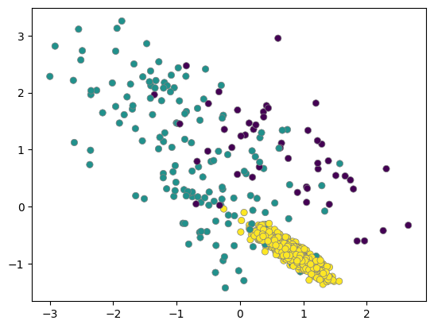
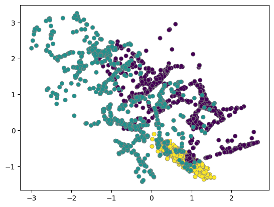
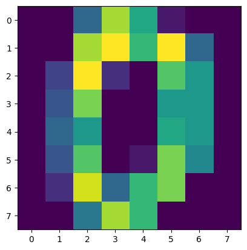
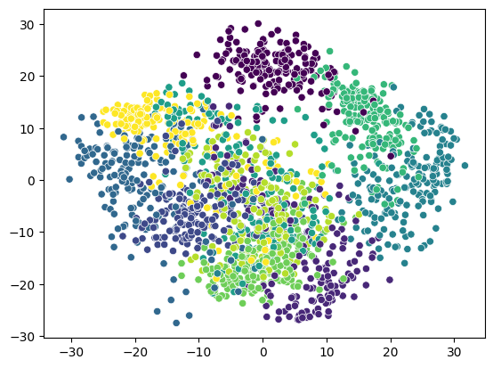

# Preparation

## Import libraries and packages


```python
# Import Libraries and Packages

import numpy as np
import pandas as pd
import sklearn
import matplotlib.pyplot as plt

import os 
from os.path import join

import warnings   # Ignore unneccessary warning messages
warnings.filterwarnings('ignore')
```

먼저 머신러닝의 대표적인 데이터 셋 중 하나인 전복 데이터를 불러오겠습니다. 전복 데이터셋은 수컷, 암컷, 유아기 3개의 범주로 이루어진 범주형 변수와 길이, 직경, 높이, 무게 등 여러 수치형 변수로 이루어져 있습니다. 데이터를 불러온 후 입력으로 사용할 변수들과 레이블로 사용할 성별 변수로 나누겠습니다.

## Load data

### Make data paths


```python
abalone_path = join('.', 'abalone.txt')
column_path = join('.', 'abalone_attributes.txt')  # Load names of columns
```

### Load 'Alabone_attributes.txt' to make column headers


```python
abalone_columns = list()      # Make a list for names of columns
for l in open(column_path):   # Open the file 'abalone_attributes.txt'
  abalone_columns.append(l.strip())   # add 'l' to the list by line
                                      # append(l.strip()) -> strip(): cleaning a result  e.g. \n, space
print(abalone_columns)        # Check whether a list is made well
```

    ['Sex', 'Length', 'Diameter', 'Height', 'Whole weight', 'Shucked weight', 'Viscera weight', 'Shell weight', 'Rings']


### Load 'Abalone.txt' data


```python
#data = pd.read_csv(abalone_path)  # Issue: The first column is recognized as a 'header' -> Solve: Header=none
data = pd.read_csv(abalone_path, header=None) 
data
```


  <div id="df-82f0e242-87e8-4da8-8b04-1a41180417e5">
    <div class="colab-df-container">
      <div>
<style scoped>
    .dataframe tbody tr th:only-of-type {
        vertical-align: middle;
    }

    .dataframe tbody tr th {
        vertical-align: top;
    }
    
    .dataframe thead th {
        text-align: right;
    }
</style>

<table border="1" class="dataframe">
  <thead>
    <tr style="text-align: right;">
      <th></th>
      <th>0</th>
      <th>1</th>
      <th>2</th>
      <th>3</th>
      <th>4</th>
      <th>5</th>
      <th>6</th>
      <th>7</th>
      <th>8</th>
    </tr>
  </thead>
  <tbody>
    <tr>
      <th>0</th>
      <td>M</td>
      <td>0.455</td>
      <td>0.365</td>
      <td>0.095</td>
      <td>0.5140</td>
      <td>0.2245</td>
      <td>0.1010</td>
      <td>0.1500</td>
      <td>15</td>
    </tr>
    <tr>
      <th>1</th>
      <td>M</td>
      <td>0.350</td>
      <td>0.265</td>
      <td>0.090</td>
      <td>0.2255</td>
      <td>0.0995</td>
      <td>0.0485</td>
      <td>0.0700</td>
      <td>7</td>
    </tr>
    <tr>
      <th>2</th>
      <td>F</td>
      <td>0.530</td>
      <td>0.420</td>
      <td>0.135</td>
      <td>0.6770</td>
      <td>0.2565</td>
      <td>0.1415</td>
      <td>0.2100</td>
      <td>9</td>
    </tr>
    <tr>
      <th>3</th>
      <td>M</td>
      <td>0.440</td>
      <td>0.365</td>
      <td>0.125</td>
      <td>0.5160</td>
      <td>0.2155</td>
      <td>0.1140</td>
      <td>0.1550</td>
      <td>10</td>
    </tr>
    <tr>
      <th>4</th>
      <td>I</td>
      <td>0.330</td>
      <td>0.255</td>
      <td>0.080</td>
      <td>0.2050</td>
      <td>0.0895</td>
      <td>0.0395</td>
      <td>0.0550</td>
      <td>7</td>
    </tr>
    <tr>
      <th>...</th>
      <td>...</td>
      <td>...</td>
      <td>...</td>
      <td>...</td>
      <td>...</td>
      <td>...</td>
      <td>...</td>
      <td>...</td>
      <td>...</td>
    </tr>
    <tr>
      <th>4172</th>
      <td>F</td>
      <td>0.565</td>
      <td>0.450</td>
      <td>0.165</td>
      <td>0.8870</td>
      <td>0.3700</td>
      <td>0.2390</td>
      <td>0.2490</td>
      <td>11</td>
    </tr>
    <tr>
      <th>4173</th>
      <td>M</td>
      <td>0.590</td>
      <td>0.440</td>
      <td>0.135</td>
      <td>0.9660</td>
      <td>0.4390</td>
      <td>0.2145</td>
      <td>0.2605</td>
      <td>10</td>
    </tr>
    <tr>
      <th>4174</th>
      <td>M</td>
      <td>0.600</td>
      <td>0.475</td>
      <td>0.205</td>
      <td>1.1760</td>
      <td>0.5255</td>
      <td>0.2875</td>
      <td>0.3080</td>
      <td>9</td>
    </tr>
    <tr>
      <th>4175</th>
      <td>F</td>
      <td>0.625</td>
      <td>0.485</td>
      <td>0.150</td>
      <td>1.0945</td>
      <td>0.5310</td>
      <td>0.2610</td>
      <td>0.2960</td>
      <td>10</td>
    </tr>
    <tr>
      <th>4176</th>
      <td>M</td>
      <td>0.710</td>
      <td>0.555</td>
      <td>0.195</td>
      <td>1.9485</td>
      <td>0.9455</td>
      <td>0.3765</td>
      <td>0.4950</td>
      <td>12</td>
    </tr>
  </tbody>
</table>
<p>4177 rows × 9 columns</p>
</div>
      <button class="colab-df-convert" onclick="convertToInteractive('df-82f0e242-87e8-4da8-8b04-1a41180417e5')"
              title="Convert this dataframe to an interactive table."
              style="display:none;">

  <svg xmlns="http://www.w3.org/2000/svg" height="24px"viewBox="0 0 24 24"
       width="24px">
    <path d="M0 0h24v24H0V0z" fill="none"/>
    <path d="M18.56 5.44l.94 2.06.94-2.06 2.06-.94-2.06-.94-.94-2.06-.94 2.06-2.06.94zm-11 1L8.5 8.5l.94-2.06 2.06-.94-2.06-.94L8.5 2.5l-.94 2.06-2.06.94zm10 10l.94 2.06.94-2.06 2.06-.94-2.06-.94-.94-2.06-.94 2.06-2.06.94z"/><path d="M17.41 7.96l-1.37-1.37c-.4-.4-.92-.59-1.43-.59-.52 0-1.04.2-1.43.59L10.3 9.45l-7.72 7.72c-.78.78-.78 2.05 0 2.83L4 21.41c.39.39.9.59 1.41.59.51 0 1.02-.2 1.41-.59l7.78-7.78 2.81-2.81c.8-.78.8-2.07 0-2.86zM5.41 20L4 18.59l7.72-7.72 1.47 1.35L5.41 20z"/>
  </svg>
      </button>


    .colab-df-convert {
      background-color: #E8F0FE;
      border: none;
      border-radius: 50%;
      cursor: pointer;
      display: none;
      fill: #1967D2;
      height: 32px;
      padding: 0 0 0 0;
      width: 32px;
    }
    
    .colab-df-convert:hover {
      background-color: #E2EBFA;
      box-shadow: 0px 1px 2px rgba(60, 64, 67, 0.3), 0px 1px 3px 1px rgba(60, 64, 67, 0.15);
      fill: #174EA6;
    }
    
    [theme=dark] .colab-df-convert {
      background-color: #3B4455;
      fill: #D2E3FC;
    }
    
    [theme=dark] .colab-df-convert:hover {
      background-color: #434B5C;
      box-shadow: 0px 1px 3px 1px rgba(0, 0, 0, 0.15);
      filter: drop-shadow(0px 1px 2px rgba(0, 0, 0, 0.3));
      fill: #FFFFFF;
    }
  </style>

      <script>
        const buttonEl =
          document.querySelector('#df-82f0e242-87e8-4da8-8b04-1a41180417e5 button.colab-df-convert');
        buttonEl.style.display =
          google.colab.kernel.accessAllowed ? 'block' : 'none';
    
        async function convertToInteractive(key) {
          const element = document.querySelector('#df-82f0e242-87e8-4da8-8b04-1a41180417e5');
          const dataTable =
            await google.colab.kernel.invokeFunction('convertToInteractive',
                                                     [key], {});
          if (!dataTable) return;
    
          const docLinkHtml = 'Like what you see? Visit the ' +
            '<a target="_blank" href=https://colab.research.google.com/notebooks/data_table.ipynb>data table notebook</a>'
            + ' to learn more about interactive tables.';
          element.innerHTML = '';
          dataTable['output_type'] = 'display_data';
          await google.colab.output.renderOutput(dataTable, element);
          const docLink = document.createElement('div');
          docLink.innerHTML = docLinkHtml;
          element.appendChild(docLink);
        }
      </script>
    </div>
  </div>


### Add Column Headers to Abalone dataset


```python
data = pd.read_csv(abalone_path,
                   header=None,
                   names = abalone_columns)   # Set 'abalone_columns' as a table header
data
```


  <div id="df-32632289-21a4-4a8e-9aa5-6939cb60961b">
    <div class="colab-df-container">
      <div>
<style scoped>
    .dataframe tbody tr th:only-of-type {
        vertical-align: middle;
    }

    .dataframe tbody tr th {
        vertical-align: top;
    }
    
    .dataframe thead th {
        text-align: right;
    }
</style>
<table border="1" class="dataframe">
  <thead>
    <tr style="text-align: right;">
      <th></th>
      <th>Sex</th>
      <th>Length</th>
      <th>Diameter</th>
      <th>Height</th>
      <th>Whole weight</th>
      <th>Shucked weight</th>
      <th>Viscera weight</th>
      <th>Shell weight</th>
      <th>Rings</th>
    </tr>
  </thead>
  <tbody>
    <tr>
      <th>0</th>
      <td>M</td>
      <td>0.455</td>
      <td>0.365</td>
      <td>0.095</td>
      <td>0.5140</td>
      <td>0.2245</td>
      <td>0.1010</td>
      <td>0.1500</td>
      <td>15</td>
    </tr>
    <tr>
      <th>1</th>
      <td>M</td>
      <td>0.350</td>
      <td>0.265</td>
      <td>0.090</td>
      <td>0.2255</td>
      <td>0.0995</td>
      <td>0.0485</td>
      <td>0.0700</td>
      <td>7</td>
    </tr>
    <tr>
      <th>2</th>
      <td>F</td>
      <td>0.530</td>
      <td>0.420</td>
      <td>0.135</td>
      <td>0.6770</td>
      <td>0.2565</td>
      <td>0.1415</td>
      <td>0.2100</td>
      <td>9</td>
    </tr>
    <tr>
      <th>3</th>
      <td>M</td>
      <td>0.440</td>
      <td>0.365</td>
      <td>0.125</td>
      <td>0.5160</td>
      <td>0.2155</td>
      <td>0.1140</td>
      <td>0.1550</td>
      <td>10</td>
    </tr>
    <tr>
      <th>4</th>
      <td>I</td>
      <td>0.330</td>
      <td>0.255</td>
      <td>0.080</td>
      <td>0.2050</td>
      <td>0.0895</td>
      <td>0.0395</td>
      <td>0.0550</td>
      <td>7</td>
    </tr>
    <tr>
      <th>...</th>
      <td>...</td>
      <td>...</td>
      <td>...</td>
      <td>...</td>
      <td>...</td>
      <td>...</td>
      <td>...</td>
      <td>...</td>
      <td>...</td>
    </tr>
    <tr>
      <th>4172</th>
      <td>F</td>
      <td>0.565</td>
      <td>0.450</td>
      <td>0.165</td>
      <td>0.8870</td>
      <td>0.3700</td>
      <td>0.2390</td>
      <td>0.2490</td>
      <td>11</td>
    </tr>
    <tr>
      <th>4173</th>
      <td>M</td>
      <td>0.590</td>
      <td>0.440</td>
      <td>0.135</td>
      <td>0.9660</td>
      <td>0.4390</td>
      <td>0.2145</td>
      <td>0.2605</td>
      <td>10</td>
    </tr>
    <tr>
      <th>4174</th>
      <td>M</td>
      <td>0.600</td>
      <td>0.475</td>
      <td>0.205</td>
      <td>1.1760</td>
      <td>0.5255</td>
      <td>0.2875</td>
      <td>0.3080</td>
      <td>9</td>
    </tr>
    <tr>
      <th>4175</th>
      <td>F</td>
      <td>0.625</td>
      <td>0.485</td>
      <td>0.150</td>
      <td>1.0945</td>
      <td>0.5310</td>
      <td>0.2610</td>
      <td>0.2960</td>
      <td>10</td>
    </tr>
    <tr>
      <th>4176</th>
      <td>M</td>
      <td>0.710</td>
      <td>0.555</td>
      <td>0.195</td>
      <td>1.9485</td>
      <td>0.9455</td>
      <td>0.3765</td>
      <td>0.4950</td>
      <td>12</td>
    </tr>
  </tbody>
</table>
<p>4177 rows × 9 columns</p>
</div>
      <button class="colab-df-convert" onclick="convertToInteractive('df-32632289-21a4-4a8e-9aa5-6939cb60961b')"
              title="Convert this dataframe to an interactive table."
              style="display:none;">

  <svg xmlns="http://www.w3.org/2000/svg" height="24px"viewBox="0 0 24 24"
       width="24px">
    <path d="M0 0h24v24H0V0z" fill="none"/>
    <path d="M18.56 5.44l.94 2.06.94-2.06 2.06-.94-2.06-.94-.94-2.06-.94 2.06-2.06.94zm-11 1L8.5 8.5l.94-2.06 2.06-.94-2.06-.94L8.5 2.5l-.94 2.06-2.06.94zm10 10l.94 2.06.94-2.06 2.06-.94-2.06-.94-.94-2.06-.94 2.06-2.06.94z"/><path d="M17.41 7.96l-1.37-1.37c-.4-.4-.92-.59-1.43-.59-.52 0-1.04.2-1.43.59L10.3 9.45l-7.72 7.72c-.78.78-.78 2.05 0 2.83L4 21.41c.39.39.9.59 1.41.59.51 0 1.02-.2 1.41-.59l7.78-7.78 2.81-2.81c.8-.78.8-2.07 0-2.86zM5.41 20L4 18.59l7.72-7.72 1.47 1.35L5.41 20z"/>
  </svg>
      </button>

  <style>
    .colab-df-container {
      display:flex;
      flex-wrap:wrap;
      gap: 12px;
    }

    .colab-df-convert {
      background-color: #E8F0FE;
      border: none;
      border-radius: 50%;
      cursor: pointer;
      display: none;
      fill: #1967D2;
      height: 32px;
      padding: 0 0 0 0;
      width: 32px;
    }
    
    .colab-df-convert:hover {
      background-color: #E2EBFA;
      box-shadow: 0px 1px 2px rgba(60, 64, 67, 0.3), 0px 1px 3px 1px rgba(60, 64, 67, 0.15);
      fill: #174EA6;
    }
    
    [theme=dark] .colab-df-convert {
      background-color: #3B4455;
      fill: #D2E3FC;
    }
    
    [theme=dark] .colab-df-convert:hover {
      background-color: #434B5C;
      box-shadow: 0px 1px 3px 1px rgba(0, 0, 0, 0.15);
      filter: drop-shadow(0px 1px 2px rgba(0, 0, 0, 0.3));
      fill: #FFFFFF;
    }
  </style>

      <script>
        const buttonEl =
          document.querySelector('#df-32632289-21a4-4a8e-9aa5-6939cb60961b button.colab-df-convert');
        buttonEl.style.display =
          google.colab.kernel.accessAllowed ? 'block' : 'none';
    
        async function convertToInteractive(key) {
          const element = document.querySelector('#df-32632289-21a4-4a8e-9aa5-6939cb60961b');
          const dataTable =
            await google.colab.kernel.invokeFunction('convertToInteractive',
                                                     [key], {});
          if (!dataTable) return;
    
          const docLinkHtml = 'Like what you see? Visit the ' +
            '<a target="_blank" href=https://colab.research.google.com/notebooks/data_table.ipynb>data table notebook</a>'
            + ' to learn more about interactive tables.';
          element.innerHTML = '';
          dataTable['output_type'] = 'display_data';
          await google.colab.output.renderOutput(dataTable, element);
          const docLink = document.createElement('div');
          docLink.innerHTML = docLinkHtml;
          element.appendChild(docLink);
        }
      </script>
    </div>
  </div>


## Look Up Data 


```python
data.head()
```


  <div id="df-fa2f567b-1672-4867-936b-12bd3a196331">
    <div class="colab-df-container">
      <div>
<style scoped>
    .dataframe tbody tr th:only-of-type {
        vertical-align: middle;
    }

    .dataframe tbody tr th {
        vertical-align: top;
    }
    
    .dataframe thead th {
        text-align: right;
    }
</style>
<table border="1" class="dataframe">
  <thead>
    <tr style="text-align: right;">
      <th></th>
      <th>Sex</th>
      <th>Length</th>
      <th>Diameter</th>
      <th>Height</th>
      <th>Whole weight</th>
      <th>Shucked weight</th>
      <th>Viscera weight</th>
      <th>Shell weight</th>
      <th>Rings</th>
    </tr>
  </thead>
  <tbody>
    <tr>
      <th>0</th>
      <td>M</td>
      <td>0.455</td>
      <td>0.365</td>
      <td>0.095</td>
      <td>0.5140</td>
      <td>0.2245</td>
      <td>0.1010</td>
      <td>0.150</td>
      <td>15</td>
    </tr>
    <tr>
      <th>1</th>
      <td>M</td>
      <td>0.350</td>
      <td>0.265</td>
      <td>0.090</td>
      <td>0.2255</td>
      <td>0.0995</td>
      <td>0.0485</td>
      <td>0.070</td>
      <td>7</td>
    </tr>
    <tr>
      <th>2</th>
      <td>F</td>
      <td>0.530</td>
      <td>0.420</td>
      <td>0.135</td>
      <td>0.6770</td>
      <td>0.2565</td>
      <td>0.1415</td>
      <td>0.210</td>
      <td>9</td>
    </tr>
    <tr>
      <th>3</th>
      <td>M</td>
      <td>0.440</td>
      <td>0.365</td>
      <td>0.125</td>
      <td>0.5160</td>
      <td>0.2155</td>
      <td>0.1140</td>
      <td>0.155</td>
      <td>10</td>
    </tr>
    <tr>
      <th>4</th>
      <td>I</td>
      <td>0.330</td>
      <td>0.255</td>
      <td>0.080</td>
      <td>0.2050</td>
      <td>0.0895</td>
      <td>0.0395</td>
      <td>0.055</td>
      <td>7</td>
    </tr>
  </tbody>
</table>
</div>
      <button class="colab-df-convert" onclick="convertToInteractive('df-fa2f567b-1672-4867-936b-12bd3a196331')"
              title="Convert this dataframe to an interactive table."
              style="display:none;">

  <svg xmlns="http://www.w3.org/2000/svg" height="24px"viewBox="0 0 24 24"
       width="24px">
    <path d="M0 0h24v24H0V0z" fill="none"/>
    <path d="M18.56 5.44l.94 2.06.94-2.06 2.06-.94-2.06-.94-.94-2.06-.94 2.06-2.06.94zm-11 1L8.5 8.5l.94-2.06 2.06-.94-2.06-.94L8.5 2.5l-.94 2.06-2.06.94zm10 10l.94 2.06.94-2.06 2.06-.94-2.06-.94-.94-2.06-.94 2.06-2.06.94z"/><path d="M17.41 7.96l-1.37-1.37c-.4-.4-.92-.59-1.43-.59-.52 0-1.04.2-1.43.59L10.3 9.45l-7.72 7.72c-.78.78-.78 2.05 0 2.83L4 21.41c.39.39.9.59 1.41.59.51 0 1.02-.2 1.41-.59l7.78-7.78 2.81-2.81c.8-.78.8-2.07 0-2.86zM5.41 20L4 18.59l7.72-7.72 1.47 1.35L5.41 20z"/>
  </svg>
      </button>

  <style>
    .colab-df-container {
      display:flex;
      flex-wrap:wrap;
      gap: 12px;
    }

    .colab-df-convert {
      background-color: #E8F0FE;
      border: none;
      border-radius: 50%;
      cursor: pointer;
      display: none;
      fill: #1967D2;
      height: 32px;
      padding: 0 0 0 0;
      width: 32px;
    }
    
    .colab-df-convert:hover {
      background-color: #E2EBFA;
      box-shadow: 0px 1px 2px rgba(60, 64, 67, 0.3), 0px 1px 3px 1px rgba(60, 64, 67, 0.15);
      fill: #174EA6;
    }
    
    [theme=dark] .colab-df-convert {
      background-color: #3B4455;
      fill: #D2E3FC;
    }
    
    [theme=dark] .colab-df-convert:hover {
      background-color: #434B5C;
      box-shadow: 0px 1px 3px 1px rgba(0, 0, 0, 0.15);
      filter: drop-shadow(0px 1px 2px rgba(0, 0, 0, 0.3));
      fill: #FFFFFF;
    }
  </style>

      <script>
        const buttonEl =
          document.querySelector('#df-fa2f567b-1672-4867-936b-12bd3a196331 button.colab-df-convert');
        buttonEl.style.display =
          google.colab.kernel.accessAllowed ? 'block' : 'none';
    
        async function convertToInteractive(key) {
          const element = document.querySelector('#df-fa2f567b-1672-4867-936b-12bd3a196331');
          const dataTable =
            await google.colab.kernel.invokeFunction('convertToInteractive',
                                                     [key], {});
          if (!dataTable) return;
    
          const docLinkHtml = 'Like what you see? Visit the ' +
            '<a target="_blank" href=https://colab.research.google.com/notebooks/data_table.ipynb>data table notebook</a>'
            + ' to learn more about interactive tables.';
          element.innerHTML = '';
          dataTable['output_type'] = 'display_data';
          await google.colab.output.renderOutput(dataTable, element);
          const docLink = document.createElement('div');
          docLink.innerHTML = docLinkHtml;
          element.appendChild(docLink);
        }
      </script>
    </div>
  </div>


```python
data.shape   # -> Results: (the number of rows, the number of numbers)
```


    (4177, 9)


```python
data.describe()
```


  <div id="df-716160f5-56aa-44ff-bd20-f1bac8ca3b2f">
    <div class="colab-df-container">
      <div>
<style scoped>
    .dataframe tbody tr th:only-of-type {
        vertical-align: middle;
    }

    .dataframe tbody tr th {
        vertical-align: top;
    }
    
    .dataframe thead th {
        text-align: right;
    }
</style>
<table border="1" class="dataframe">
  <thead>
    <tr style="text-align: right;">
      <th></th>
      <th>Length</th>
      <th>Diameter</th>
      <th>Height</th>
      <th>Whole weight</th>
      <th>Shucked weight</th>
      <th>Viscera weight</th>
      <th>Shell weight</th>
      <th>Rings</th>
    </tr>
  </thead>
  <tbody>
    <tr>
      <th>count</th>
      <td>4177.000000</td>
      <td>4177.000000</td>
      <td>4177.000000</td>
      <td>4177.000000</td>
      <td>4177.000000</td>
      <td>4177.000000</td>
      <td>4177.000000</td>
      <td>4177.000000</td>
    </tr>
    <tr>
      <th>mean</th>
      <td>0.523992</td>
      <td>0.407881</td>
      <td>0.139516</td>
      <td>0.828742</td>
      <td>0.359367</td>
      <td>0.180594</td>
      <td>0.238831</td>
      <td>9.933684</td>
    </tr>
    <tr>
      <th>std</th>
      <td>0.120093</td>
      <td>0.099240</td>
      <td>0.041827</td>
      <td>0.490389</td>
      <td>0.221963</td>
      <td>0.109614</td>
      <td>0.139203</td>
      <td>3.224169</td>
    </tr>
    <tr>
      <th>min</th>
      <td>0.075000</td>
      <td>0.055000</td>
      <td>0.000000</td>
      <td>0.002000</td>
      <td>0.001000</td>
      <td>0.000500</td>
      <td>0.001500</td>
      <td>1.000000</td>
    </tr>
    <tr>
      <th>25%</th>
      <td>0.450000</td>
      <td>0.350000</td>
      <td>0.115000</td>
      <td>0.441500</td>
      <td>0.186000</td>
      <td>0.093500</td>
      <td>0.130000</td>
      <td>8.000000</td>
    </tr>
    <tr>
      <th>50%</th>
      <td>0.545000</td>
      <td>0.425000</td>
      <td>0.140000</td>
      <td>0.799500</td>
      <td>0.336000</td>
      <td>0.171000</td>
      <td>0.234000</td>
      <td>9.000000</td>
    </tr>
    <tr>
      <th>75%</th>
      <td>0.615000</td>
      <td>0.480000</td>
      <td>0.165000</td>
      <td>1.153000</td>
      <td>0.502000</td>
      <td>0.253000</td>
      <td>0.329000</td>
      <td>11.000000</td>
    </tr>
    <tr>
      <th>max</th>
      <td>0.815000</td>
      <td>0.650000</td>
      <td>1.130000</td>
      <td>2.825500</td>
      <td>1.488000</td>
      <td>0.760000</td>
      <td>1.005000</td>
      <td>29.000000</td>
    </tr>
  </tbody>
</table>
</div>
      <button class="colab-df-convert" onclick="convertToInteractive('df-716160f5-56aa-44ff-bd20-f1bac8ca3b2f')"
              title="Convert this dataframe to an interactive table."
              style="display:none;">

  <svg xmlns="http://www.w3.org/2000/svg" height="24px"viewBox="0 0 24 24"
       width="24px">
    <path d="M0 0h24v24H0V0z" fill="none"/>
    <path d="M18.56 5.44l.94 2.06.94-2.06 2.06-.94-2.06-.94-.94-2.06-.94 2.06-2.06.94zm-11 1L8.5 8.5l.94-2.06 2.06-.94-2.06-.94L8.5 2.5l-.94 2.06-2.06.94zm10 10l.94 2.06.94-2.06 2.06-.94-2.06-.94-.94-2.06-.94 2.06-2.06.94z"/><path d="M17.41 7.96l-1.37-1.37c-.4-.4-.92-.59-1.43-.59-.52 0-1.04.2-1.43.59L10.3 9.45l-7.72 7.72c-.78.78-.78 2.05 0 2.83L4 21.41c.39.39.9.59 1.41.59.51 0 1.02-.2 1.41-.59l7.78-7.78 2.81-2.81c.8-.78.8-2.07 0-2.86zM5.41 20L4 18.59l7.72-7.72 1.47 1.35L5.41 20z"/>
  </svg>
      </button>

  <style>
    .colab-df-container {
      display:flex;
      flex-wrap:wrap;
      gap: 12px;
    }

    .colab-df-convert {
      background-color: #E8F0FE;
      border: none;
      border-radius: 50%;
      cursor: pointer;
      display: none;
      fill: #1967D2;
      height: 32px;
      padding: 0 0 0 0;
      width: 32px;
    }
    
    .colab-df-convert:hover {
      background-color: #E2EBFA;
      box-shadow: 0px 1px 2px rgba(60, 64, 67, 0.3), 0px 1px 3px 1px rgba(60, 64, 67, 0.15);
      fill: #174EA6;
    }
    
    [theme=dark] .colab-df-convert {
      background-color: #3B4455;
      fill: #D2E3FC;
    }
    
    [theme=dark] .colab-df-convert:hover {
      background-color: #434B5C;
      box-shadow: 0px 1px 3px 1px rgba(0, 0, 0, 0.15);
      filter: drop-shadow(0px 1px 2px rgba(0, 0, 0, 0.3));
      fill: #FFFFFF;
    }
  </style>

      <script>
        const buttonEl =
          document.querySelector('#df-716160f5-56aa-44ff-bd20-f1bac8ca3b2f button.colab-df-convert');
        buttonEl.style.display =
          google.colab.kernel.accessAllowed ? 'block' : 'none';
    
        async function convertToInteractive(key) {
          const element = document.querySelector('#df-716160f5-56aa-44ff-bd20-f1bac8ca3b2f');
          const dataTable =
            await google.colab.kernel.invokeFunction('convertToInteractive',
                                                     [key], {});
          if (!dataTable) return;
    
          const docLinkHtml = 'Like what you see? Visit the ' +
            '<a target="_blank" href=https://colab.research.google.com/notebooks/data_table.ipynb>data table notebook</a>'
            + ' to learn more about interactive tables.';
          element.innerHTML = '';
          dataTable['output_type'] = 'display_data';
          await google.colab.output.renderOutput(dataTable, element);
          const docLink = document.createElement('div');
          docLink.innerHTML = docLinkHtml;
          element.appendChild(docLink);
        }
      </script>
    </div>
  </div>


```python
data.info()
```

    <class 'pandas.core.frame.DataFrame'>
    RangeIndex: 4177 entries, 0 to 4176
    Data columns (total 9 columns):
     #   Column          Non-Null Count  Dtype  
    ---  ------          --------------  -----  
     0   Sex             4177 non-null   object 
     1   Length          4177 non-null   float64
     2   Diameter        4177 non-null   float64
     3   Height          4177 non-null   float64
     4   Whole weight    4177 non-null   float64
     5   Shucked weight  4177 non-null   float64
     6   Viscera weight  4177 non-null   float64
     7   Shell weight    4177 non-null   float64
     8   Rings           4177 non-null   int64  
    dtypes: float64(7), int64(1), object(1)
    memory usage: 293.8+ KB


## Seperate Label Data('Sex') and Feature Data

### Delete Label Data 


```python
label = data['Sex']  # Get 'Sex' column as a label
del data['Sex']
data.head()
```


  <div id="df-df9c0907-007a-40d4-b5ab-62154e1be85c">
    <div class="colab-df-container">
      <div>
<style scoped>
    .dataframe tbody tr th:only-of-type {
        vertical-align: middle;
    }

    .dataframe tbody tr th {
        vertical-align: top;
    }
    
    .dataframe thead th {
        text-align: right;
    }
</style>
<table border="1" class="dataframe">
  <thead>
    <tr style="text-align: right;">
      <th></th>
      <th>Length</th>
      <th>Diameter</th>
      <th>Height</th>
      <th>Whole weight</th>
      <th>Shucked weight</th>
      <th>Viscera weight</th>
      <th>Shell weight</th>
      <th>Rings</th>
    </tr>
  </thead>
  <tbody>
    <tr>
      <th>0</th>
      <td>0.455</td>
      <td>0.365</td>
      <td>0.095</td>
      <td>0.5140</td>
      <td>0.2245</td>
      <td>0.1010</td>
      <td>0.150</td>
      <td>15</td>
    </tr>
    <tr>
      <th>1</th>
      <td>0.350</td>
      <td>0.265</td>
      <td>0.090</td>
      <td>0.2255</td>
      <td>0.0995</td>
      <td>0.0485</td>
      <td>0.070</td>
      <td>7</td>
    </tr>
    <tr>
      <th>2</th>
      <td>0.530</td>
      <td>0.420</td>
      <td>0.135</td>
      <td>0.6770</td>
      <td>0.2565</td>
      <td>0.1415</td>
      <td>0.210</td>
      <td>9</td>
    </tr>
    <tr>
      <th>3</th>
      <td>0.440</td>
      <td>0.365</td>
      <td>0.125</td>
      <td>0.5160</td>
      <td>0.2155</td>
      <td>0.1140</td>
      <td>0.155</td>
      <td>10</td>
    </tr>
    <tr>
      <th>4</th>
      <td>0.330</td>
      <td>0.255</td>
      <td>0.080</td>
      <td>0.2050</td>
      <td>0.0895</td>
      <td>0.0395</td>
      <td>0.055</td>
      <td>7</td>
    </tr>
  </tbody>
</table>
</div>
      <button class="colab-df-convert" onclick="convertToInteractive('df-df9c0907-007a-40d4-b5ab-62154e1be85c')"
              title="Convert this dataframe to an interactive table."
              style="display:none;">

  <svg xmlns="http://www.w3.org/2000/svg" height="24px"viewBox="0 0 24 24"
       width="24px">
    <path d="M0 0h24v24H0V0z" fill="none"/>
    <path d="M18.56 5.44l.94 2.06.94-2.06 2.06-.94-2.06-.94-.94-2.06-.94 2.06-2.06.94zm-11 1L8.5 8.5l.94-2.06 2.06-.94-2.06-.94L8.5 2.5l-.94 2.06-2.06.94zm10 10l.94 2.06.94-2.06 2.06-.94-2.06-.94-.94-2.06-.94 2.06-2.06.94z"/><path d="M17.41 7.96l-1.37-1.37c-.4-.4-.92-.59-1.43-.59-.52 0-1.04.2-1.43.59L10.3 9.45l-7.72 7.72c-.78.78-.78 2.05 0 2.83L4 21.41c.39.39.9.59 1.41.59.51 0 1.02-.2 1.41-.59l7.78-7.78 2.81-2.81c.8-.78.8-2.07 0-2.86zM5.41 20L4 18.59l7.72-7.72 1.47 1.35L5.41 20z"/>
  </svg>
      </button>

  <style>
    .colab-df-container {
      display:flex;
      flex-wrap:wrap;
      gap: 12px;
    }

    .colab-df-convert {
      background-color: #E8F0FE;
      border: none;
      border-radius: 50%;
      cursor: pointer;
      display: none;
      fill: #1967D2;
      height: 32px;
      padding: 0 0 0 0;
      width: 32px;
    }
    
    .colab-df-convert:hover {
      background-color: #E2EBFA;
      box-shadow: 0px 1px 2px rgba(60, 64, 67, 0.3), 0px 1px 3px 1px rgba(60, 64, 67, 0.15);
      fill: #174EA6;
    }
    
    [theme=dark] .colab-df-convert {
      background-color: #3B4455;
      fill: #D2E3FC;
    }
    
    [theme=dark] .colab-df-convert:hover {
      background-color: #434B5C;
      box-shadow: 0px 1px 3px 1px rgba(0, 0, 0, 0.15);
      filter: drop-shadow(0px 1px 2px rgba(0, 0, 0, 0.3));
      fill: #FFFFFF;
    }
  </style>

      <script>
        const buttonEl =
          document.querySelector('#df-df9c0907-007a-40d4-b5ab-62154e1be85c button.colab-df-convert');
        buttonEl.style.display =
          google.colab.kernel.accessAllowed ? 'block' : 'none';
    
        async function convertToInteractive(key) {
          const element = document.querySelector('#df-df9c0907-007a-40d4-b5ab-62154e1be85c');
          const dataTable =
            await google.colab.kernel.invokeFunction('convertToInteractive',
                                                     [key], {});
          if (!dataTable) return;
    
          const docLinkHtml = 'Like what you see? Visit the ' +
            '<a target="_blank" href=https://colab.research.google.com/notebooks/data_table.ipynb>data table notebook</a>'
            + ' to learn more about interactive tables.';
          element.innerHTML = '';
          dataTable['output_type'] = 'display_data';
          await google.colab.output.renderOutput(dataTable, element);
          const docLink = document.createElement('div');
          docLink.innerHTML = docLinkHtml;
          element.appendChild(docLink);
        }
      </script>
    </div>
  </div>


# Scaling

## Min-Max Scaling (Min-Max Normalization)

It consists of rescaling the range of features to scale the range in [0, 1].


```python
data2 = (data - np.min(data)) / (np.max(data) - np.min(data))  # Not recommended -> use libraries
data2
```


  <div id="df-5a79c0f7-0a79-4a33-a479-07dcfa1ddd89">
    <div class="colab-df-container">
      <div>
<style scoped>
    .dataframe tbody tr th:only-of-type {
        vertical-align: middle;
    }

    .dataframe tbody tr th {
        vertical-align: top;
    }
    
    .dataframe thead th {
        text-align: right;
    }
</style>
<table border="1" class="dataframe">
  <thead>
    <tr style="text-align: right;">
      <th></th>
      <th>Length</th>
      <th>Diameter</th>
      <th>Height</th>
      <th>Whole weight</th>
      <th>Shucked weight</th>
      <th>Viscera weight</th>
      <th>Shell weight</th>
      <th>Rings</th>
    </tr>
  </thead>
  <tbody>
    <tr>
      <th>0</th>
      <td>0.513514</td>
      <td>0.521008</td>
      <td>0.084071</td>
      <td>0.181335</td>
      <td>0.150303</td>
      <td>0.132324</td>
      <td>0.147982</td>
      <td>0.500000</td>
    </tr>
    <tr>
      <th>1</th>
      <td>0.371622</td>
      <td>0.352941</td>
      <td>0.079646</td>
      <td>0.079157</td>
      <td>0.066241</td>
      <td>0.063199</td>
      <td>0.068261</td>
      <td>0.214286</td>
    </tr>
    <tr>
      <th>2</th>
      <td>0.614865</td>
      <td>0.613445</td>
      <td>0.119469</td>
      <td>0.239065</td>
      <td>0.171822</td>
      <td>0.185648</td>
      <td>0.207773</td>
      <td>0.285714</td>
    </tr>
    <tr>
      <th>3</th>
      <td>0.493243</td>
      <td>0.521008</td>
      <td>0.110619</td>
      <td>0.182044</td>
      <td>0.144250</td>
      <td>0.149440</td>
      <td>0.152965</td>
      <td>0.321429</td>
    </tr>
    <tr>
      <th>4</th>
      <td>0.344595</td>
      <td>0.336134</td>
      <td>0.070796</td>
      <td>0.071897</td>
      <td>0.059516</td>
      <td>0.051350</td>
      <td>0.053313</td>
      <td>0.214286</td>
    </tr>
    <tr>
      <th>...</th>
      <td>...</td>
      <td>...</td>
      <td>...</td>
      <td>...</td>
      <td>...</td>
      <td>...</td>
      <td>...</td>
      <td>...</td>
    </tr>
    <tr>
      <th>4172</th>
      <td>0.662162</td>
      <td>0.663866</td>
      <td>0.146018</td>
      <td>0.313441</td>
      <td>0.248151</td>
      <td>0.314022</td>
      <td>0.246637</td>
      <td>0.357143</td>
    </tr>
    <tr>
      <th>4173</th>
      <td>0.695946</td>
      <td>0.647059</td>
      <td>0.119469</td>
      <td>0.341420</td>
      <td>0.294553</td>
      <td>0.281764</td>
      <td>0.258097</td>
      <td>0.321429</td>
    </tr>
    <tr>
      <th>4174</th>
      <td>0.709459</td>
      <td>0.705882</td>
      <td>0.181416</td>
      <td>0.415796</td>
      <td>0.352724</td>
      <td>0.377880</td>
      <td>0.305431</td>
      <td>0.285714</td>
    </tr>
    <tr>
      <th>4175</th>
      <td>0.743243</td>
      <td>0.722689</td>
      <td>0.132743</td>
      <td>0.386931</td>
      <td>0.356422</td>
      <td>0.342989</td>
      <td>0.293473</td>
      <td>0.321429</td>
    </tr>
    <tr>
      <th>4176</th>
      <td>0.858108</td>
      <td>0.840336</td>
      <td>0.172566</td>
      <td>0.689393</td>
      <td>0.635171</td>
      <td>0.495063</td>
      <td>0.491779</td>
      <td>0.392857</td>
    </tr>
  </tbody>
</table>
<p>4177 rows × 8 columns</p>
</div>
      <button class="colab-df-convert" onclick="convertToInteractive('df-5a79c0f7-0a79-4a33-a479-07dcfa1ddd89')"
              title="Convert this dataframe to an interactive table."
              style="display:none;">

  <svg xmlns="http://www.w3.org/2000/svg" height="24px"viewBox="0 0 24 24"
       width="24px">
    <path d="M0 0h24v24H0V0z" fill="none"/>
    <path d="M18.56 5.44l.94 2.06.94-2.06 2.06-.94-2.06-.94-.94-2.06-.94 2.06-2.06.94zm-11 1L8.5 8.5l.94-2.06 2.06-.94-2.06-.94L8.5 2.5l-.94 2.06-2.06.94zm10 10l.94 2.06.94-2.06 2.06-.94-2.06-.94-.94-2.06-.94 2.06-2.06.94z"/><path d="M17.41 7.96l-1.37-1.37c-.4-.4-.92-.59-1.43-.59-.52 0-1.04.2-1.43.59L10.3 9.45l-7.72 7.72c-.78.78-.78 2.05 0 2.83L4 21.41c.39.39.9.59 1.41.59.51 0 1.02-.2 1.41-.59l7.78-7.78 2.81-2.81c.8-.78.8-2.07 0-2.86zM5.41 20L4 18.59l7.72-7.72 1.47 1.35L5.41 20z"/>
  </svg>
      </button>

  <style>
    .colab-df-container {
      display:flex;
      flex-wrap:wrap;
      gap: 12px;
    }

    .colab-df-convert {
      background-color: #E8F0FE;
      border: none;
      border-radius: 50%;
      cursor: pointer;
      display: none;
      fill: #1967D2;
      height: 32px;
      padding: 0 0 0 0;
      width: 32px;
    }
    
    .colab-df-convert:hover {
      background-color: #E2EBFA;
      box-shadow: 0px 1px 2px rgba(60, 64, 67, 0.3), 0px 1px 3px 1px rgba(60, 64, 67, 0.15);
      fill: #174EA6;
    }
    
    [theme=dark] .colab-df-convert {
      background-color: #3B4455;
      fill: #D2E3FC;
    }
    
    [theme=dark] .colab-df-convert:hover {
      background-color: #434B5C;
      box-shadow: 0px 1px 3px 1px rgba(0, 0, 0, 0.15);
      filter: drop-shadow(0px 1px 2px rgba(0, 0, 0, 0.3));
      fill: #FFFFFF;
    }
  </style>

      <script>
        const buttonEl =
          document.querySelector('#df-5a79c0f7-0a79-4a33-a479-07dcfa1ddd89 button.colab-df-convert');
        buttonEl.style.display =
          google.colab.kernel.accessAllowed ? 'block' : 'none';
    
        async function convertToInteractive(key) {
          const element = document.querySelector('#df-5a79c0f7-0a79-4a33-a479-07dcfa1ddd89');
          const dataTable =
            await google.colab.kernel.invokeFunction('convertToInteractive',
                                                     [key], {});
          if (!dataTable) return;
    
          const docLinkHtml = 'Like what you see? Visit the ' +
            '<a target="_blank" href=https://colab.research.google.com/notebooks/data_table.ipynb>data table notebook</a>'
            + ' to learn more about interactive tables.';
          element.innerHTML = '';
          dataTable['output_type'] = 'display_data';
          await google.colab.output.renderOutput(dataTable, element);
          const docLink = document.createElement('div');
          docLink.innerHTML = docLinkHtml;
          element.appendChild(docLink);
        }
      </script>
    </div>
  </div>


### 1) Load Data-Processing Module 


```python
# Fit and Transform Data seperately
from  sklearn.preprocessing import MinMaxScaler
```

### 2) Min-Max Transform

#### 1. Fit -> Transform (2 steps)


```python
mMscaler = MinMaxScaler()
mMscaler.fit(data)  # Fit data 
data3 = mMscaler.transform(data) # Transform from normal data to Min-Max data

#data3.head()  # Issue: error msg is {'numpy.ndarray' object has no attribute 'head'} -> 'Panda's data type
              # Solution: Change the type from Numpy's NdArray to Panda's DataFrame
type(data3)  
```


    numpy.ndarray


#### Fit + Transform (1 step)


```python
# Fit and Transform Data

mMscaler = MinMaxScaler()
data4 = mMscaler.fit_transform(data)  # 'fit + transform' in a single step

type(data4)
```


    numpy.ndarray


```python
# Change type from Numpy's NdArray to Panda's DataFrame

mMscaled_data = pd.DataFrame(data4, columns=data.columns)  # Load a list of columns -> Change to DataFrame
mMscaled_data.head()
```


  <div id="df-36553797-08a5-4431-9df0-43b7bde94788">
    <div class="colab-df-container">
      <div>
<style scoped>
    .dataframe tbody tr th:only-of-type {
        vertical-align: middle;
    }

    .dataframe tbody tr th {
        vertical-align: top;
    }
    
    .dataframe thead th {
        text-align: right;
    }
</style>
<table border="1" class="dataframe">
  <thead>
    <tr style="text-align: right;">
      <th></th>
      <th>Length</th>
      <th>Diameter</th>
      <th>Height</th>
      <th>Whole weight</th>
      <th>Shucked weight</th>
      <th>Viscera weight</th>
      <th>Shell weight</th>
      <th>Rings</th>
    </tr>
  </thead>
  <tbody>
    <tr>
      <th>0</th>
      <td>0.513514</td>
      <td>0.521008</td>
      <td>0.084071</td>
      <td>0.181335</td>
      <td>0.150303</td>
      <td>0.132324</td>
      <td>0.147982</td>
      <td>0.500000</td>
    </tr>
    <tr>
      <th>1</th>
      <td>0.371622</td>
      <td>0.352941</td>
      <td>0.079646</td>
      <td>0.079157</td>
      <td>0.066241</td>
      <td>0.063199</td>
      <td>0.068261</td>
      <td>0.214286</td>
    </tr>
    <tr>
      <th>2</th>
      <td>0.614865</td>
      <td>0.613445</td>
      <td>0.119469</td>
      <td>0.239065</td>
      <td>0.171822</td>
      <td>0.185648</td>
      <td>0.207773</td>
      <td>0.285714</td>
    </tr>
    <tr>
      <th>3</th>
      <td>0.493243</td>
      <td>0.521008</td>
      <td>0.110619</td>
      <td>0.182044</td>
      <td>0.144250</td>
      <td>0.149440</td>
      <td>0.152965</td>
      <td>0.321429</td>
    </tr>
    <tr>
      <th>4</th>
      <td>0.344595</td>
      <td>0.336134</td>
      <td>0.070796</td>
      <td>0.071897</td>
      <td>0.059516</td>
      <td>0.051350</td>
      <td>0.053313</td>
      <td>0.214286</td>
    </tr>
  </tbody>
</table>
</div>
      <button class="colab-df-convert" onclick="convertToInteractive('df-36553797-08a5-4431-9df0-43b7bde94788')"
              title="Convert this dataframe to an interactive table."
              style="display:none;">

  <svg xmlns="http://www.w3.org/2000/svg" height="24px"viewBox="0 0 24 24"
       width="24px">
    <path d="M0 0h24v24H0V0z" fill="none"/>
    <path d="M18.56 5.44l.94 2.06.94-2.06 2.06-.94-2.06-.94-.94-2.06-.94 2.06-2.06.94zm-11 1L8.5 8.5l.94-2.06 2.06-.94-2.06-.94L8.5 2.5l-.94 2.06-2.06.94zm10 10l.94 2.06.94-2.06 2.06-.94-2.06-.94-.94-2.06-.94 2.06-2.06.94z"/><path d="M17.41 7.96l-1.37-1.37c-.4-.4-.92-.59-1.43-.59-.52 0-1.04.2-1.43.59L10.3 9.45l-7.72 7.72c-.78.78-.78 2.05 0 2.83L4 21.41c.39.39.9.59 1.41.59.51 0 1.02-.2 1.41-.59l7.78-7.78 2.81-2.81c.8-.78.8-2.07 0-2.86zM5.41 20L4 18.59l7.72-7.72 1.47 1.35L5.41 20z"/>
  </svg>
      </button>

  <style>
    .colab-df-container {
      display:flex;
      flex-wrap:wrap;
      gap: 12px;
    }

    .colab-df-convert {
      background-color: #E8F0FE;
      border: none;
      border-radius: 50%;
      cursor: pointer;
      display: none;
      fill: #1967D2;
      height: 32px;
      padding: 0 0 0 0;
      width: 32px;
    }
    
    .colab-df-convert:hover {
      background-color: #E2EBFA;
      box-shadow: 0px 1px 2px rgba(60, 64, 67, 0.3), 0px 1px 3px 1px rgba(60, 64, 67, 0.15);
      fill: #174EA6;
    }
    
    [theme=dark] .colab-df-convert {
      background-color: #3B4455;
      fill: #D2E3FC;
    }
    
    [theme=dark] .colab-df-convert:hover {
      background-color: #434B5C;
      box-shadow: 0px 1px 3px 1px rgba(0, 0, 0, 0.15);
      filter: drop-shadow(0px 1px 2px rgba(0, 0, 0, 0.3));
      fill: #FFFFFF;
    }
  </style>

      <script>
        const buttonEl =
          document.querySelector('#df-36553797-08a5-4431-9df0-43b7bde94788 button.colab-df-convert');
        buttonEl.style.display =
          google.colab.kernel.accessAllowed ? 'block' : 'none';
    
        async function convertToInteractive(key) {
          const element = document.querySelector('#df-36553797-08a5-4431-9df0-43b7bde94788');
          const dataTable =
            await google.colab.kernel.invokeFunction('convertToInteractive',
                                                     [key], {});
          if (!dataTable) return;
    
          const docLinkHtml = 'Like what you see? Visit the ' +
            '<a target="_blank" href=https://colab.research.google.com/notebooks/data_table.ipynb>data table notebook</a>'
            + ' to learn more about interactive tables.';
          element.innerHTML = '';
          dataTable['output_type'] = 'display_data';
          await google.colab.output.renderOutput(dataTable, element);
          const docLink = document.createElement('div');
          docLink.innerHTML = docLinkHtml;
          element.appendChild(docLink);
        }
      </script>
    </div>
  </div>


## Standard Scaling

### 1) Load Data-Processing Module 


```python
from sklearn.preprocessing import StandardScaler
```

### 2) Standard Scaling


```python
sdscaler = StandardScaler()   # Instance
sdscaled_data = sdscaler.fit_transform(data)
```


```python
sdscaled_data = pd.DataFrame(sdscaled_data, columns=data.columns)
sdscaled_data.head()
```


  <div id="df-497a9e2a-73c4-4818-bc7e-292d0ab9ff59">
    <div class="colab-df-container">
      <div>
<style scoped>
    .dataframe tbody tr th:only-of-type {
        vertical-align: middle;
    }

    .dataframe tbody tr th {
        vertical-align: top;
    }
    
    .dataframe thead th {
        text-align: right;
    }
</style>
<table border="1" class="dataframe">
  <thead>
    <tr style="text-align: right;">
      <th></th>
      <th>Length</th>
      <th>Diameter</th>
      <th>Height</th>
      <th>Whole weight</th>
      <th>Shucked weight</th>
      <th>Viscera weight</th>
      <th>Shell weight</th>
      <th>Rings</th>
    </tr>
  </thead>
  <tbody>
    <tr>
      <th>0</th>
      <td>-0.574558</td>
      <td>-0.432149</td>
      <td>-1.064424</td>
      <td>-0.641898</td>
      <td>-0.607685</td>
      <td>-0.726212</td>
      <td>-0.638217</td>
      <td>1.571544</td>
    </tr>
    <tr>
      <th>1</th>
      <td>-1.448986</td>
      <td>-1.439929</td>
      <td>-1.183978</td>
      <td>-1.230277</td>
      <td>-1.170910</td>
      <td>-1.205221</td>
      <td>-1.212987</td>
      <td>-0.910013</td>
    </tr>
    <tr>
      <th>2</th>
      <td>0.050033</td>
      <td>0.122130</td>
      <td>-0.107991</td>
      <td>-0.309469</td>
      <td>-0.463500</td>
      <td>-0.356690</td>
      <td>-0.207139</td>
      <td>-0.289624</td>
    </tr>
    <tr>
      <th>3</th>
      <td>-0.699476</td>
      <td>-0.432149</td>
      <td>-0.347099</td>
      <td>-0.637819</td>
      <td>-0.648238</td>
      <td>-0.607600</td>
      <td>-0.602294</td>
      <td>0.020571</td>
    </tr>
    <tr>
      <th>4</th>
      <td>-1.615544</td>
      <td>-1.540707</td>
      <td>-1.423087</td>
      <td>-1.272086</td>
      <td>-1.215968</td>
      <td>-1.287337</td>
      <td>-1.320757</td>
      <td>-0.910013</td>
    </tr>
  </tbody>
</table>
</div>
      <button class="colab-df-convert" onclick="convertToInteractive('df-497a9e2a-73c4-4818-bc7e-292d0ab9ff59')"
              title="Convert this dataframe to an interactive table."
              style="display:none;">

  <svg xmlns="http://www.w3.org/2000/svg" height="24px"viewBox="0 0 24 24"
       width="24px">
    <path d="M0 0h24v24H0V0z" fill="none"/>
    <path d="M18.56 5.44l.94 2.06.94-2.06 2.06-.94-2.06-.94-.94-2.06-.94 2.06-2.06.94zm-11 1L8.5 8.5l.94-2.06 2.06-.94-2.06-.94L8.5 2.5l-.94 2.06-2.06.94zm10 10l.94 2.06.94-2.06 2.06-.94-2.06-.94-.94-2.06-.94 2.06-2.06.94z"/><path d="M17.41 7.96l-1.37-1.37c-.4-.4-.92-.59-1.43-.59-.52 0-1.04.2-1.43.59L10.3 9.45l-7.72 7.72c-.78.78-.78 2.05 0 2.83L4 21.41c.39.39.9.59 1.41.59.51 0 1.02-.2 1.41-.59l7.78-7.78 2.81-2.81c.8-.78.8-2.07 0-2.86zM5.41 20L4 18.59l7.72-7.72 1.47 1.35L5.41 20z"/>
  </svg>
      </button>

  <style>
    .colab-df-container {
      display:flex;
      flex-wrap:wrap;
      gap: 12px;
    }

    .colab-df-convert {
      background-color: #E8F0FE;
      border: none;
      border-radius: 50%;
      cursor: pointer;
      display: none;
      fill: #1967D2;
      height: 32px;
      padding: 0 0 0 0;
      width: 32px;
    }
    
    .colab-df-convert:hover {
      background-color: #E2EBFA;
      box-shadow: 0px 1px 2px rgba(60, 64, 67, 0.3), 0px 1px 3px 1px rgba(60, 64, 67, 0.15);
      fill: #174EA6;
    }
    
    [theme=dark] .colab-df-convert {
      background-color: #3B4455;
      fill: #D2E3FC;
    }
    
    [theme=dark] .colab-df-convert:hover {
      background-color: #434B5C;
      box-shadow: 0px 1px 3px 1px rgba(0, 0, 0, 0.15);
      filter: drop-shadow(0px 1px 2px rgba(0, 0, 0, 0.3));
      fill: #FFFFFF;
    }
  </style>

      <script>
        const buttonEl =
          document.querySelector('#df-497a9e2a-73c4-4818-bc7e-292d0ab9ff59 button.colab-df-convert');
        buttonEl.style.display =
          google.colab.kernel.accessAllowed ? 'block' : 'none';
    
        async function convertToInteractive(key) {
          const element = document.querySelector('#df-497a9e2a-73c4-4818-bc7e-292d0ab9ff59');
          const dataTable =
            await google.colab.kernel.invokeFunction('convertToInteractive',
                                                     [key], {});
          if (!dataTable) return;
    
          const docLinkHtml = 'Like what you see? Visit the ' +
            '<a target="_blank" href=https://colab.research.google.com/notebooks/data_table.ipynb>data table notebook</a>'
            + ' to learn more about interactive tables.';
          element.innerHTML = '';
          dataTable['output_type'] = 'display_data';
          await google.colab.output.renderOutput(dataTable, element);
          const docLink = document.createElement('div');
          docLink.innerHTML = docLinkHtml;
          element.appendChild(docLink);
        }
      </script>
    </div>
  </div>


# Sampling

- Oversampling: for small datasets, increasing random data
- Undersampling: for large datasets, picking random data to reduce size of dataset

## Random Over/Under Sampling

### Load Modules


```python
from imblearn.over_sampling import RandomOverSampler
from imblearn.under_sampling import RandomUnderSampler
```

### Load to memory


```python
ros = RandomOverSampler()
rus = RandomUnderSampler()
```

### Random Over Sampling


```python
oversampled_data, oversampled_label = ros.fit_resample(data, label)   # fit_resample(featureData,labelData)
oversampled_data = pd.DataFrame(oversampled_data, columns=data.columns)

oversampled_data.head()
```


  <div id="df-a287e1ae-4dcb-4b1e-bebb-944ae343d08b">
    <div class="colab-df-container">
      <div>
<style scoped>
    .dataframe tbody tr th:only-of-type {
        vertical-align: middle;
    }

    .dataframe tbody tr th {
        vertical-align: top;
    }
    
    .dataframe thead th {
        text-align: right;
    }
</style>
<table border="1" class="dataframe">
  <thead>
    <tr style="text-align: right;">
      <th></th>
      <th>Length</th>
      <th>Diameter</th>
      <th>Height</th>
      <th>Whole weight</th>
      <th>Shucked weight</th>
      <th>Viscera weight</th>
      <th>Shell weight</th>
      <th>Rings</th>
    </tr>
  </thead>
  <tbody>
    <tr>
      <th>0</th>
      <td>0.455</td>
      <td>0.365</td>
      <td>0.095</td>
      <td>0.5140</td>
      <td>0.2245</td>
      <td>0.1010</td>
      <td>0.150</td>
      <td>15</td>
    </tr>
    <tr>
      <th>1</th>
      <td>0.350</td>
      <td>0.265</td>
      <td>0.090</td>
      <td>0.2255</td>
      <td>0.0995</td>
      <td>0.0485</td>
      <td>0.070</td>
      <td>7</td>
    </tr>
    <tr>
      <th>2</th>
      <td>0.530</td>
      <td>0.420</td>
      <td>0.135</td>
      <td>0.6770</td>
      <td>0.2565</td>
      <td>0.1415</td>
      <td>0.210</td>
      <td>9</td>
    </tr>
    <tr>
      <th>3</th>
      <td>0.440</td>
      <td>0.365</td>
      <td>0.125</td>
      <td>0.5160</td>
      <td>0.2155</td>
      <td>0.1140</td>
      <td>0.155</td>
      <td>10</td>
    </tr>
    <tr>
      <th>4</th>
      <td>0.330</td>
      <td>0.255</td>
      <td>0.080</td>
      <td>0.2050</td>
      <td>0.0895</td>
      <td>0.0395</td>
      <td>0.055</td>
      <td>7</td>
    </tr>
  </tbody>
</table>
</div>
      <button class="colab-df-convert" onclick="convertToInteractive('df-a287e1ae-4dcb-4b1e-bebb-944ae343d08b')"
              title="Convert this dataframe to an interactive table."
              style="display:none;">

  <svg xmlns="http://www.w3.org/2000/svg" height="24px"viewBox="0 0 24 24"
       width="24px">
    <path d="M0 0h24v24H0V0z" fill="none"/>
    <path d="M18.56 5.44l.94 2.06.94-2.06 2.06-.94-2.06-.94-.94-2.06-.94 2.06-2.06.94zm-11 1L8.5 8.5l.94-2.06 2.06-.94-2.06-.94L8.5 2.5l-.94 2.06-2.06.94zm10 10l.94 2.06.94-2.06 2.06-.94-2.06-.94-.94-2.06-.94 2.06-2.06.94z"/><path d="M17.41 7.96l-1.37-1.37c-.4-.4-.92-.59-1.43-.59-.52 0-1.04.2-1.43.59L10.3 9.45l-7.72 7.72c-.78.78-.78 2.05 0 2.83L4 21.41c.39.39.9.59 1.41.59.51 0 1.02-.2 1.41-.59l7.78-7.78 2.81-2.81c.8-.78.8-2.07 0-2.86zM5.41 20L4 18.59l7.72-7.72 1.47 1.35L5.41 20z"/>
  </svg>
      </button>

  <style>
    .colab-df-container {
      display:flex;
      flex-wrap:wrap;
      gap: 12px;
    }

    .colab-df-convert {
      background-color: #E8F0FE;
      border: none;
      border-radius: 50%;
      cursor: pointer;
      display: none;
      fill: #1967D2;
      height: 32px;
      padding: 0 0 0 0;
      width: 32px;
    }
    
    .colab-df-convert:hover {
      background-color: #E2EBFA;
      box-shadow: 0px 1px 2px rgba(60, 64, 67, 0.3), 0px 1px 3px 1px rgba(60, 64, 67, 0.15);
      fill: #174EA6;
    }
    
    [theme=dark] .colab-df-convert {
      background-color: #3B4455;
      fill: #D2E3FC;
    }
    
    [theme=dark] .colab-df-convert:hover {
      background-color: #434B5C;
      box-shadow: 0px 1px 3px 1px rgba(0, 0, 0, 0.15);
      filter: drop-shadow(0px 1px 2px rgba(0, 0, 0, 0.3));
      fill: #FFFFFF;
    }
  </style>

      <script>
        const buttonEl =
          document.querySelector('#df-a287e1ae-4dcb-4b1e-bebb-944ae343d08b button.colab-df-convert');
        buttonEl.style.display =
          google.colab.kernel.accessAllowed ? 'block' : 'none';
    
        async function convertToInteractive(key) {
          const element = document.querySelector('#df-a287e1ae-4dcb-4b1e-bebb-944ae343d08b');
          const dataTable =
            await google.colab.kernel.invokeFunction('convertToInteractive',
                                                     [key], {});
          if (!dataTable) return;
    
          const docLinkHtml = 'Like what you see? Visit the ' +
            '<a target="_blank" href=https://colab.research.google.com/notebooks/data_table.ipynb>data table notebook</a>'
            + ' to learn more about interactive tables.';
          element.innerHTML = '';
          dataTable['output_type'] = 'display_data';
          await google.colab.output.renderOutput(dataTable, element);
          const docLink = document.createElement('div');
          docLink.innerHTML = docLinkHtml;
          element.appendChild(docLink);
        }
      </script>
    </div>
  </div>


```python
# Check current size of dataset
data.shape
```


    (4177, 8)


```python
# Check the result

# 1. Check a ratio of the original dataset
print('Class ratio of Origianl Dataset: \n{0}'.format(pd.get_dummies(label).sum()))
# 'label': from the original dataset 
# get_dummies().sum(): get dummies to sum

# Result: 'M' is the largest group -> the number of 'F' and 'I' will be increasing to '1528'('M')

# ---------------------------------
# 2. Check the result of oversampling
print('\n The result of oversamling: \n{0}'.format(pd.get_dummies(oversampled_label).sum()))
```

    Class ratio of Origianl Dataset: 
    F    1307
    I    1342
    M    1528
    dtype: int64
    
     The result of oversamling: 
    F    1528
    I    1528
    M    1528
    dtype: int64


```python
pd.get_dummies(label.head())
```


  <div id="df-0d4aac1d-222e-4a54-8068-6b8c016501c7">
    <div class="colab-df-container">
      <div>
<style scoped>
    .dataframe tbody tr th:only-of-type {
        vertical-align: middle;
    }

    .dataframe tbody tr th {
        vertical-align: top;
    }
    
    .dataframe thead th {
        text-align: right;
    }
</style>
<table border="1" class="dataframe">
  <thead>
    <tr style="text-align: right;">
      <th></th>
      <th>F</th>
      <th>I</th>
      <th>M</th>
    </tr>
  </thead>
  <tbody>
    <tr>
      <th>0</th>
      <td>0</td>
      <td>0</td>
      <td>1</td>
    </tr>
    <tr>
      <th>1</th>
      <td>0</td>
      <td>0</td>
      <td>1</td>
    </tr>
    <tr>
      <th>2</th>
      <td>1</td>
      <td>0</td>
      <td>0</td>
    </tr>
    <tr>
      <th>3</th>
      <td>0</td>
      <td>0</td>
      <td>1</td>
    </tr>
    <tr>
      <th>4</th>
      <td>0</td>
      <td>1</td>
      <td>0</td>
    </tr>
  </tbody>
</table>
</div>
      <button class="colab-df-convert" onclick="convertToInteractive('df-0d4aac1d-222e-4a54-8068-6b8c016501c7')"
              title="Convert this dataframe to an interactive table."
              style="display:none;">

  <svg xmlns="http://www.w3.org/2000/svg" height="24px"viewBox="0 0 24 24"
       width="24px">
    <path d="M0 0h24v24H0V0z" fill="none"/>
    <path d="M18.56 5.44l.94 2.06.94-2.06 2.06-.94-2.06-.94-.94-2.06-.94 2.06-2.06.94zm-11 1L8.5 8.5l.94-2.06 2.06-.94-2.06-.94L8.5 2.5l-.94 2.06-2.06.94zm10 10l.94 2.06.94-2.06 2.06-.94-2.06-.94-.94-2.06-.94 2.06-2.06.94z"/><path d="M17.41 7.96l-1.37-1.37c-.4-.4-.92-.59-1.43-.59-.52 0-1.04.2-1.43.59L10.3 9.45l-7.72 7.72c-.78.78-.78 2.05 0 2.83L4 21.41c.39.39.9.59 1.41.59.51 0 1.02-.2 1.41-.59l7.78-7.78 2.81-2.81c.8-.78.8-2.07 0-2.86zM5.41 20L4 18.59l7.72-7.72 1.47 1.35L5.41 20z"/>
  </svg>
      </button>

  <style>
    .colab-df-container {
      display:flex;
      flex-wrap:wrap;
      gap: 12px;
    }

    .colab-df-convert {
      background-color: #E8F0FE;
      border: none;
      border-radius: 50%;
      cursor: pointer;
      display: none;
      fill: #1967D2;
      height: 32px;
      padding: 0 0 0 0;
      width: 32px;
    }
    
    .colab-df-convert:hover {
      background-color: #E2EBFA;
      box-shadow: 0px 1px 2px rgba(60, 64, 67, 0.3), 0px 1px 3px 1px rgba(60, 64, 67, 0.15);
      fill: #174EA6;
    }
    
    [theme=dark] .colab-df-convert {
      background-color: #3B4455;
      fill: #D2E3FC;
    }
    
    [theme=dark] .colab-df-convert:hover {
      background-color: #434B5C;
      box-shadow: 0px 1px 3px 1px rgba(0, 0, 0, 0.15);
      filter: drop-shadow(0px 1px 2px rgba(0, 0, 0, 0.3));
      fill: #FFFFFF;
    }
  </style>

      <script>
        const buttonEl =
          document.querySelector('#df-0d4aac1d-222e-4a54-8068-6b8c016501c7 button.colab-df-convert');
        buttonEl.style.display =
          google.colab.kernel.accessAllowed ? 'block' : 'none';
    
        async function convertToInteractive(key) {
          const element = document.querySelector('#df-0d4aac1d-222e-4a54-8068-6b8c016501c7');
          const dataTable =
            await google.colab.kernel.invokeFunction('convertToInteractive',
                                                     [key], {});
          if (!dataTable) return;
    
          const docLinkHtml = 'Like what you see? Visit the ' +
            '<a target="_blank" href=https://colab.research.google.com/notebooks/data_table.ipynb>data table notebook</a>'
            + ' to learn more about interactive tables.';
          element.innerHTML = '';
          dataTable['output_type'] = 'display_data';
          await google.colab.output.renderOutput(dataTable, element);
          const docLink = document.createElement('div');
          docLink.innerHTML = docLinkHtml;
          element.appendChild(docLink);
        }
      </script>
    </div>
  </div>


### Random Under Sampling


```python
undersampled_data, undersampled_label = rus.fit_resample(data, label)
undersampled_data = pd.DataFrame(undersampled_data, columns=data.columns)
```


```python
# Check current size of dataset
data.shape
```


    (4177, 8)


```python
# Check the result

# 1. Check a ration of the original dataset
print('The original Dataset: \n{0}'.format(pd.get_dummies(label).sum()))
print('\nThe result of Undersampling: \n{0}'.format(pd.get_dummies(undersampled_label).sum()))
```

    The original Dataset: 
    F    1307
    I    1342
    M    1528
    dtype: int64
    
    The result of Undersampling: 
    F    1307
    I    1307
    M    1307
    dtype: int64


## SMOTE (Synthetic Minority Over-sampling Technique)

### Load Modules


```python
from imblearn.over_sampling import SMOTE
```

### Make a sample dataset using 'sklearn' library


```python
from sklearn.datasets import make_classification  

data, label = make_classification(n_samples=1000,   # the number of sample data
                                  n_features=2,     # the number of features
                                  n_informative=2, 
                                  n_redundant=0,
                                  n_repeated=0,
                                  n_classes=3,      # the number of classes
                                  n_clusters_per_class=1,
                                  weights=[0.05, 0.15, 0.8],  # ratio of 3 classes
                                  class_sep=0.8,
                                  random_state=2019)

label
```


    array([1, 1, 2, 2, 1, 2, 2, 1, 2, 2, 2, 2, 2, 2, 2, 1, 2, 1, 2, 2, 2, 2,
           2, 2, 2, 2, 1, 2, 2, 2, 2, 2, 2, 2, 2, 2, 1, 2, 2, 2, 2, 2, 2, 2,
           2, 1, 2, 1, 2, 1, 2, 2, 2, 2, 2, 2, 2, 2, 2, 1, 2, 2, 2, 2, 2, 2,
           1, 2, 2, 2, 2, 2, 2, 2, 1, 1, 2, 2, 2, 2, 2, 1, 2, 2, 2, 2, 2, 2,
           2, 1, 2, 1, 2, 2, 2, 2, 2, 2, 2, 0, 1, 2, 2, 2, 2, 2, 2, 0, 1, 2,
           2, 1, 1, 2, 2, 2, 2, 1, 2, 2, 2, 2, 2, 2, 2, 1, 2, 2, 2, 2, 1, 2,
           0, 0, 2, 1, 2, 1, 2, 1, 2, 2, 2, 1, 2, 2, 2, 2, 1, 2, 2, 0, 2, 1,
           1, 2, 2, 2, 2, 2, 1, 2, 1, 2, 2, 2, 2, 2, 2, 2, 2, 2, 2, 2, 2, 2,
           2, 1, 0, 2, 2, 2, 2, 2, 0, 2, 2, 2, 2, 2, 2, 2, 2, 2, 1, 2, 2, 2,
           2, 2, 2, 1, 2, 2, 2, 1, 2, 2, 2, 2, 2, 2, 2, 2, 2, 2, 2, 2, 2, 2,
           2, 2, 2, 2, 2, 2, 1, 2, 2, 2, 2, 2, 2, 2, 2, 2, 2, 2, 2, 2, 2, 2,
           2, 2, 1, 1, 0, 2, 2, 2, 0, 2, 2, 2, 2, 2, 2, 2, 2, 2, 2, 2, 0, 2,
           1, 2, 2, 2, 0, 2, 2, 1, 2, 2, 2, 2, 2, 2, 2, 2, 2, 2, 2, 2, 2, 2,
           2, 2, 2, 2, 2, 2, 1, 2, 2, 2, 2, 2, 1, 2, 2, 2, 1, 1, 2, 2, 2, 2,
           2, 2, 0, 0, 0, 2, 2, 2, 2, 2, 1, 2, 2, 2, 2, 2, 2, 2, 2, 2, 2, 2,
           0, 2, 2, 2, 2, 2, 1, 2, 2, 2, 2, 2, 2, 0, 2, 2, 2, 0, 2, 2, 2, 1,
           2, 2, 0, 2, 2, 2, 2, 2, 0, 2, 2, 0, 2, 1, 2, 2, 2, 1, 2, 0, 2, 2,
           2, 2, 0, 2, 2, 2, 1, 2, 1, 2, 2, 2, 1, 1, 2, 2, 2, 2, 2, 2, 2, 1,
           0, 2, 1, 2, 2, 2, 2, 1, 1, 2, 2, 1, 2, 2, 2, 2, 2, 2, 2, 1, 2, 2,
           2, 2, 2, 2, 1, 2, 2, 2, 1, 1, 2, 2, 2, 0, 2, 2, 2, 2, 2, 0, 2, 2,
           2, 2, 2, 0, 2, 2, 2, 1, 2, 2, 1, 2, 2, 2, 2, 1, 2, 2, 2, 2, 2, 2,
           2, 2, 2, 2, 2, 2, 2, 2, 2, 2, 2, 2, 2, 2, 2, 2, 2, 1, 2, 2, 1, 2,
           2, 1, 0, 2, 2, 2, 2, 2, 2, 2, 2, 2, 2, 1, 2, 2, 2, 2, 2, 2, 2, 1,
           1, 2, 2, 1, 2, 2, 2, 2, 2, 1, 2, 1, 2, 2, 2, 2, 2, 1, 0, 2, 2, 2,
           2, 2, 2, 2, 2, 2, 2, 1, 2, 2, 2, 2, 2, 2, 2, 2, 2, 2, 2, 2, 2, 2,
           2, 1, 2, 2, 2, 2, 1, 2, 2, 1, 2, 2, 2, 2, 2, 2, 2, 2, 1, 2, 2, 2,
           2, 2, 2, 2, 1, 2, 2, 2, 2, 2, 2, 1, 2, 2, 2, 2, 2, 2, 2, 1, 2, 2,
           2, 2, 2, 0, 2, 2, 2, 2, 2, 0, 2, 1, 2, 2, 2, 1, 2, 1, 0, 2, 2, 1,
           1, 1, 2, 2, 0, 2, 1, 0, 2, 2, 2, 2, 2, 2, 2, 2, 2, 2, 1, 2, 2, 1,
           2, 1, 2, 2, 2, 2, 2, 2, 2, 2, 2, 2, 2, 2, 2, 2, 2, 2, 2, 1, 2, 2,
           2, 2, 2, 2, 2, 1, 1, 2, 2, 2, 2, 1, 2, 2, 2, 2, 1, 1, 1, 2, 2, 2,
           2, 2, 2, 1, 2, 2, 2, 2, 0, 2, 2, 0, 2, 2, 2, 2, 2, 2, 2, 2, 1, 2,
           2, 2, 2, 2, 2, 2, 2, 2, 2, 0, 2, 1, 1, 2, 2, 2, 2, 1, 1, 2, 0, 2,
           2, 2, 2, 2, 2, 2, 1, 2, 2, 1, 2, 2, 2, 2, 1, 2, 2, 2, 2, 2, 2, 2,
           2, 2, 2, 2, 1, 2, 2, 2, 2, 2, 2, 2, 0, 2, 2, 2, 2, 2, 2, 2, 2, 2,
           1, 0, 2, 2, 2, 0, 1, 2, 1, 2, 2, 2, 2, 1, 2, 2, 0, 2, 2, 2, 2, 2,
           2, 2, 2, 2, 2, 2, 2, 1, 2, 2, 2, 0, 2, 2, 2, 2, 2, 2, 2, 1, 2, 2,
           0, 1, 1, 2, 2, 2, 2, 2, 2, 2, 1, 2, 2, 1, 1, 2, 1, 1, 2, 2, 2, 2,
           2, 0, 1, 2, 2, 2, 2, 2, 2, 2, 2, 2, 2, 2, 2, 1, 1, 1, 2, 2, 2, 1,
           1, 2, 2, 2, 2, 1, 2, 2, 2, 1, 2, 0, 2, 2, 2, 0, 1, 2, 2, 0, 2, 2,
           2, 2, 2, 2, 2, 2, 2, 1, 2, 2, 0, 1, 2, 2, 1, 2, 2, 0, 2, 1, 2, 2,
           2, 2, 2, 2, 2, 2, 2, 2, 2, 1, 2, 2, 2, 2, 2, 1, 2, 2, 1, 2, 0, 2,
           2, 2, 2, 2, 2, 2, 2, 0, 2, 1, 1, 2, 2, 2, 2, 2, 1, 0, 2, 2, 2, 2,
           2, 2, 2, 1, 2, 2, 2, 2, 2, 2, 2, 2, 1, 2, 2, 2, 2, 2, 1, 2, 2, 2,
           2, 0, 2, 2, 2, 2, 2, 2, 2, 2, 2, 1, 2, 2, 2, 1, 1, 2, 2, 2, 2, 2,
           2, 2, 2, 1, 2, 1, 2, 2, 1, 2])


```python
data
```


    array([[-0.38148542, -0.25661671],
           [-0.4083119 ,  0.09191871],
           [ 0.68144629, -0.67466142],
           ...,
           [ 0.36566061, -0.52399384],
           [-1.78159071,  1.92432382],
           [ 0.73685928, -0.85311514]])


### Visualization for Original Dataset


```python
# Make a board
fig = plt.Figure(figsize=(12,6))

# Scatter Plot
plt.scatter(data[:,0],  # x = the first column -> '[:]' the whole rows, '0': the first column
            data[:,1],  # y = the second column
            c=label,    # color by label
            linewidth=0.5,       # edge line width
            edgecolor='grey') # edge line color

```


    <matplotlib.collections.PathCollection at 0x7f8c6e2c8be0>




### SMOTE


```python
# Set neighbors for SMOTE
smote = SMOTE(k_neighbors=5)  # the number of neighbors is 5 
```


```python
smoted_data, smoted_label = smote.fit_resample(data, label)
```


```python
# Comparison

print('Original Dataset: \n{0}'.format(pd.get_dummies(label).sum()))
print('\nSmoted Dataset: \n{0}'.format(pd.get_dummies(smoted_label).sum()))
```

    Original Dataset: 
    0     53
    1    154
    2    793
    dtype: int64
    
    Smoted Dataset: 
    0    793
    1    793
    2    793
    dtype: int64


```python
# Visualization

fig = plt.Figure(figsize=(12,6))
plt.scatter(smoted_data[:,0],   # X-axis 
            smoted_data[:,1],   # Y-axis
            c=smoted_label,
            linewidth=0.5,
            edgecolor='grey')
```


    <matplotlib.collections.PathCollection at 0x7f8c6ea82520>




# Dimensionality Reduction (=Curse of Dimensionality)


```python
# Curse of Dimensionality

# Reason of Curse of Dimensionality
# To reduce density to increase efficiency of learning data
```

## Load Modules


```python
from sklearn.datasets import load_digits

digits = load_digits()
```


```python
print(digits.DESCR)
```

    .. _digits_dataset:
    
    Optical recognition of handwritten digits dataset
    --------------------------------------------------
    
    **Data Set Characteristics:**
    
        :Number of Instances: 1797
        :Number of Attributes: 64
        :Attribute Information: 8x8 image of integer pixels in the range 0..16.
        :Missing Attribute Values: None
        :Creator: E. Alpaydin (alpaydin '@' boun.edu.tr)
        :Date: July; 1998
    
    This is a copy of the test set of the UCI ML hand-written digits datasets
    https://archive.ics.uci.edu/ml/datasets/Optical+Recognition+of+Handwritten+Digits
    
    The data set contains images of hand-written digits: 10 classes where
    each class refers to a digit.
    
    Preprocessing programs made available by NIST were used to extract
    normalized bitmaps of handwritten digits from a preprinted form. From a
    total of 43 people, 30 contributed to the training set and different 13
    to the test set. 32x32 bitmaps are divided into nonoverlapping blocks of
    4x4 and the number of on pixels are counted in each block. This generates
    an input matrix of 8x8 where each element is an integer in the range
    0..16. This reduces dimensionality and gives invariance to small
    distortions.
    
    For info on NIST preprocessing routines, see M. D. Garris, J. L. Blue, G.
    T. Candela, D. L. Dimmick, J. Geist, P. J. Grother, S. A. Janet, and C.
    L. Wilson, NIST Form-Based Handprint Recognition System, NISTIR 5469,
    1994.
    
    .. topic:: References
    
      - C. Kaynak (1995) Methods of Combining Multiple Classifiers and Their
        Applications to Handwritten Digit Recognition, MSc Thesis, Institute of
        Graduate Studies in Science and Engineering, Bogazici University.
      - E. Alpaydin, C. Kaynak (1998) Cascading Classifiers, Kybernetika.
      - Ken Tang and Ponnuthurai N. Suganthan and Xi Yao and A. Kai Qin.
        Linear dimensionalityreduction using relevance weighted LDA. School of
        Electrical and Electronic Engineering Nanyang Technological University.
        2005.
      - Claudio Gentile. A New Approximate Maximal Margin Classification
        Algorithm. NIPS. 2000.


​    

## Get Data


```python
# Get Data
data = digits.data
label = digits.target

print(data[0])   # Result: Result shows in 64 dimention
print('\n',label[0])

```

    [ 0.  0.  5. 13.  9.  1.  0.  0.  0.  0. 13. 15. 10. 15.  5.  0.  0.  3.
     15.  2.  0. 11.  8.  0.  0.  4. 12.  0.  0.  8.  8.  0.  0.  5.  8.  0.
      0.  9.  8.  0.  0.  4. 11.  0.  1. 12.  7.  0.  0.  2. 14.  5. 10. 12.
      0.  0.  0.  0.  6. 13. 10.  0.  0.  0.]
    
     0


```python
# Reshape the data to 8*8
#print(data[0].reshape((8,8)))  # -> reason of using (()): datatype is tuple
print(data[0].reshape((8,-1)))  # ((8,-1))=((8,8))
```

    [[ 0.  0.  5. 13.  9.  1.  0.  0.]
     [ 0.  0. 13. 15. 10. 15.  5.  0.]
     [ 0.  3. 15.  2.  0. 11.  8.  0.]
     [ 0.  4. 12.  0.  0.  8.  8.  0.]
     [ 0.  5.  8.  0.  0.  9.  8.  0.]
     [ 0.  4. 11.  0.  1. 12.  7.  0.]
     [ 0.  2. 14.  5. 10. 12.  0.  0.]
     [ 0.  0.  6. 13. 10.  0.  0.  0.]]


```python
# Visualization
plt.imshow(data[0].reshape((8,8)))
print('Label: {}'.format(label[0]))
```

    Label: 0



    


## Dimensionality reduction: PCA (Principal Component Analysis)

### Load Modules


```python
from sklearn.decomposition import PCA
```


```python
pca = PCA(n_components=2)
```

### Find Principal Components


```python
new_data = pca.fit_transform(data)
new_data
```


    array([[ -1.25946634,  21.27488396],
           [  7.95761214, -20.76870072],
           [  6.99192228,  -9.95598525],
           ...,
           [ 10.80128356,  -6.96025418],
           [ -4.87209944,  12.42395511],
           [ -0.34439046,   6.36554918]])


### Check Results


```python
# Check result
print('The dimentionality of Original dataset: \n{}'.format(data.shape))
print('\nThe dimentionality of PCA dataset: \n{}'.format(new_data.shape))
```

    The dimentionality of Original dataset: 
    (1797, 64)
    
    The dimentionality of PCA dataset: 
    (1797, 2)


```python
# Visualization

plt.scatter(new_data[:,0],
            new_data[:,1],
            c=label,
            linewidth=0.5,
            edgecolor='white')
```


    <matplotlib.collections.PathCollection at 0x7f8c6ba839d0>



    


# Categorical Variable to Numeric Variable 

## Label Encoding

### Load Dataset


```python
data = pd.read_csv(abalone_path, header=None, names=abalone_columns)
label = data['Sex']
del data
```

### Import Module


```python
from sklearn.preprocessing import LabelEncoder
labelEncode = LabelEncoder()
```

### Label Encoding


```python
encoded_label = labelEncode.fit_transform(label)   # Tansform from 'F, M, I' to '0,1,2'
encoded_label
```


    array([2, 2, 0, ..., 2, 0, 2])


## One-hot Encoding

### Load Modules


```python
from sklearn.preprocessing import OneHotEncoder

ohe = OneHotEncoder(sparse=False)
```

### Look UP Data


```python
label
```


    0       M
    1       M
    2       F
    3       M
    4       I
           ..
    4172    F
    4173    M
    4174    M
    4175    F
    4176    M
    Name: Sex, Length: 4177, dtype: object


```python
label.values
```


    array(['M', 'M', 'F', ..., 'M', 'F', 'M'], dtype=object)


### Reshape Data and Transform


```python
label.values.reshape((-1, 1))  # One data in a column
```


    array([['M'],
           ['M'],
           ['F'],
           ...,
           ['M'],
           ['F'],
           ['M']], dtype=object)


```python
label.values.reshape((1,-1))  # ? data in a row
```


    array([['M', 'M', 'F', ..., 'M', 'F', 'M']], dtype=object)


### One-Hot Encoding


```python
#one_hot_encoded = ohe.fit_transform(label.values.reshape(-1,1))

ohe.fit(label.values.reshape((-1, 1)))
one_hot_encoded = ohe.transform(label.values.reshape((-1,1)))

one_hot_encoded
```


    array([[0., 0., 1.],
           [0., 0., 1.],
           [1., 0., 0.],
           ...,
           [0., 0., 1.],
           [1., 0., 0.],
           [0., 0., 1.]])


```python
columns = np.concatenate([np.array(['label']),   # Make columns containing a column 'label' -> empty value
                          ohe.categories_[0]])   # Add a list of categories to columns

columns
```


    array(['label', 'F', 'I', 'M'], dtype=object)


```python
print(columns)
```

    ['label' 'F' 'I' 'M']


```python
ohe.categories_[0]
```


    array(['F', 'I', 'M'], dtype=object)


```python
result = pd.DataFrame(data = np.concatenate([label.values.reshape((-1,1)), one_hot_encoded.reshape((-1,3))],
                                            axis=1,),
                      columns=columns)

result.head(10)
```


  <div id="df-e53b09ec-3257-43c9-8de8-9471263aff7b">
    <div class="colab-df-container">
      <div>
<style scoped>
    .dataframe tbody tr th:only-of-type {
        vertical-align: middle;
    }

    .dataframe tbody tr th {
        vertical-align: top;
    }
    
    .dataframe thead th {
        text-align: right;
    }
</style>
<table border="1" class="dataframe">
  <thead>
    <tr style="text-align: right;">
      <th></th>
      <th>label</th>
      <th>F</th>
      <th>I</th>
      <th>M</th>
    </tr>
  </thead>
  <tbody>
    <tr>
      <th>0</th>
      <td>M</td>
      <td>0.0</td>
      <td>0.0</td>
      <td>1.0</td>
    </tr>
    <tr>
      <th>1</th>
      <td>M</td>
      <td>0.0</td>
      <td>0.0</td>
      <td>1.0</td>
    </tr>
    <tr>
      <th>2</th>
      <td>F</td>
      <td>1.0</td>
      <td>0.0</td>
      <td>0.0</td>
    </tr>
    <tr>
      <th>3</th>
      <td>M</td>
      <td>0.0</td>
      <td>0.0</td>
      <td>1.0</td>
    </tr>
    <tr>
      <th>4</th>
      <td>I</td>
      <td>0.0</td>
      <td>1.0</td>
      <td>0.0</td>
    </tr>
    <tr>
      <th>5</th>
      <td>I</td>
      <td>0.0</td>
      <td>1.0</td>
      <td>0.0</td>
    </tr>
    <tr>
      <th>6</th>
      <td>F</td>
      <td>1.0</td>
      <td>0.0</td>
      <td>0.0</td>
    </tr>
    <tr>
      <th>7</th>
      <td>F</td>
      <td>1.0</td>
      <td>0.0</td>
      <td>0.0</td>
    </tr>
    <tr>
      <th>8</th>
      <td>M</td>
      <td>0.0</td>
      <td>0.0</td>
      <td>1.0</td>
    </tr>
    <tr>
      <th>9</th>
      <td>F</td>
      <td>1.0</td>
      <td>0.0</td>
      <td>0.0</td>
    </tr>
  </tbody>
</table>
</div>
      <button class="colab-df-convert" onclick="convertToInteractive('df-e53b09ec-3257-43c9-8de8-9471263aff7b')"
              title="Convert this dataframe to an interactive table."
              style="display:none;">

  <svg xmlns="http://www.w3.org/2000/svg" height="24px"viewBox="0 0 24 24"
       width="24px">
    <path d="M0 0h24v24H0V0z" fill="none"/>
    <path d="M18.56 5.44l.94 2.06.94-2.06 2.06-.94-2.06-.94-.94-2.06-.94 2.06-2.06.94zm-11 1L8.5 8.5l.94-2.06 2.06-.94-2.06-.94L8.5 2.5l-.94 2.06-2.06.94zm10 10l.94 2.06.94-2.06 2.06-.94-2.06-.94-.94-2.06-.94 2.06-2.06.94z"/><path d="M17.41 7.96l-1.37-1.37c-.4-.4-.92-.59-1.43-.59-.52 0-1.04.2-1.43.59L10.3 9.45l-7.72 7.72c-.78.78-.78 2.05 0 2.83L4 21.41c.39.39.9.59 1.41.59.51 0 1.02-.2 1.41-.59l7.78-7.78 2.81-2.81c.8-.78.8-2.07 0-2.86zM5.41 20L4 18.59l7.72-7.72 1.47 1.35L5.41 20z"/>
  </svg>
      </button>

  <style>
    .colab-df-container {
      display:flex;
      flex-wrap:wrap;
      gap: 12px;
    }

    .colab-df-convert {
      background-color: #E8F0FE;
      border: none;
      border-radius: 50%;
      cursor: pointer;
      display: none;
      fill: #1967D2;
      height: 32px;
      padding: 0 0 0 0;
      width: 32px;
    }
    
    .colab-df-convert:hover {
      background-color: #E2EBFA;
      box-shadow: 0px 1px 2px rgba(60, 64, 67, 0.3), 0px 1px 3px 1px rgba(60, 64, 67, 0.15);
      fill: #174EA6;
    }
    
    [theme=dark] .colab-df-convert {
      background-color: #3B4455;
      fill: #D2E3FC;
    }
    
    [theme=dark] .colab-df-convert:hover {
      background-color: #434B5C;
      box-shadow: 0px 1px 3px 1px rgba(0, 0, 0, 0.15);
      filter: drop-shadow(0px 1px 2px rgba(0, 0, 0, 0.3));
      fill: #FFFFFF;
    }
  </style>

      <script>
        const buttonEl =
          document.querySelector('#df-e53b09ec-3257-43c9-8de8-9471263aff7b button.colab-df-convert');
        buttonEl.style.display =
          google.colab.kernel.accessAllowed ? 'block' : 'none';
    
        async function convertToInteractive(key) {
          const element = document.querySelector('#df-e53b09ec-3257-43c9-8de8-9471263aff7b');
          const dataTable =
            await google.colab.kernel.invokeFunction('convertToInteractive',
                                                     [key], {});
          if (!dataTable) return;
    
          const docLinkHtml = 'Like what you see? Visit the ' +
            '<a target="_blank" href=https://colab.research.google.com/notebooks/data_table.ipynb>data table notebook</a>'
            + ' to learn more about interactive tables.';
          element.innerHTML = '';
          dataTable['output_type'] = 'display_data';
          await google.colab.output.renderOutput(dataTable, element);
          const docLink = document.createElement('div');
          docLink.innerHTML = docLinkHtml;
          element.appendChild(docLink);
        }
      </script>
    </div>
  </div>


