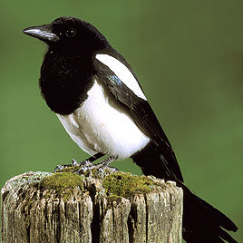
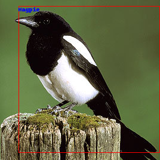

* Note: 
 - A Microsoft Azure Computer Vision is already created.

# 1. Preparation


```python
# Import modules

import requests
from io import BytesIO  
from PIL import Image  # Python Image Library
```


```python
# Get an image from a website

#image_url = 'https://www.halifaxhumanesociety.org/zupload/library/153/-703-700x500-0.jpg'
#image_url = 'https://img.freepik.com/premium-photo/close-up-belgian-shepherd-dog-cat_191971-18280.jpg'

image_url = 'https://www.birdfood.co.uk/media/wildlife/bird/Magpie-FactFile.jpg'

image = Image.open(BytesIO(requests.get(image_url).content))
image
```




```python
# Connect to the Microsoft Azure Computer Vision

key = '2cdace3d53444d5bb98e507b17e31f24'
endpoint = 'https://meow94computervision2.cognitiveservices.azure.com/' + 'vision/v3.0/' 
```

# 2. Image Analysis


```python
# Make Endpoints 

analyze_endpoint = endpoint + 'analyze'   # -> Image Analysis API
```


```python
# Get Headers and Parameters

header = {'Ocp-Apim-Subscription-Key': key}  
params = {'visualFeatures':'Categories,Description,Color'}

data = {'url':image_url}
```


```python
response_analyze = requests.post(analyze_endpoint, 
              headers=header,
              params=params,
              json=data)

response_analyze
```


    <Response [200]>


```python
# Get a Result
result_analyze = response_analyze.json()
result_analyze
```


    {'categories': [{'name': 'animal_bird', 'score': 0.99609375}],
     'color': {'dominantColorForeground': 'White',
      'dominantColorBackground': 'Green',
      'dominantColors': ['Green', 'Black'],
      'accentColor': '8F833C',
      'isBwImg': False,
      'isBWImg': False},
     'description': {'tags': ['bird',
       'sitting',
       'animal',
       'outdoor',
       'small',
       'perched',
       'grass',
       'standing',
       'green',
       'branch',
       'colorful',
       'water',
       'wooden',
       'colored',
       'little',
       'brown',
       'post',
       'blue',
       'purple'],
      'captions': [{'text': 'a small bird perched on top of a wooden post',
        'confidence': 0.9314525342043326}]},
     'requestId': '42a78ff6-18ee-4d0a-b3f6-4fdf59573adb',
     'metadata': {'height': 268, 'width': 268, 'format': 'Jpeg'}}


```python
# Get a description from the result

result_analyze['description']  
```


    {'tags': ['bird',
      'sitting',
      'animal',
      'outdoor',
      'small',
      'perched',
      'grass',
      'standing',
      'green',
      'branch',
      'colorful',
      'water',
      'wooden',
      'colored',
      'little',
      'brown',
      'post',
      'blue',
      'purple'],
     'captions': [{'text': 'a small bird perched on top of a wooden post',
       'confidence': 0.9314525342043326}]}


```python
# Get tags from the description part

result_analyze['description']['tags']
```


    ['bird',
     'sitting',
     'animal',
     'outdoor',
     'small',
     'perched',
     'grass',
     'standing',
     'green',
     'branch',
     'colorful',
     'water',
     'wooden',
     'colored',
     'little',
     'brown',
     'post',
     'blue',
     'purple']


```python
# Get captionss from the description part

result_analyze['description']['captions']
```


    [{'text': 'a small bird perched on top of a wooden post',
      'confidence': 0.9314525342043326}]


```python
# Get the first caption from the description part

result_analyze['description']['captions'][0]

```


    {'text': 'a small bird perched on top of a wooden post',
     'confidence': 0.9314525342043326}


```python
# Get only text of the first caption from the description part

result_analyze['description']['captions'][0]['text']
```


    'a small bird perched on top of a wooden post'


# 3. Object Detection


```python
# Make Endpoints 

detect_endpoint = endpoint + 'detect'  # Object Detection API
```


```python
# Set Headers and Parameters

headers = {'Ocp-Apim-Subscription-Key': key}
params = {}  # Object Detection has no parameters
data = {'url':image_url}
```


```python
# Load on memory
response_detection = requests.post(detect_endpoint,
                         headers=headers,
                         params=params,
                         json=data)
response_detection
```


    <Response [200]>


```python
# Show a result

result_detection = response_detection.json()
result_detection
```


    {'objects': [{'rectangle': {'x': 31, 'y': 10, 'w': 236, 'h': 245},
       'object': 'Magpie',
       'confidence': 0.581,
       'parent': {'object': 'bird',
        'confidence': 0.883,
        'parent': {'object': 'animal', 'confidence': 0.916}}}],
     'requestId': '08f108d8-665c-463a-a6e0-640f78217dad',
     'metadata': {'height': 268, 'width': 268, 'format': 'Jpeg'}}


```python
# Show a result
# One of the differences between 'analyze' and 'detection'
# 'detection' provides x and y axies

result_analyze
```


    {'categories': [{'name': 'animal_bird', 'score': 0.99609375}],
     'color': {'dominantColorForeground': 'White',
      'dominantColorBackground': 'Green',
      'dominantColors': ['Green', 'Black'],
      'accentColor': '8F833C',
      'isBwImg': False,
      'isBWImg': False},
     'description': {'tags': ['bird',
       'sitting',
       'animal',
       'outdoor',
       'small',
       'perched',
       'grass',
       'standing',
       'green',
       'branch',
       'colorful',
       'water',
       'wooden',
       'colored',
       'little',
       'brown',
       'post',
       'blue',
       'purple'],
      'captions': [{'text': 'a small bird perched on top of a wooden post',
        'confidence': 0.9314525342043326}]},
     'requestId': '42a78ff6-18ee-4d0a-b3f6-4fdf59573adb',
     'metadata': {'height': 268, 'width': 268, 'format': 'Jpeg'}}


```python
# To find out objects easily when there are many objects
def MakeBox (result_makebox):
  print(result_makebox)


MakeBox(result_detection)
```

    {'objects': [{'rectangle': {'x': 31, 'y': 10, 'w': 236, 'h': 245}, 'object': 'Magpie', 'confidence': 0.581, 'parent': {'object': 'bird', 'confidence': 0.883, 'parent': {'object': 'animal', 'confidence': 0.916}}}], 'requestId': '08f108d8-665c-463a-a6e0-640f78217dad', 'metadata': {'height': 268, 'width': 268, 'format': 'Jpeg'}}


```python
# Get only 'objects'

def MakeBox(result_makebox):
  objects = result_makebox['objects']
  print(objects)

MakeBox(result_detection)
```

    [{'rectangle': {'x': 31, 'y': 10, 'w': 236, 'h': 245}, 'object': 'Magpie', 'confidence': 0.581, 'parent': {'object': 'bird', 'confidence': 0.883, 'parent': {'object': 'animal', 'confidence': 0.916}}}]


```python
# Repeat

def MakeBox(result_makebox):
  objects = result_makebox['objects']
  for obj in objects:   # Repeat by the number of squares inside
    print(objects)

MakeBox(result_detection)
```

    [{'rectangle': {'x': 31, 'y': 10, 'w': 236, 'h': 245}, 'object': 'Magpie', 'confidence': 0.581, 'parent': {'object': 'bird', 'confidence': 0.883, 'parent': {'object': 'animal', 'confidence': 0.916}}}]


```python
# Print only coordinates

def MakeBox(result_makebox):
  objects = result_makebox['objects']
  for obj in objects:  
    rect = obj['rectangle']
    print(rect)

MakeBox(result_detection)
```

    {'x': 31, 'y': 10, 'w': 236, 'h': 245}


```python
# Import modules related to Images

from PIL import Image, ImageDraw, ImageFont
# ImageDraw: Draw images
# ImageFont: Add words on images
```


```python
# Crate a canvas

draw = ImageDraw.Draw(image)
```


```python
# Get coordinates of objects

def MakeBox(result_makebox):
  objects = result_makebox['objects']
  for obj in objects:  
    rect = obj['rectangle']   
    print(rect)
    x = rect['x']    
    y = rect['y']
    w = rect['w']
    h = rect['h']

MakeBox(result_detection)
```

    {'x': 31, 'y': 10, 'w': 236, 'h': 245}


```python
# Draw a rectangle 

def MakeBox(result_makebox):
  objects = result_makebox['objects']

  # Get coordinates of each object
  for obj in objects:  
    rect = obj['rectangle']   
    print(rect)
    x = rect['x'] 
    y = rect['y']
    w = rect['w']
    h = rect['h']

  # Draw a rectangle based on the coordinates
  draw.rectangle(( (x,y), (x+w,y+h)), outline='red') 

MakeBox(result_detection)
```

    {'x': 31, 'y': 10, 'w': 236, 'h': 245}


```python
# Draw a rectangle of objects

image
```


```python
# The Final script of Image Analysis

def MakeBox(result_makebox):
  objects = result_makebox['objects']

  # Get coordinates of each object
  for obj in objects:  
    rect = obj['rectangle']   
    print(rect)
    x = rect['x']
    y = rect['y']
    w = rect['w']
    h = rect['h']

    # Draw a rectangle based on the coordinates
    draw.rectangle(( (x,y), (x+w,y+h)), outline='red')   # rectangle((Start coordinate, End coordinate), Line color)
    
    # Get a name of object
    objectName = obj['object']

    # Print the name over the image
    draw.text((x,y), objectName, fill='blue')

MakeBox(result_detection)

image
```

    {'x': 31, 'y': 10, 'w': 236, 'h': 245}




# 4. OCR


```python
# Make an endpoint 

ocr_endpoint = endpoint + 'ocr'
```


```python
# Get an URL address of images
image_url_ocr = "https://www.goalcast.com/wp-content/uploads/2016/07/jobs-1-750x394.jpg"
image_ocr = Image.open(BytesIO(requests.get(image_url_ocr).content))
image_ocr
```


```python
# Set Headers and Parameters

headers = {'Ocp-Apim-Subscription-Key': key}
params = {'language': 'en', 'detectOrientation':'true'}  
# 'language': 'unk'(=unknown) - Automatically detect a language
# 'detectOrientation': Recognize a direction of the image when it's 'true'

data = {'url': image_url_ocr}
```


```python
response_ocr = requests.post(ocr_endpoint,
                              headers=headers,
                              params=params,
                              json=data)
result_ocr = response_ocr.json()
result_ocr
```


    {'language': 'en',
     'textAngle': 0.0,
     'orientation': 'Up',
     'regions': [{'boundingBox': '273,148,449,223',
       'lines': [{'boundingBox': '273,148,449,50',
         'words': [{'boundingBox': '273,149,76,41', 'text': 'Have'},
          {'boundingBox': '358,149,49,41', 'text': 'the'},
          {'boundingBox': '418,159,145,39', 'text': 'courage'},
          {'boundingBox': '574,151,30,39', 'text': 'to'},
          {'boundingBox': '614,148,108,42', 'text': 'follow'}]},
        {'boundingBox': '290,210,412,49',
         'words': [{'boundingBox': '290,223,69,36', 'text': 'your'},
          {'boundingBox': '369,210,96,42', 'text': 'heart'},
          {'boundingBox': '476,212,54,40', 'text': 'and'},
          {'boundingBox': '542,212,160,40', 'text': 'intuition.'}]},
        {'boundingBox': '418,271,134,21',
         'words': [{'boundingBox': '418,282,8,3', 'text': '-'},
          {'boundingBox': '433,271,60,21', 'text': 'Steve'},
          {'boundingBox': '499,272,53,20', 'text': 'Jobs'}]},
        {'boundingBox': '594,347,128,24',
         'words': [{'boundingBox': '594,347,128,24', 'text': 'Goalcast'}]}]}]}


```python
# Repeat getting texts
for reg in result_ocr['regions']:
  for line in reg['lines']:
    for word in line['words']:
      print(word['text'])
```

    Have
    the
    courage
    to
    follow
    your
    heart
    and
    intuition.
    -
    Steve
    Jobs
    Goalcast

